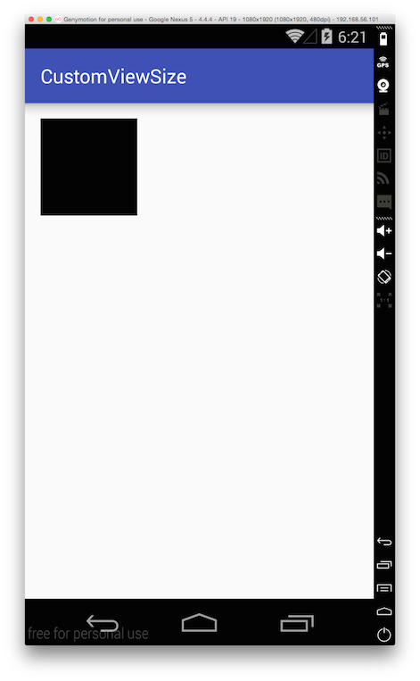
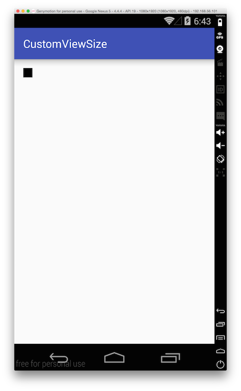
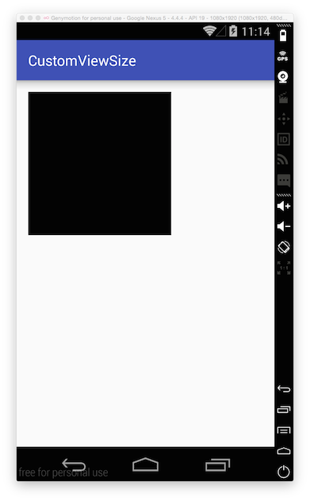

# 커스텀뷰의 크기\(기하 혹은 좌표계\) 정하기

뷰를 생각해 봅시다. 뷰는 하나의 사각형으로 화면에 무엇인가를 그리는 객체입니다. 그리고 사용자로부터 터치 이벤트를 받는 인터렉션의 주체이기도 합니다.

뷰를 생각할 때 가장 중요한 것은 하나의 사각형 영입니다. 우리가 뷰에 무엇을 그려야 하거나 어떤 뷰에 인터렉션이 발생했는지 알기 위해서는 뷰를 구분지을 영역이 필요하기 때문입니다.

커스텀뷰를 만들 때, 가장 먼저 해야할 일도 뷰의 사각형 영역을 정하는 것입니다. 보통 뷰의 기하 혹은 좌표계를 정의하는 단계라고 생각하면 됩니다. 절대좌표계를 사용하는 시스템에서는 이 과정이 무척 쉽습니다. 원하는 대로 내가 어디서부터 어디까지 사용하겠다고 정하기만 하면 되니까요.

안드로이드 뷰에서는 어떻게 사각형 영역을 설정할까요?

#### 기억해야할 두 단계 <a id="&#xAE30;&#xC5B5;&#xD574;&#xC57C;&#xD560;-&#xB450;-&#xB2E8;&#xACC4;"></a>

안드로이드 뷰는 뷰의 영역을 설정하고 사용하는 두 단계가 있습니다. 하나는 뷰의 좌표계를 설정하는 단계이고 나머지 하나는 설정된 뷰의 좌표계를 사용하는 단계입니다.

뷰의 좌표계를 설정하는 단계는 measure단계입니다. 측정단계라고 할 수 있는데 무엇인가를 측정해서 뷰의 좌표계를 정하는 것입니다. 무엇을 측정하는 것일까요?

뷰의 좌표계를 사용하는 단계는 layout단계 또는 draw단계입니다. 이 단계에서 가장 중요하게 기억할 점은 이 단계에서는 이미 뷰의 좌표계가 정의되어 있다는 것입니다. 마치 절대 좌표계에서 코드를 작성하듯 이 단계에서는 그렇게 할 수 가 있습니다.

#### 측정 <a id="&#xCE21;&#xC815;"></a>

안드로이드 뷰의 측정 단계를 이해하기 위해서는 안드로이드 뷰가 어떻게 존재하는지 알아야 합니다. 안드로이드 뷰는 그 홀로 존재할 수 없습니다. 반드시 뷰그룹\(ViewGroup\)에 담겨야 합니다. 그래서 측정이라는 단계가 필요합니다. 뷰가 자기 자신의 크기를 결정하기 위해서 자기 자신을 담고 있는 뷰그룹의 크기를 알아야 하고 뷰그릅에서 사용할 수 있는 영역의 크기도 알아야 할 것입니다. 그리고 자기가 사용할 영역의 크기도 알아야 하겠지요. 즉, 측정단계에서는 자신의 주변 환경과 자기 자신의 정보를 측정하는 것입니다. 측정한 내용을 바탕으로 자신의 크기를 결정하는 것입니다.

이제 코드를 작성해 가며 좀 더 실질적으로 살펴 보도록 하겠습니다.

#### 프로젝트 만들기 <a id="&#xD504;&#xB85C;&#xC81D;&#xD2B8;-&#xB9CC;&#xB4E4;&#xAE30;"></a>

텅빈 액티비티 한개를 갖는 안드로이드 프로젝트를 생성 후 커스텀 뷰를 만듭니다.

```java
public class CustomView extends View {

    public CustomView(Context context) {
        super(context);
    }

    public CustomView(Context context, AttributeSet attrs) {
        super(context, attrs);
    }

    public CustomView(Context context, AttributeSet attrs, int defStyleAttr) {
        super(context, attrs, defStyleAttr);
    }

    @TargetApi(Build.VERSION_CODES.LOLLIPOP)
    public CustomView(Context context, AttributeSet attrs, int defStyleAttr, int defStyleRes) {
        super(context, attrs, defStyleAttr, defStyleRes);
    }
}
```

그리고 측정단계와 사용단계를 살펴보기 위해서 아래의 메서드들을 재정의합니다.

```java
public class CustomView extends View {
    ...

    @Override
    protected void onMeasure(int widthMeasureSpec, int heightMeasureSpec) {
        super.onMeasure(widthMeasureSpec, heightMeasureSpec);
    }

    @Override
    protected void onLayout(boolean changed, int left, int top, int right, int bottom) {
        super.onLayout(changed, left, top, right, bottom);
    }

    @Override
    protected void onDraw(Canvas canvas) {
        super.onDraw(canvas);
    }

    ...
}
```

각 메서드를 설명하자면 아래와 같습니다.

* onMeasure\(\)
  * 뷰의 기하, 좌표계를 결정하는 곳입니다.
* onLayout\(\)
  * 뷰의 좌표계가 정해진 단계로 좌표계를 바탕으로 뷰의 내용물을 배치하는 곳입니다.
* onDraw\(\)
  * 뷰의 좌표계가 정해진 단계로 좌표계를 바탕으로 뷰의 내용을 그리는 곳입니다.

이렇게 작성한 뷰도 커스텀뷰의 역할을 충실히 해냄으로 액티비티의 레이아웃 파일에 선언해서 사용해 보겠습니다.

```markup
<?xml version="1.0" encoding="utf-8"?>
<RelativeLayout xmlns:android="http://schemas.android.com/apk/res/android"
    xmlns:tools="http://schemas.android.com/tools" 
    android:layout_width="match_parent"
    android:layout_height="match_parent" 
    android:paddingLeft="@dimen/activity_horizontal_margin"
    android:paddingRight="@dimen/activity_horizontal_margin"
    android:paddingTop="@dimen/activity_vertical_margin"
    android:paddingBottom="@dimen/activity_vertical_margin" 
    tools:context=".MainActivity">
    <kr.pe.burt.android.study.customviewsize.CustomView
        android:layout_width="100dp"
        android:layout_height="100dp"
        android:background="@android:color/black"
        />
</RelativeLayout>
```

프로젝트를 빌드해서 앱을 실행시켜 봅시다.



위 그림처럼 커스텀뷰의 크기가 100dp를 설정되어 화면에 잘 그려진 것을 확인할 수 있습니다. 뷰의 좌표계를 결정짓는 onMeasure\(\) 메서드에 코드를 작성하지 않았는데 어떻게 뷰의 크기가 정해졌을까요? 그 이유를 알아보기 위해서 `super.onMeasure(widthMeasureSpec, heightMeasureSpec);` 를 주석으로 만들고 다시 프로젝트를 빌드하고 앱을 실행해 봅시다.

```java
FATAL EXCEPTION: main
E/AndroidRuntime: Process: kr.pe.burt.android.study.customviewsize, PID: 8317
E/AndroidRuntime: java.lang.IllegalStateException: onMeasure() did not set the measured dimension by calling setMeasuredDimension()
E/AndroidRuntime:     at android.view.View.measure(View.java:16509)
E/AndroidRuntime:     at android.widget.RelativeLayout.measureChildHorizontal(RelativeLayout.java:719)
E/AndroidRuntime:     at android.widget.RelativeLayout.onMeasure(RelativeLayout.java:455)
```

앱을 실행해 보면 `java.lang.IllegalStateException`예외가 발생하면서 앱이 실행되지 않습니다. 예외의 내용을 살펴보니 onMeasure\(\) 메서드에서 setMeasuredDimension\(\)을 호출해서 뷰의 기하를 설정하지 않았다고 합니다. 그렇다고 한다면 `super.onMeasure(widthMeasureSpec, heightMeasureSpec);`의 내용을 살펴봅시다.

```java
//View.onMeasure(widthMeasureSpec, heightMeasureSpec)의 코드입니다.
protected void onMeasure(int widthMeasureSpec, int heightMeasureSpec) {
        setMeasuredDimension(getDefaultSize(getSuggestedMinimumWidth(), widthMeasureSpec),
                getDefaultSize(getSuggestedMinimumHeight(), heightMeasureSpec));
}
```

코드를 살펴보니 부모 뷰에서 `setMeasuredDimension()` 메서드를 호출하는 것을 확인할 수 있습니다. 그렇다면 onLayout\(\)과 onDraw\(\)의 기본 구현은 어떻게 되어 있을까요?

```java
//View.onLayout() 구현
protected void onLayout(boolean changed, int left, int top, int right, int bottom) {
}

//View.onDraw() 구현
protected void onDraw(Canvas canvas) {
}
```

코드를 보면 확인할 수 있듯이 아무런 구현도 없는 텅빈 메서드입니다. 따라서 onLayout\(\)과 onDraw\(\)에서는 super의 메서드를 호출하지 않아도 됩니다. 정리하면 코드가 아래와 같겠죠.

```java
public class CustomView extends View {
    ...

    @Override
    protected void onMeasure(int widthMeasureSpec, int heightMeasureSpec) {
        super.onMeasure(widthMeasureSpec, heightMeasureSpec);
    }

    @Override
    protected void onLayout(boolean changed, int left, int top, int right, int bottom) {
    }

    @Override
    protected void onDraw(Canvas canvas) {
    }

    ...
}
```

위 코드에서 `super.onMeasure(widthMeasureSpec, heightMeasureSpec);`를 지울 수도 있습니다. 대신 우리가 직접 setMeasuredDimension\(\) 메서드를 호출해 주기만 하면 됩니다. 그렇게 한번 해볼까요?

```java
public class CustomView extends View {
    ...

    @Override
    protected void onMeasure(int widthMeasureSpec, int heightMeasureSpec) {
        setMeasuredDimension(50, 50);
    }

    @Override
    protected void onLayout(boolean changed, int left, int top, int right, int bottom) {
    }

    @Override
    protected void onDraw(Canvas canvas) {
    }

    ...
}
```

크기를 무조건 50픽셀x50픽셀로 설정했습니다.



xml레이아웃 파일에서는 100dp x 100dp로 폭과 높이를 설정했지만 `setMeasuredDimension(50, 50)`메서드에서 50픽셀x50픽셀로 설정했기 때문에 사각형의 크기가 작게 그려졌습니다. 즉, `setMeasuredDimension()`메서드로 원하는 뷰의 기하를 정해주면 그만입니다. 너무 쉽죠?

그러나 몇가지 생각해 봐야할 것이 있습니다. 지금 상황은 커스텀뷰를 담고 있는 뷰그룹이 전체화면 크기이기 때문에 자기가 원하는대로 뷰의 크기를 설정할 수 있었습니다. 만약 커스텀뷰를 담고 있는 뷰그룹의 전체 크기가 30픽셀x30픽셀이라면 어떨까요? 또는 뷰그룹의 크기가 유동적이라면요? 안드로이드에서는 이런 상황을 쉽게 해결할 수 있도록 측정 모드를 알려줍니다.

#### 측정모드 <a id="&#xCE21;&#xC815;&#xBAA8;&#xB4DC;"></a>

3가지 종류의 측정모드가 있습니다.

* MeasureSpec.UNSPECIFIED
* MeasureSpec.AT\_MOST
* MeasureSpec.EXACTLY

각각이 풍기는 뉘앙스는 아래와 같습니다.

* MeasureSpec.UNSPECIFIED
  * 아직 정확하게 측정된 값은 없어. 아무래도 다시 측정과정을 진행해야겠어. 그러니 네가 원하는 값을 맘대로 적든 말든 상관 없어~
* MeasureSpec.AT\_MOST
  * 네가 설정할 수 있는 최대 측정값을 알려줄게. 이 안에서 값을 설정해~. 아 그리고 다시 측정과정이 발생할 수 있어. 최대치도 변할 수 있고~
* MeasureSpec.EXACTLY
  * 정확한 측정값이야. 이 값으로 해도 되고 이 값보다 작은 값으로 설정해도 되. 측정과정이 다시 발생하진 않을거야.

이 세가지 측정모드를 이해하기 위해서 아래 코드를 다시 살펴봅시다.

```java
//View.onMeasure(widthMeasureSpec, heightMeasureSpec)의 코드입니다.
protected void onMeasure(int widthMeasureSpec, int heightMeasureSpec) {
        setMeasuredDimension(getDefaultSize(getSuggestedMinimumWidth(), widthMeasureSpec),
                getDefaultSize(getSuggestedMinimumHeight(), heightMeasureSpec));
}
```

위 코드에서 `getDefaultSize()`메서드는 어떻게 구현되어 있을까요?

```java
public static int getDefaultSize(int size, int measureSpec) {
    int result = size;
    int specMode = MeasureSpec.getMode(measureSpec);
    int specSize = MeasureSpec.getSize(measureSpec);

    switch (specMode) {
    case MeasureSpec.UNSPECIFIED:
        result = size;
        break;
    case MeasureSpec.AT_MOST:
    case MeasureSpec.EXACTLY:
        result = specSize;
        break;
    }
    return result;
}
```

위 코드를 보면 두 가지 size가 나오는데 하나는 내가 원하는 size이고 다른 하나는 측정된 size입니다.

* result : 내가 원하는 크기
* specSize : 측정된 크기

참고로 `getSuggestedMinimumWidth()`코드는 아래와 같습니다.

```java
protected int getSuggestedMinimumWidth() {
    return (mBackground == null) ? mMinWidth : max(mMinWidth, mBackground.getMinimumWidth());
}

protected int getSuggestedMinimumHeight() {
    return (mBackground == null) ? mMinHeight : max(mMinHeight, mBackground.getMinimumHeight());
}
```

mBackgroud는 Drawable로 `getMinimumWidth()`메서드는 아래와 같습니다.

```java
public int IntrinsicHeight() {
    final int intrinsicWidth = getIntrinsicWidth();
    return intrinsicWidth > 0 ? intrinsicWidth : 0;
}

public int getMinimumHeight() {
    final int intrinsicHeight = getIntrinsicHeight();
    return intrinsicHeight > 0 ? intrinsicHeight : 0;
}
```

즉, `IntrinsicHeight()`는 Drawable이 Solid컬러가 아닌 비트맵과 같은 크기가 있는 Drawable이면 컨텐츠의 크기를 반환합니다. 따라서 `getSuggestedMinimumHeight()`코드를 읽어보면 배경 Drawable이 없으면 뷰의 최소크기를 반환하고 배경Drawable이 있으면 뷰의 최소 크기와 배경Drawable의 최소크기 중 큰 값을 반환합니다.

```java
//View.onMeasure(widthMeasureSpec, heightMeasureSpec)의 코드입니다.
protected void onMeasure(int widthMeasureSpec, int heightMeasureSpec) {
        setMeasuredDimension(getDefaultSize(getSuggestedMinimumWidth(), widthMeasureSpec),
                getDefaultSize(getSuggestedMinimumHeight(), heightMeasureSpec));
}
```

즉, 뷰의 최소 폭과 높이를 기본크기로 제안하여 뷰의 기하를 측정하게 합니다.

```java
public static int getDefaultSize(int size, int measureSpec) {
    int result = size;
    int specMode = MeasureSpec.getMode(measureSpec);
    int specSize = MeasureSpec.getSize(measureSpec);

    switch (specMode) {
    case MeasureSpec.UNSPECIFIED:
        result = size;
        break;
    case MeasureSpec.AT_MOST:
    case MeasureSpec.EXACTLY:
        result = specSize;
        break;
    }
    return result;
}
```

따라서 MeasureSpec.UNSPECIFIED 일 경우에는 뷰의 최소 크기를 측정 제안치로 계속 설정합니다. 부모뷰그룹이 MeasureSpec.UNSPECIFIED 일 때는 자식 뷰가 제안한 측정치를 가지고 다시 측정 과정을 거칩니다. 그러다 MeasureSpec.AT\_MOST 이거나 MeasureSpec.EXACTLY 일 경우에는 측정된 값을 기본값으로 설정합니다.

이제 CustomView의 코드를 아래와 같이 작성합니다. 측정모드별로 측정되는 폭과 높이가 어떻게 되는지 알기 위해서 관련 코드를 작성했습니다.

```java
public class CustomView extends View {
    ...

    @Override
    protected void onMeasure(int widthMeasureSpec, int heightMeasureSpec) {
        super.onMeasure(widthMeasureSpec, heightMeasureSpec);

        DisplayMetrics metrics = getResources().getDisplayMetrics();
        Log.v("CustomView-density", "" + metrics.density);

        //모드를 출력해 보자.
        int widthMode = View.MeasureSpec.getMode(widthMeasureSpec);
        int heightMode = View.MeasureSpec.getMode(heightMeasureSpec);
        printMode("width mode : ", widthMode);
        printMode("height mode : ", heightMode);

        //측정된 폭과 높이를 출력해 보자 
        int width = View.MeasureSpec.getSize(widthMeasureSpec);
        int height = View.MeasureSpec.getSize(heightMeasureSpec);
        Log.v("CustomView-onMeasure", "width : " + width + " height : " + height);
    }

    @Override
    protected void onLayout(boolean changed, int left, int top, int right, int bottom) {
        Log.v("CustomView-onLayout", "rect : (x, y, w, h) : " + left + " " + top + " " + (right-left) + " " + (bottom-top));
    }

    @Override
    protected void onDraw(Canvas canvas) {
        int left  = getLeft();
        int top   = getTop();
        int width = getWidth();
        int height= getHeight();
        int mwidth= getMeasuredWidth();
        int mheight=getMeasuredHeight();

        Log.v("CustomView-onDraw", "rect : (x, y, w, h, mw, mh) : " + left + " " + top + " " + width + " " + height + " " + mwidth + " " + mheight);    

    }


    private void printMode(String tag, int mode) {
        switch (mode) {
            case MeasureSpec.AT_MOST:
                Log.v("CustomView-MeasureSpec", tag + " AT_MOST");
                break;
            case MeasureSpec.EXACTLY:
                Log.v("CustomView-MeasureSpec", tag + " EXACTLY");
                break;
            case MeasureSpec.UNSPECIFIED:
                Log.v("CustomView-MeasureSpec", tag + " UNSPECIFIED");
                break;
        }
    }
    ...
}
```

그리고 xml 레이아웃파일을 아래와 같이 수정합니다.

```markup
<?xml version="1.0" encoding="utf-8"?>
<RelativeLayout xmlns:android="http://schemas.android.com/apk/res/android"
    xmlns:tools="http://schemas.android.com/tools"
    android:layout_width="match_parent"
    android:layout_height="match_parent"
    android:paddingLeft="@dimen/activity_horizontal_margin"
    android:paddingRight="@dimen/activity_horizontal_margin"
    android:paddingTop="@dimen/activity_vertical_margin"
    android:paddingBottom="@dimen/activity_vertical_margin" tools:context=".MainActivity">


    <RelativeLayout
        android:layout_width="10dp"
        android:layout_height="10dp">
        <kr.pe.burt.android.study.customviewsize.CustomView
            android:layout_width="100dp"
            android:layout_height="100dp"
            android:background="@android:color/black"
            />
    </RelativeLayout>
</RelativeLayout>
```

자식뷰인 커스텀뷰의 크기보다 부모뷰그룹의 크기를 일부러 적게해 보았습니다.

```java
V/CustomView-density: 3.0
V/CustomView-MeasureSpec: width mode :  EXACTLY
V/CustomView-MeasureSpec: height mode :  AT_MOST
V/CustomView-onMeasure: width : 30 height : 1437

V/CustomView-density: 3.0
V/CustomView-MeasureSpec: width mode :  EXACTLY
V/CustomView-MeasureSpec: height mode :  EXACTLY
V/CustomView-onMeasure: width : 30 height : 300

V/CustomView-density: 3.0
V/CustomView-MeasureSpec: width mode :  EXACTLY
V/CustomView-MeasureSpec: height mode :  AT_MOST
V/CustomView-onMeasure: width : 30 height : 30

V/CustomView-density: 3.0
V/CustomView-MeasureSpec: width mode :  EXACTLY
V/CustomView-MeasureSpec: height mode :  EXACTLY
V/CustomView-onMeasure: width : 30 height : 30

V/CustomView-onLayout: rect : (x, y, w, h) : 0 0 30 30

V/CustomView-density: 3.0
V/CustomView-MeasureSpec: width mode :  EXACTLY
V/CustomView-MeasureSpec: height mode :  AT_MOST
V/CustomView-onMeasure: width : 30 height : 1437

V/CustomView-density: 3.0
V/CustomView-MeasureSpec: width mode :  EXACTLY
V/CustomView-MeasureSpec: height mode :  EXACTLY
V/CustomView-onMeasure: width : 30 height : 300

V/CustomView-density: 3.0
V/CustomView-MeasureSpec: width mode :  EXACTLY
V/CustomView-MeasureSpec: height mode :  AT_MOST
V/CustomView-onMeasure: width : 30 height : 30

V/CustomView-density: 3.0
V/CustomView-MeasureSpec: width mode :  EXACTLY
V/CustomView-MeasureSpec: height mode :  EXACTLY
V/CustomView-onMeasure: width : 30 height : 30

V/CustomView-onLayout: rect : (x, y, w, h) : 0 0 30 30
V/CustomView-onDraw: rect : (x, y, w, h, mw, mh) : 0 0 30 30 30 30
```

위 로그를 보면 측정과정을 여러번 거칩니다. 측정하는 모드는 EXACTLY 아니면 AT\_MOST입니다. 이 모드에서는 주어진 측정치 값을 최대치로 생각하고 뷰의 크기를 설정해 주면 됩니다. 여러 측정 단계를 거쳐 자식뷰의 크기가 부모뷰그룹의 크기에 맞춰지는 것을 알 수 있습니다. 그 값이 자식뷰가 사용할 수 있는 최대값이기 때문입니다.

이번에는 부모뷰그룹의 크기를 좀 넉넉하게 잡아봅시다.

```markup
<?xml version="1.0" encoding="utf-8"?>
<RelativeLayout xmlns:android="http://schemas.android.com/apk/res/android"
    xmlns:tools="http://schemas.android.com/tools"
    android:layout_width="match_parent"
    android:layout_height="match_parent"
    android:paddingLeft="@dimen/activity_horizontal_margin"
    android:paddingRight="@dimen/activity_horizontal_margin"
    android:paddingTop="@dimen/activity_vertical_margin"
    android:paddingBottom="@dimen/activity_vertical_margin" tools:context=".MainActivity">


    <RelativeLayout
        android:layout_width="200dp"
        android:layout_height="200dp">
        <kr.pe.burt.android.study.customviewsize.CustomView
            android:layout_width="100dp"
            android:layout_height="100dp"
            android:background="@android:color/black"
            />
    </RelativeLayout>

</RelativeLayout>
```

```java
V/CustomView-density: 3.0
V/CustomView-MeasureSpec: width mode :  EXACTLY
V/CustomView-MeasureSpec: height mode :  AT_MOST
V/CustomView-onMeasure: width : 300 height : 1437

V/CustomView-density: 3.0
V/CustomView-MeasureSpec: width mode :  EXACTLY
V/CustomView-MeasureSpec: height mode :  EXACTLY
V/CustomView-onMeasure: width : 300 height : 300

V/CustomView-density: 3.0
V/CustomView-MeasureSpec: width mode :  EXACTLY
V/CustomView-MeasureSpec: height mode :  AT_MOST
V/CustomView-onMeasure: width : 300 height : 600

V/CustomView-density: 3.0
V/CustomView-MeasureSpec: width mode :  EXACTLY
V/CustomView-MeasureSpec: height mode :  EXACTLY
V/CustomView-onMeasure: width : 300 height : 300

V/CustomView-onLayout: rect : (x, y, w, h) : 0 0 300 300

V/CustomView-density: 3.0
V/CustomView-MeasureSpec: width mode :  EXACTLY
V/CustomView-MeasureSpec: height mode :  AT_MOST
V/CustomView-onMeasure: width : 300 height : 1437

V/CustomView-density: 3.0
V/CustomView-MeasureSpec: width mode :  EXACTLY
V/CustomView-MeasureSpec: height mode :  EXACTLY
V/CustomView-onMeasure: width : 300 height : 300

V/CustomView-density: 3.0
V/CustomView-MeasureSpec: width mode :  EXACTLY
V/CustomView-MeasureSpec: height mode :  AT_MOST
V/CustomView-onMeasure: width : 300 height : 600

V/CustomView-density: 3.0
V/CustomView-MeasureSpec: width mode :  EXACTLY
V/CustomView-MeasureSpec: height mode :  EXACTLY
V/CustomView-onMeasure: width : 300 height : 300

V/CustomView-onLayout: rect : (x, y, w, h) : 0 0 300 300
V/CustomView-onDraw: rect : (x, y, w, h, mw, mh) : 0 0 300 300 300 300
```

이번에도 `EXACTLY`와 `AT_MOST` 측정모드를 번갈아 가며 측정하고 자식뷰가 사용할 수 있는 크기의 최대값을 알려줍니다. 그리고 로그를 보면 onLayout과 onDraw에서는 확실하게 뷰의 좌표계가 결정되는 것을 확인할 수 있습니다. 즉, `EXACTLY`, `AT_MOST` 모드일 경우 주어진 값을 바탕으로 뷰 자신의 크기를 정합니다. 마진값이나 패딩값 등 기타 여러 조건들을 바탕으로 설정할 수 있는 최대값 내에서 뷰의 크기를 결정하면 됩니다.

지금까지 View의 onMeasure\(\) 메서드를 호출해 뷰의 크기를 결정했습니다. 이 부분을 직접 크기를 결정하는 코드로 변경해 봅시다.

```java
@Override
protected void onMeasure(int widthMeasureSpec, int heightMeasureSpec) {
    setMeasuredDimension(1600, 1600);
}
```

최대값을 고려하지 않고 무턱대고 1600x1600으로 설정했습니다. 과연 어떻게 될까요?

```java
V/CustomView-density: 3.0
V/CustomView-MeasureSpec: width mode :  EXACTLY
V/CustomView-MeasureSpec: height mode :  AT_MOST
V/CustomView-onMeasure: width : 300 height : 1437

V/CustomView-density: 3.0
V/CustomView-MeasureSpec: width mode :  EXACTLY
V/CustomView-MeasureSpec: height mode :  EXACTLY
V/CustomView-onMeasure: width : 1600 height : 300

V/CustomView-density: 3.0
V/CustomView-MeasureSpec: width mode :  EXACTLY
V/CustomView-MeasureSpec: height mode :  AT_MOST
V/CustomView-onMeasure: width : 300 height : 600

V/CustomView-density: 3.0
V/CustomView-MeasureSpec: width mode :  EXACTLY
V/CustomView-MeasureSpec: height mode :  EXACTLY
V/CustomView-onMeasure: width : 1600 height : 300
V/CustomView-onLayout: rect : (x, y, w, h) : 0 0 1600 1600

V/CustomView-density: 3.0
V/CustomView-MeasureSpec: width mode :  EXACTLY
V/CustomView-MeasureSpec: height mode :  AT_MOST
V/CustomView-onMeasure: width : 300 height : 1437

V/CustomView-density: 3.0
V/CustomView-MeasureSpec: width mode :  EXACTLY
V/CustomView-MeasureSpec: height mode :  EXACTLY
V/CustomView-onMeasure: width : 1600 height : 300

V/CustomView-density: 3.0
V/CustomView-MeasureSpec: width mode :  EXACTLY
V/CustomView-MeasureSpec: height mode :  AT_MOST
V/CustomView-onMeasure: width : 300 height : 600

V/CustomView-density: 3.0
V/CustomView-MeasureSpec: width mode :  EXACTLY
V/CustomView-MeasureSpec: height mode :  EXACTLY
V/CustomView-onMeasure: width : 1600 height : 300

V/CustomView-onLayout: rect : (x, y, w, h) : 0 0 1600 1600
V/CustomView-onDraw: rect : (x, y, w, h, mw, mh) : 0 0 1600 1600 1600 1600
```

측정모드를 번갈아 가며 여러번 측정되지만 onLayout과 onDraw를 보면 결국에는 무턱대고 설정한 1600x1600이 됩니다. 그렇다면 뷰는 화면에 어떻게 보일까요?



뷰의 크기는 1600x1600이지만 그려지는 영역은 부모 뷰그룹의 크기를 벗어날 수 없음을 확인할 수 있습니다. 즉, `setMeasuredDimension()`메서드를 사용해서 구현자 마음대로 뷰의 크기를 설정할 수 있습니다. 하지만 정상적으로 화면에 표시하기 위해서는 최대값을 고려해서 뷰를 표시해야 합니다. 측정된 값의 10%를 패딩값으로 뺀 값으로 뷰의 크기를 설정하는 코드를 작성해 보겠습니다.

```java
@Override
protected void onMeasure(int widthMeasureSpec, int heightMeasureSpec) {

    // 측정된 폭과 높이를 출력해 보자
    int width = View.MeasureSpec.getSize(widthMeasureSpec);
    int height = View.MeasureSpec.getSize(heightMeasureSpec);

    // 패딩값을 측정값의 10%를 주어 뺀다.
    int paddingWidth = width / 10;
    int paddingHeight = height / 10;

    setMeasuredDimension(width - paddingWidth, height - paddingHeight);
}
```

로그는 아래와 같습니다. 측정 단계 로그는 제외하였습니다.

```java
10-29 11:28:49.984 10648-10648/? V/CustomView-onLayout: rect : (x, y, w, h) : 0 0 270 270
10-29 11:28:49.992 10648-10648/? V/CustomView-onLayout: rect : (x, y, w, h) : 0 0 270 270
10-29 11:28:49.992 10648-10648/? V/CustomView-onDraw: rect : (x, y, w, h, mw, mh) : 0 0 270 270 243 270
```

아래는 결과 화면입니다.


아래는 CustomView의 전체 코드입니다.

```java
package kr.pe.burt.android.study.customviewsize;

import android.annotation.TargetApi;
import android.content.Context;
import android.graphics.Canvas;
import android.os.Build;
import android.util.AttributeSet;
import android.util.Log;
import android.view.View;

/**
 * Created by burt on 15. 10. 16..
 */
public class CustomView extends View {

    public CustomView(Context context) {
        super(context);
    }

    public CustomView(Context context, AttributeSet attrs) {
        super(context, attrs);
    }

    public CustomView(Context context, AttributeSet attrs, int defStyleAttr) {
        super(context, attrs, defStyleAttr);
    }

    @TargetApi(Build.VERSION_CODES.LOLLIPOP)
    public CustomView(Context context, AttributeSet attrs, int defStyleAttr, int defStyleRes) {
        super(context, attrs, defStyleAttr, defStyleRes);
    }


    @Override
    protected void onMeasure(int widthMeasureSpec, int heightMeasureSpec) {

        // 측정된 폭과 높이를 출력해 보자
        int width = View.MeasureSpec.getSize(widthMeasureSpec);
        int height = View.MeasureSpec.getSize(heightMeasureSpec);

        // 패딩값을 측정값의 10%를 주어 뺀다.
        int paddingWidth = width / 10;
        int paddingHeight = height / 10;

        setMeasuredDimension(width - paddingWidth, height - paddingHeight);
    }

    @Override
    protected void onLayout(boolean changed, int left, int top, int right, int bottom) {
        super.onLayout(changed, left, top, right, bottom);
        Log.v("CustomView-onLayout", "rect : (x, y, w, h) : " + left + " " + top + " " + (right-left) + " " + (bottom-top));
    }

    @Override
    protected void onDraw(Canvas canvas) {
        super.onDraw(canvas);

        int left  = getLeft();
        int top   = getTop();
        int width = getWidth();
        int height= getHeight();
        int mwidth= getMeasuredWidth();
        int mheight=getMeasuredHeight();

        Log.v("CustomView-onDraw", "rect : (x, y, w, h, mw, mh) : " + left + " " + top + " " + width + " " + height + " " + mwidth + " " + mheight);
    }

    private void printMode(String tag, int mode) {
        switch (mode) {
            case MeasureSpec.AT_MOST:
                Log.v("CustomView-MeasureSpec", tag + " AT_MOST");
                break;
            case MeasureSpec.EXACTLY:
                Log.v("CustomView-MeasureSpec", tag + " EXACTLY");
                break;
            case MeasureSpec.UNSPECIFIED:
                Log.v("CustomView-MeasureSpec", tag + " UNSPECIFIED");
                break;
        }
    }
}
```

