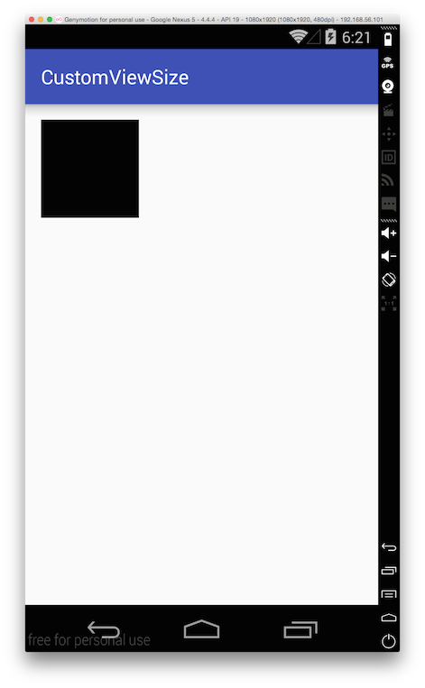

# 3장. OpenGL\|ES 개발 환경 만들기

이번 시간이 실제적인 첫 시간이네요. 그렇다면 가장 먼저 해야할 일이 아이폰에서 OpenGL\|ES를 사용하기 위해서 환경을 설정하는 방법일 것 같네요. 참고로 타이핑이 편리함을 위해서\(;;;;\) 앞으로 OpenGL\|ES를 OpenGL이라고 적겠습니다. 양해 부탁드려요

[소스코드](https://skyfe79.gitbooks.io/ios-opengles-tutorial/content/ch2/tutorial02.zip)

첨부파일에 소스코드를 올려 놓았으니 미리 먼저 컴파일 및 실행 해 보신 후 이 글을 읽으셔도 좋을 것 같습니다. 아주 좋은 방법은 이 글을 보면서 모두 따라해 보는 것이구요^^

아래 그림은 이번 튜토리얼에서 만들 최종 결과물입니다.


너무 썰렁하다구요? 네 그래요ㅜㅜ 하지만 멋진 2D, 3D게임의 시작은 모두 이렇게 썰렁한 화면에서 시작하게 됩니다. 나중에 멋진 그림을 그리기 위해 깨끗한 도화지 한 장 준비하는 것과 똑 같죠. 멋진 게임이 탄생하는 그날을 위해 이제 본격적으로 시작해 보아요^^

제일 먼저 해야할 일은 XCode를 구동하고 프로젝트를 만드는 것입니다. 아무 것도 없는 상태에서 OpenGL 적용을 위한 모든 코드를 직접 짜보기 위해서 Window용 프로젝트를 만들겠습니다. 저는 Tutorial01이라고 프로젝트이름을 지었는데 프로젝트 이름은 마음대로 지어도 상관 없습니다. 아래 그림처럼 앱의 타입을 설정하고 프로젝트를 만들어 주세요.


위의 그림에 이어 아래 그림은 제가 만든 프로젝트 모습입니다.



지금 위 프로젝트를 컴파일하고 실행하면 결과 화면과 다를 바 없이 하얀 화면만 나옵니다. 해당 하얀 화면은 아이폰의 모든 앱이 하나씩 가지고 있는 UIWindow 객체의 모습입니다. 우리는 이제 이 UIWindow 객체에 우리만의 OpenGL용 View를 만들어서 하위 뷰로 추가해야합니다.

그 일을 하기 전에 아이폰에서 OpenGL을 사용하기 위해서 해줘야할 작업이 있습니다. 바로 OpenGL 프레임워크를 추가하는 것입니다. 간략하게 프레임워크를 설명하자면 집 안에 있는 가전기기와도 같은 것입니다. 집에서 TV를 보려면 TV한 대를 사와서 안테나를 꼽고 전기선을 연결해야 합니다. 그래야 TV를 맘껏 볼 수 있지요. 이 것과 마찬가지로 아이폰에서 OpenGL을 사용하려면 OpenGL 프레임워크를 추가\(TV를 사오고\)하고 OpenGL을 그릴 수 있는 뷰를 만들고\(전기선을 꼽고\) 해당 OpenGL뷰를 보기 위해서 UIWindow 객체의 하위뷰로 넣어야\(안테나를 꼽고 채널을 설정\)합니다.

아래 그림처럼 OpenGL프레임워크와 Quartz 프레임워크를 추가해 주세요. 엥? 왜 쿼츠프레임워크도 추가해야 하죠? 그건 아이폰이 OpenGL로 그린 그림들을 최종적으로 CALayer라고 하는 코어애니메이션 객체에 그리기 때문입니다. OpenGL과 코어애니메이션의 관계는 튜토리얼을 진행하면서 설명해 드리겠습니다. 지금 당장 알고 싶으신 분은 제 블로그 글을 참고하셔도 되구요. 참고로 이 튜토리얼은 XCode 3.x를 사용하여 예제 코드를 작성하고 있습니다. 따라서 XCode 4.x를 사용하시는 분과는 화면이 다를 수 있습니다.


이제 OpenGL을 그릴 수 있는 UIView객체를 만들어 보겠습니다. 커스텀 UIView이니 UIView를 상속해야 합니다. 아래 그림처럼 OGLView 를 만들어 주세요.


이제 본격적으로 코드를 작성해 보겠습니다. OGLView 의 헤더파일을 선택한 후 아래와 같이 작성해 주세요.

```objectivec
#import <UIKit/UIKit.h>
#import <QuartzCore/QuartzCore.h>
#import <OpenGLES/ES1/gl.h>
#import <OpenGLES/ES1/glext.h>

@interface OGLView : UIView
{
    CAEAGLLayer        *eaglLayer;          //: 1
    EAGLContext        *context;            //: 2
    GLuint             colorRenderBuffer;   //: 3
}
@end
```


1번은 현재 우리가 만들고 있는 OGLView가 내부적으로 사용할 CALayer입니다. 그런데 이름이 CALayer가 아니죠? 그건 코어애니메이션이 가지고 있는 레이어의 종류가 아주 다양해서 CALayer를 부모로 두고 상속 받은 레이어가 있기 때문입니다. 위의 CAEAGLLayer 도 CALayer를 상속받은 레이어로 OpenGL로 그린 그림을 보여주기 위한 역할을 합니다.

사실 아이폰용 앱이 사용하는 모든 UIView는 내부적으로 CALayer를 가지고 있습니다. 일종의 백버퍼라고 보시면 되는데요. 아이폰의 UI애니메이션들이 화려한 이유는 바로 UIView가 위의 얘기처럼 만들어져 있습니다. 게임 개발을 조금이라도 공부해부신 분은 게임내 그림이 깜빡이는 것을 방지하기 위해서 더블 버퍼링을 사용하는 방법을 알고 계실 것입니다.

UIView가 가지고 있는 CALayer도 더블버퍼링의 개념과 비슷하다고 생각하시면 됩니다. 현재 UIView의 모습을 CALayer에 비트맵으로 보관하고 각 종 애니메이션 처리를 합니다. 그래서 사양이 낮은 아이폰에서도 UI의 움직임이 아주 부드럽게 되는 것이죠.

사실 UIView의 성격은 사용자에게 그림을 보여주는 것입니다. 버튼의 모양, 텍스트의 모양 등 모두 그림입니다. 컴퓨터에서 모든 그림은 비트맵 데이터입니다. 그렇게 생각하고 MVC 를 생각해 보면 UIView 는 내부적으로 비트맵 데이터의 모델로 CALayer를 사용하는 것입니다.

OpenGL로 그린 그림도 생각해 보아요. 우리 눈에는 3D로 보이긴 하지만 컴퓨터 모니터와 아이폰 화면은 2D평판입니다. 즉, 3D로 보이는 그림도 단순한 2차원 비트맵 데이터입니다. 따라서 UIView의 모델인 CALayer가 가지고 있어야 합니다. 그렇기 때문에 OpenGL용 모델인 CAEAGLLayer를 UIView가 사용하는 것입니다. 그런데 CAEAGLLayer 의 단점은 발음하기가 힘들다는 것입니다. ㅋㅋㅋ 그렇다면 eaglLayer 를 '이글레이어'라고 부르시면 편하실거에요 ^^

2번은 OpenGL컨텍스트입니다. 이 컨텍스트는 iOS가 OpenGL을 이용해 그림을 그릴 때 필요한 모든 정보를 가지고 있습니다. 쉽게 예를 들자면 MS의 Windows를 사용해 보셨다면 장치 드라이버를 많이 설치해 보셨을 겁니다. 프린터를 새로 사서 문서를 인쇄하려면 해당 프린터의 드라이버를 설치해 줘야 합니다. 그건 설치한 드라이버가 해당 프린터로 문서를 출력하기에 필요한 모든 정보를 가지고 있기 때문입니다. MS-Windows는 드라이버가 제공하는 정보를 바탕으로 문서를 인쇄합니다.

마찬가지로 iOS\(아이폰 또는 아이패드\)가 OpenGL로 그림을 그리기 위해서는 정보가 필요합니다. 이 정보를 정확히 알아야 제대로 된 그림을 그릴 수 있기 때문입니다. 이 정보를 바로 EAGLContext가 제공하는 것입니다.

3번은 OpenGL이 사용하는 렌더링버퍼 중 하나인 컬러 버퍼의 핸들입니다. 아이폰에서 NSDictionary 를 사용해 보셨다면 Key라는 개념을 아실 것입니다. 키를 사용해서 사전이 담고 있는 여러 데이터 중에서 원하는 데이터를 뽑아 사용합니다. 이와 비슷하게 OpenGL은 내부에 렌더링 버퍼 중 컬러 버퍼를 메모리에 생성하고 해당 버퍼를 위의 GLuint형의 핸들에 바인딩\(연결\)합니다. 그리고 나중에 컬러 버퍼가 필요할 때에는 바인딩한 핸들을 가지고 필요한 컬러 버퍼를 선택할 수 있는 것입니다.

이제 OGLView의 헤더 구현이 끝났으니 몸체를 구현해 보도록 하겠습니다. 아래의 순서로 구현합니다.

1. OGLView의 모델로 CAEAGLLayer 설정하기
2. EAGLContext 만들고 설정하기
3. 색상 렌더 버퍼 만들기
4. 프레임 버퍼를 만들고 렌더 버퍼 슬롯에 색상 렌더 버퍼 꼽기
5. 렌더링 루프 만들기
6. 그림 그리기
7. OGLView를 UIWindow의 하위뷰로 넣고 실행해 보기

#### 1. OGLView의 모델로 CAEAGLLayer 설정하기 <a id="1-oglview%EC%9D%98-%EB%AA%A8%EB%8D%B8%EB%A1%9C-caeagllayer-%EC%84%A4%EC%A0%95%ED%95%98%EA%B8%B0"></a>

이 방법은 아주 간단합니다. 그냥 아래처럼 layerClass 를 재정의 해 주면 됩니다. 이 클래스 메서드를 재정의 해주면 OGLView가 생성될 때 재정의한 layerClass 메서드가 호출되서 OGLView이 사용하는 레이어가 CAEAGLLayer 가 됩니다.

```objectivec
+(Class)layerClass
{
    return [CAEAGLLayer class];
}
```

#### 2. EAGLContext 만들고 설정하기 <a id="2-eaglcontext-%EB%A7%8C%EB%93%A4%EA%B3%A0-%EC%84%A4%EC%A0%95%ED%95%98%EA%B8%B0"></a>

우리가 사용할 OpenGL의 버전을 설정하여 컨텍스트 객체를 만들고 해당 객체를 현재 컨텍스트로 설정합니다.

```objectivec
-(void)setupContext
{
    EAGLRenderingAPI api = kEAGLRenderingAPIOpenGLES1;
    context = [[EAGLContext alloc] initWithAPI:api];
    if(context == nil)
    {
        NSLog(@"OpenGLES 1.0 Context 초기화 실패");
        exit(1);
    }

    if(![EAGLContext setCurrentContext:context])
    {
        NSLog(@"현재 OpenGL context 설정 실패");
        exit(1);
    }
}
```

위의 코드에서 OpenGL\|ES 1.0 API 를 사용한다고 설정하여 컨텍스트를 만들었습니다.

#### 3. 색상 렌더 버퍼 만들기 <a id="3-%EC%83%89%EC%83%81-%EB%A0%8C%EB%8D%94-%EB%B2%84%ED%8D%BC-%EB%A7%8C%EB%93%A4%EA%B8%B0"></a>

```objectivec
-(void)setupRenderBuffer
{
    glGenRenderbuffersOES(1, &colorRenderBuffer); //: OpenGL이 렌더버퍼를 생성하고 핸들값을 받아 온다.
    glBindRenderbufferOES(GL_RENDERBUFFER_OES, colorRenderBuffer); //: 렌더 버퍼 핸들을 렌더 버퍼에 바인딩 한다
    [context renderbufferStorage:GL_RENDERBUFFER_OES fromDrawable:eaglLayer]; //: 컨텍스트가 CAEAGLLayer에 비트맵을 담을 공간을 할당한다.
}
```

렌더버퍼는 우리에게 보여질 그림 데이터를 담고 있는 버퍼입니다. 3차원 표현을 위해서 각종 변환과 렌더링 파이프 라인을 통과하고 난 비트맵 데이터를 담고 있습니다. 렌더 버퍼를 생성하기 위해서 OpenGL이 생성하고 핸들에 바인딩 하고 현재 컨텍스트가 해당 렌더버퍼가 비트맵 데이터를 담아 놓을 공간을 만듭니다. 그런데 이 비트맵 데이터를 어디에 할당해야 할까요? 바로 OGLView의 모델인 eaglLayer가 비트맵 데이터를 담아 놓는 역할을 하니 eaglLayer에 할당하는 것이 이치에 맞을 것 같습니다.

#### 4. 프레임 버퍼를 만들고 렌더 버퍼 슬롯에 색상 렌더 버퍼 꼽기 <a id="4-%ED%94%84%EB%A0%88%EC%9E%84-%EB%B2%84%ED%8D%BC%EB%A5%BC-%EB%A7%8C%EB%93%A4%EA%B3%A0-%EB%A0%8C%EB%8D%94-%EB%B2%84%ED%8D%BC-%EC%8A%AC%EB%A1%AF%EC%97%90-%EC%83%89%EC%83%81-%EB%A0%8C%EB%8D%94-%EB%B2%84%ED%8D%BC-%EA%BC%BD%EA%B8%B0"></a>

우리는 게임을 하거나 영화를 볼 때, 프레임 얘기를 많이 합니다. 60프레임이라고 하면 초당 60장의 그림이 눈에 보이는 것이지요. 프레임버퍼는 이 프레임들을 담고 있는 버퍼입니다. 단, 60장 씩 여러개를 가지고 있는 것이 아니라 1~2장 정도를 가지고 있습니다.

하나의 프레임은 여러 렌더 버퍼로 구성되어 있습니다. 제일 대표적인 것이 컬러 렌더 버퍼입니다. 그림을 생각해 보면 그림의 한 픽셀은 결국 RGB 색상입니다. 이 색상들이 모여 그림을 만듭니다. 일상에서 뒤에 오는 사람은 앞에 오는 사람이 가리면 안 보이게 됩니다. 안 보이는 것은 그릴 필요가 없겠죠. 이처럼 깊이\(거리\)에 따라 그리기 제외를 하기 위해서 깊이 버퍼가 있습니다. 그 외에 그림자나 기타 여러가지 효과를 내기 위한 스텐실 버퍼 등 종류가 다양합니다. 튜토리얼을 점차 진행하면서 해당 내용이 다뤄지면 더 깊이 설명하도록 하겠습니다.

프레임버퍼는 여러 개의 렌더버퍼로 구성되고 여러 버퍼를 꼽기 위한 슬롯을 가지고 있습니다. 그 슬롯에 컬퍼버퍼를 꼽아 주게 되면 우리 눈에 보이는 최종 프레임은 그림을 가지고 있게 되는 것입니다.

```objectivec
-(void)setupFrameBuffer
{
    GLuint framebuffer;
    glGenFramebuffersOES(1, &framebuffer);  //: 프레임버퍼 생성및핸들값 가져오기
    glBindFramebufferOES(GL_FRAMEBUFFER_OES, framebuffer); //: 프레임버퍼에 핸들값 바인딩하기
    glFramebufferRenderbufferOES(GL_FRAMEBUFFER_OES, GL_COLOR_ATTACHMENT0_OES, GL_RENDERBUFFER_OES, colorRenderBuffer);  //: 프레임버퍼의 컬러렌더링버퍼 슬롯에 컬러렌더링버퍼 꼽기
}
```

#### 5. 렌더링 루프 만들기 <a id="5-%EB%A0%8C%EB%8D%94%EB%A7%81-%EB%A3%A8%ED%94%84-%EB%A7%8C%EB%93%A4%EA%B8%B0"></a>

이제 마지막으로 해야 할 것은 렌더링 루프를 만드는 것입니다. 렌더링 루프가 존재하기에 애니메이션이 존재할 수 있는 것입니다. 우리가 어렸을 적 책의 모퉁이에 연결되는 작은 그림들을 그려 놓고 책장을 빠르게 넘기면 그림이 살아 움직이는 듯한 신기한 경험을 해 보았을 것입니다. 렌더링 루프가 바로 책장을 빠르게 넘기는 손가락입니다. 렌더링 루프가 빠르게 넘기는 것은 당연히 프레임버퍼가 가지고 있는 프레임입니다.

예전 iOS 3.0이전부터는 타이머를 만들어서 렌더링 루프를 만들었는데 iOS3.1부터는 CADisplayLink 라는 객체가 제공되서 렌더링 루프를 CADisplayLink를 사용해서 만듭니다. CADisplayLink 는 아이폰의 화면이 주사에 의해 한번 그려질 때마다 셀렉터가 호출되게끔 작동하는데 1초에 60번정도 호출 됨을 보장 받을 수 있다고 생각하시면 됩니다. 그러면 60프레임의 성능을 낼 수 있는 것입니다. 물론 우리가 직접 작성하는 렌더링 루프가 하는 역할이 간소해야 겠지만요.

```objectivec
-(void)setupDisplayLink
{
    CADisplayLink *displayLink = [CADisplayLink displayLinkWithTarget:self selector:@selector(render:)];
    [displayLink addToRunLoop:[NSRunLoop currentRunLoop] forMode:NSDefaultRunLoopMode];
}
```

사용방법은 아주 간단합니다. CADisplayLink 객체를 만들어서 현재 런루프에 넣어 주기만 하면 됩니다. 위처럼하면 아이폰 화면이 갱신 될 때마다 render: 메서드가 호출됩니다.

#### 6. 그림 그리기 <a id="6-%EA%B7%B8%EB%A6%BC-%EA%B7%B8%EB%A6%AC%EA%B8%B0"></a>

그림을 그리는 것은 모두 렌더 루프에서 이뤄집니다. 그림을 그리고, 그려진 그림 데이터를 현재 컨텍스트가 eaglLayer에 제공합니다. 그러면 우리가 만든 OGLView에 보이게 되는 것입니다.

```objectivec
-(void)render:(CADisplayLink *)displayLink
{
    glClearColor(1.0, 1.0, 1.0, 1.0);
    glClear(GL_COLOR_BUFFER_BIT);
    [context presentRenderbuffer:GL_RENDERBUFFER_OES];
}
```

위의 코드는 버퍼의 모든 내용을 초기화할 RGBA값을 설정하고 해당 값으로 컬러 버퍼를 초기화 한 후 컨텍스트가 렌더버퍼의 내용을 eaglLayer에 넘겨주는 것입니다.

컬러버퍼를 흰색 RGBA\(1.0, 1.0, 1.0, 1.0\) 값으로 초기화 하니 결과 화면이 온통 하얗게 나오는 것입니다. OpenGL에서 색상의 범위는 0.0 ~ 1.0 사이입니다. 바이트\(byte\)로 환산하며 0.0은 0이고 1.0 은 255입니다. 위의 코드에서 색상값만 자유자재로 바꾼 다음 재실행 해 보시면 화면 색상이 하얀색이 아닌 다른 색으로 나올 것 입니다.

#### 7. OGLView를 UIWindow의 하위뷰로 넣고 실행해 보기 <a id="7-oglview%EB%A5%BC-uiwindow%EC%9D%98-%ED%95%98%EC%9C%84%EB%B7%B0%EB%A1%9C-%EB%84%A3%EA%B3%A0-%EC%8B%A4%ED%96%89%ED%95%B4-%EB%B3%B4%EA%B8%B0"></a>

이제 마지막 단계로 OGLView의 객체를 만들어서 UIWindow 객체의 하위뷰로 넣어보겠습니다. 아래의 코드처럼 앱델리게이트의 헤더 파일을 작성해 주세요.

```objectivec
#import <UIKit/UIKit.h>
#import "OGLView.h"

@interface Tutorial01AppDelegate : NSObject <UIApplicationDelegate>
{
    OGLView     *glView;
    UIWindow *window;
}
@property (nonatomic, retain) OGLView *glView;
@property (nonatomic, retain) IBOutlet UIWindow *window;

@end
```

우리가 지금까지 만든 OGLView를 멤버로 선언하고 메모리 관리를 위해서 속성으로 설정했습니다. 이제 앱델리게이트의 몸체 구현부로 옮겨 아래 그림처럼 window의 하위 뷰로 OGLView의 객체인 glView를 넣어주세요.

```objectivec
@implementation Tutorial01AppDelegate

@synthesize glView;
@synthesize window;

- (BOOL)application:(UIApplication *)application didFinishLaunchingWithOptions:(NSDictionary *)launchOptions {   

    // Override point for customization after application launch.
    CGRect screenBounds = [[UIScreen mainScreen]bounds];
    self.glView = [[[OGLView alloc] initWithFrame:screenBounds]autorelease];
    [self.window addSubview:self.glView];
    [self.window makeKeyAndVisible];

    return YES;
}
```

그리고 소멸자에서 glView의 메모리를 정리해줍니다 :\)

```text
- (void)dealloc {
    [glView release];
    [window release];
    [super dealloc];
}
```

이제 실행을 하면! 아래 화면이 나옵니다. 아자!


