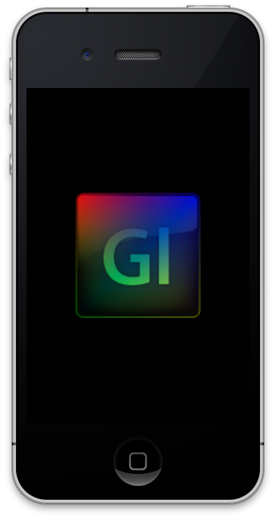

# 4장. 뷰 배경색상 변경하기

안녕하세요. OpenGL\|ES 튜토리얼 3편입니다. 이번 시간에는 OpenGL의 컬러버퍼를 지우는 방법을 알아보겠습니다. 2편에서는 배경 화면이 하얗게 나왔는데요. 이번에는 원하는 색상으로 지울 수 있게 설정해 보겠습니다.


위의 그림은 이번 장에서 만들 예제의 결과화면입니다. 결과 화면이 이번 장에서도 심심하지만 그래도 즐겁게 해 보아요^^ 먼저 코드를 받아서 실행해 보실 분은 아래의 코드를 받으세요 :\)

[소스코드](https://skyfe79.gitbooks.io/ios-opengles-tutorial/content/ch3/Tutorial03.zip)

이번 장에서 배울 내용은 아래와 같습니다.

* glClearColor
* GL\_COLOR\_BUFFER\_BIT
* glClear

#### 1. glClearColor\(R,G,B,A\) <a id="1-glclearcolor-r-g-b-a"></a>

glClearColor는 현재 프레임을 채울 색상을 설정하는 함수로 RGBA 값을 인자로 받습니다. 현재 프레임을 하얀 색상으로 채운다면 모든 화면을 깨끗하게 지운 것처럼 느껴질 것입니다. 그래서 이 함수는 프레임으 내용을 지울 때 자주 사용됩니다. 이 함수로 지정한 색상은 컬러 퍼버에 채워지게 되는데요. 그렇다면 컬러 버퍼는 무엇일까요?

#### 2. 컬러 버퍼 소개 <a id="2-%EC%BB%AC%EB%9F%AC-%EB%B2%84%ED%8D%BC-%EC%86%8C%EA%B0%9C"></a>

컬러버퍼는 현재 플레임의 각 픽셀의 색상값을 담고 있는 버퍼입니다. 즉, 우리 눈에 보이는 그림입니다. 애니메이션을 표현할 때 매 프레임을 그린 다음에 전체 화면을 특정 색으로 지우지 않는다면 새로운 프레임을 그릴 때 이전에 그린 내용이 그대로 남아 있어 잔상이 남은 것처럼 표현이 됩니다. 이 현상의 예는 화면에 폴리곤을 그릴 때 알아보겠습니다.

#### 3. glClear <a id="3-glclear"></a>

glClear 함수가 실제로 컬러 버퍼를 glClearColor로 정한 색상으로 채우는 역할을 합니다. 지우개라고 생각하시면 됩니다. 이 함수는 색상 버퍼 뿐만이 아니라 다른 버퍼 들의 값도 지울 수 있습니다. OpenGL\|ES는 색상 버퍼 이외에도 깊이버퍼, 스텐실 버퍼 등 다른 버퍼들이 있습니다. 이 중 GL\_COLOR\_BUFFER\_BIT 플래그만 설정하면 glCear 함수가 색상버퍼의 값을 glClearColor함수로 설정한 색상값으로 채우게 되고 우리 눈에는 화면을 지운 것처럼 느껴지는 것입니다.

#### 4. 기본코드 수정 <a id="4-%EA%B8%B0%EB%B3%B8%EC%BD%94%EB%93%9C-%EC%88%98%EC%A0%95"></a>

튜토리얼 2편에서 만들었던 예제를 이제 수정해야 합니다. 앞으로 예제를 쉽게 작성하기 위해서 OGLView를 상속해서 필요한 메서드만 구현하는 방식으로 코드를 변경하겠습니다. 이런 것을 템플릿 패턴이라고 하나요? :\)

OGLView.h 파일을 연 다음 아래의 메서드 선언을 추가합니다.

```objectivec
-(void)setupView;
-(void)renderView;
```

위의 코드를 입력한 후 GLView.h파일의 내용은 아래와 같습니다

```objectivec
#import <UIKit/UIKit.h>
#import <QuartzCore/QuartzCore.h>
#import <OpenGLES/ES1/gl.h>
#import <OpenGLES/ES1/glext.h>

@interface OGLView : UIView 
{
    CAEAGLLayer        *eaglLayer;
    EAGLContext        *context;
    GLuint            colorRenderBuffer;
}
-(void)setupView;
-(void)renderView;
@end
```

이제 OGLView.m 파일을 열어 아래의 코드에서 굵게 표시한 부분을 입력합니다.

```objectivec
- (id)initWithFrame:(CGRect)frame {
    self = [super initWithFrame:frame];
    if (self) 
    {
        [self setupLayer];
        [self setupContext];
        [self setupRenderBuffer];
        [self setupFrameBuffer];
        [self setupView];
        [self setupDisplayLink];
    }
    return self;
}
```

setupView와 renderView의 메서드 구현을 추가한 다음 기존의 render: 메서드를 아래 처럼 수정합니다.

```objectivec
-(void)setupView
{
}

-(void)renderView
{
    glClearColor(0.0, 0.0, 0.0, 1.0);
    glClear(GL_COLOR_BUFFER_BIT);
}

-(void)render:(CADisplayLink *)displayLink
{
    [self renderView];
    [context presentRenderbuffer:GL_RENDERBUFFER_OES];
}
```

이제 기본 코드의 수정이 끝났습니다. 이제부터는 OGLView를 상속 받아 새로운 View를 만들고 setupView와 renderView만 작성해 주면 원하는 결과를 얻을 수 있습니다.

#### 5. 배경 지우기 <a id="5-%EB%B0%B0%EA%B2%BD-%EC%A7%80%EC%9A%B0%EA%B8%B0"></a>

이제 본격적으로 배경을 특정 색으로 지우는 예제를 만들어 보겠습니다. 그렇게 하기 위해서 새로운 Objective-C 클래스를 만들겠습니다. 새로운 클래스를 생성한 다음 OGLView를 상속 받도록 합니다. 저는 ColorView 라고 이름을 지었습니다.

```objectivec
#import <UIKit/UIKit.h>
#import "OGLView.h"

@interface ColorView : OGLView
{
}
@end
```

이제 새로 만들어진 ColorView를 구현할 차례입니다. ColorView.m파일을 연 다음 renderView를 아래와 같이 구현합니다. 아직 setupView에는 적을 내용이 없습니다. setupView는 후에 원근 설정, 깊이 버퍼 설정 등이 쓰일 때 사용할 것입니다.

```objectivec
#import "ColorView.h"

@implementation ColorView
-(void)setupView
{    
}

-(void)renderView
{
    glClearColor(0.0, 0.0, 0.4, 1.0);
    glClear(GL_COLOR_BUFFER_BIT);
}
@end
```

위의 코드를 보면 glClearColor 함수로 파란색 계열의 색상을 설정하고 glClear함수로 컬퍼버퍼를 설정해서 지우도록 작성했습니다.

이제 컴파일하고 실행하면 파란 화면이 나와야 하겠지만 아직 나오지 않습니다. 그 이유는 UIWindow에 ColorView를 하위뷰로 넣지 않았기 때문입니다. 이를 위해서 앱델리게이트 파일을 수정해야 합니다. 델리게이트의 구현 파일을 열어 아래와 같이 수정합니다.

```objectivec
#import "Tutorial01AppDelegate.h"
#import "ColorView.h"
@implementation Tutorial01AppDelegate
@synthesize glView;
@synthesize window;

#pragma mark -
#pragma mark Application lifecycle
- (BOOL)application:(UIApplication *)application 
     didFinishLaunchingWithOptions:(NSDictionary *)launchOptions
{    
    // Override point for customization after application launch.
    self.glView = [ColorView oglView];
    [self.window addSubview:self.glView];
    [self.window makeKeyAndVisible];
    return YES;
}
```

위의 메서드 구현을 보면 oglView 클래스 메서드가 보일 것입니다. 이 메서드는 OGLView를 상속받은 뷰의 인스턴스를 편리하게 얻기 위해서 만든 클래스 메서드입니다.

OGLView.h 파일을 열어 아래와 같이 클래스 메서드 선언을 입력합니다.

```objectivec
#import <UIKit/UIKit.h>
#import <QuartzCore/QuartzCore.h>
#import <OpenGLES/ES1/gl.h>
#import <OpenGLES/ES1/glext.h>

@interface OGLView : UIView 
{
    CAEAGLLayer        *eaglLayer;
    EAGLContext        *context;
    GLuint            colorRenderBuffer;
}
+(id)oglView;
-(void)setupView;
-(void)renderView;
@end
```

이제 OGLView.m 파일을 열어 아래와 같이 oglView 클래스 메서드를 구현합니다.

```objectivec
+(id)oglView
{
    return [[[self alloc] initWithFrame:CGRectMake(0, 0, 320, 480)]autorelease];
}
```

이제 코드를 컴파일하고 실행하면 아래 화면처럼 파란 화면이 출력됩니다.


#### 6. 터치에 따라 배경 색상 바꾸기 <a id="6-%ED%84%B0%EC%B9%98%EC%97%90-%EB%94%B0%EB%9D%BC-%EB%B0%B0%EA%B2%BD-%EC%83%89%EC%83%81-%EB%B0%94%EA%BE%B8%EA%B8%B0"></a>

예제에 재미를 더하기 위해서 화면을 손가락으로 터치를 하면 배경을 랜덤하게 바꾸는 코드를 작성해 보겠습니다.

일단 OGLView가 터치에 반응하기 위해서는 UIView의 multipleTouchEnabled 속성을 켜줘야 합니다. 그리고 랜덤 색상값을 저장하기 위해 색상값을 저장하는 변수도 가지고 있어야 합니다.

ColorView.h 파일을 열어 아래처럼 컬러값을 담을 변수를 선언해 주세요. r은 빨강, g 는 녹색, b 파랑색 값을 저장하는 변수이고 a는 알파값을 저장하는 변수입니다.

```objectivec
#import <UIKit/UIKit.h>
#import "OGLView.h"

@interface ColorView : OGLView
{
    GLfloat    r, g, b, a;
}
@end
```

이제 ColorView.m파일을 열어서 setupView에 멀티터치가 가능하도록 설정합니다. 그리고 색상값을 가지고 있는 변수들의 값을 초기화해 줍니다.

```objectivec
-(void)setupView
{    
    self.multipleTouchEnabled = YES;
    r = g = b = 0.0;
    a = 1.0f;
}
```

그리고 터치를 처리하는 메서드를 구현합니다. 이 메서드에서는 단순하게 랜덤값을 0.0 에서 1.0 사이로 만듭니다.

```objectivec
-(void)touchesEnded:(NSSet *)touches withEvent:(UIEvent *)event
{
    r = (GLfloat)((arc4random() % 256) / 255.0f);
    g = (GLfloat)((arc4random() % 256) / 255.0f);
    b = (GLfloat)((arc4random() % 256) / 255.0f);
    a = (GLfloat)((arc4random() % 256) / 255.0f);
}
```

r,g,b,a값이 설정되었으니 이제 glClearColor함수에 해당 값을 적용해야 합니다. renderView메서드를 아래처럼 수정합니다.

```objectivec
-(void)renderView
{
    glClearColor(r, g, b, a);
    glClear(GL_COLOR_BUFFER_BIT);
}
```

이제 예제를 컴파일하고 실행하면 터치할 때마다 색상이 변경되는 것을 확인할 수 있습니다.



이상 3번째 튜토리얼을 마치겠습니다. 다음 편에서 다시 뵈요. 감사합니다^^

