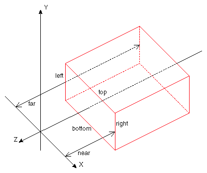
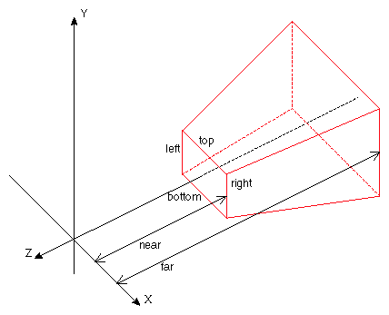

# 5장. 투영에 대해서 1/2

3차원 표현의 핵심은 무엇일까요? 바로 미술시간에 배운 소실점입니다. 그림 속에 소실점이 한 개가 있다면 원근감이 느껴집니다. OpenGL\|ES에서는 3차원 그림을 원근감이 있게 또는 없게 표현할 수 있습니다. 바로 소실점이 있거나 없는 것이지요. 원근감이 있게 표현하는 것은 Perspective\(원근\) 투영이라 하고 원근감이 없게 표현하는 것을 Orthographic\(직교\) 투영이라고 합니다.

원근감은 가까이 있는 물체 보다 멀리 있는 물체가 더 작게 보이는 효과를 뜻합니다. 따라서 사실적인 3차원 표현을 하려면 원근감이 있게 표현을 해야 합니다. 사실 이 원근감의 유무에 따라 2D게임과 3D게임이 나뉘기도 하며 2D게임을 제작할 때에는 대부분 원근감이 없도록 표현을 합니다. 즉, x, y 좌표만으로 물체의 위치를 정하며 원근감이 있는 3D게임에서는 x,y,z 좌표로 물체의 위치를 정합니다.

> \[참고\] OpenGL\|ES 를 이해하기 위해서는 렌더링 파이프라인과 관련 수학을 이해하고 있으면 좋습니다. 튜토리얼에서 다루기에는 내용이 조금 방대한 면이 있으므로 이 튜토리얼에서는 다루지 않겠습니다. 관련 내용은 [게임&인터랙티브 애플리케이션을 위한 수학](http://www.yes24.com/24/Goods/2807319?Acode=101) 이란 좋은 책이 있으므로 참고하시길 바랍니다. :\)

이 번 튜토리얼에서는 원근감이 없는 상태에서 점을 출력하는 예제를 만들어 보겠습니다. 다음은 이번 튜토리얼에서 다룰 내용입니다.

* glMatrixMode\(\)
* GL\_PROJECTION
* GL\_MODELVIEW
* glLoadIdentity\(\)
* GL\_POINTS
* glVertexPointer\(\)
* glEnableClientState\(\)
* glPointSize\(\)
* glDrawArrays\(\)
* glDisableClientState\(\)

아래의 화면은 만들어 볼 프로그램의 실행 결과 화면과 예제 코드입니다. 먼저 실행해 보실 분은 [소스코드](https://skyfe79.gitbooks.io/ios-opengles-tutorial/content/ch4/Tutorial04.zip)를 받아 컴파일해 보시길 바랍니다.


#### 1. OGLView 수정하기 <a id="1-oglview-%EC%88%98%EC%A0%95%ED%95%98%EA%B8%B0"></a>

iOS 에서 OpenGL은 CAEAGLLayer에 그려집니다. 지난 튜토리얼까지는 그림을 그리지 않고 배경 화면만 색상을 바꿔 보았습니다. CAEAGLLayer에 정점을 정의해 그림을 그리려면 추가적인 설정이 필요합니다. 바로 CAEAGLLayer의 드로잉 속성입니다. 이 속성으로 정해 주는 내용은 간단합니다.

* kEAGLDrawablePropertyColorFormat 레이어의 색상 형식을 설정합니다. 기본값으로 RGBA를 모두 표현할 수 있는 kEAGLColorFormatRGBA8 를 사용합니다.
* kEAGLDrawablePropertyRetainedBacking 레이어를 다 그리고 난 후 해당 내용을 메모리에 유지하고 있을 것인지 설정합니다. 메모리 사용과 성능 상의 이유로 꼭 필요할 경우가 아니면 NO로 설정하는 것이 좋습니다.

이제 관련 내용을 추가해 봅시다. OGLView.m 파일의 setupLayer메소드를 아래와 같이 수정합니다.

```objectivec
-(void)setupLayer
{
    eaglLayer = (CAEAGLLayer *)self.layer;
    [eaglLayer setOpaque:YES];
    //: 추가합니다. 
    [eaglLayer setDrawableProperties:[NSDictionary dictionaryWithObjectsAndKeys:
                                      [NSNumber numberWithBool:FALSE], kEAGLDrawablePropertyRetainedBacking,
                                      kEAGLColorFormatRGBA8, kEAGLDrawablePropertyColorFormat,
                                      nil]];
}
```

#### 2. DrawPointView 만들기 <a id="2-drawpointview-%EB%A7%8C%EB%93%A4%EA%B8%B0"></a>

OGLView를 상속받는 DrawPointView 클래스를 새로 만들어 줍니다. DrawPointView 클래스에서 직교 투영을 설정하고 점을 그리려 합니다.

우선 setupView 메서드를 재정의하여 투영을 직교 투영으로 설정하고 그림이 그려질 영역인 뷰포트 크기를 정의하겠습니다.

```objectivec
-(void)setupView
{
    //: 행렬 모드는 투영 행렬로 변경한다
    glMatrixMode(GL_PROJECTION);

    //: 투영행렬을 초기화 한다
    glLoadIdentity();

    //: 직교투영으로 설정한다
    glOrthof(0.0f, 1.0f, 0.0f, 1.0f, -1.0f, 1.0f);

    //: 뷰포트의 크기를 전체 화면으로 설정한다.
    glViewport(0, 0, self.bounds.size.width, self.bounds.size.height);
}
```

위의 함수 중에서 중요한 함수는 glOrthof 함수입니다. 직교투영 행렬을 정의하는 함수이기 때문입니다. 투영행렬을 만드는 것은 절두체를 설정하는 것입니다. 절두체는 \(x, y, z\) 축마다 범위를 설정하고 투영을 설정하여 객체 컬링\(범위 벗어나는 그림을 잘라내는 것\) 등에 사용됩니다. 아래 그림은 직교투영과 원근투영 절두체의 모양입니다.





각 절두체를 보면 \(left, right, top, bottom, near, far\) 항목이 있습니다. 이 것이 바로 \(x, y, z\)축의 범위값입니다

x축의 범위값은 \(left, right\)이고 y축의 범위값은 \(bottom, top\) 이고 z축의 범위값은 \(near, far\)입니다. 따라서 위 코드에서 glOrthof 함수 인자는 glOrthof\(left, right, bottom, top, near, far\) 입니다.그리고 위처럼 직교투영절두체의 범위를 설정하면 아이폰 화면의 좌-하단이 원점이 되도록 설정한 것입니다.


#### 3. 정점 정의하기 <a id="3-%EC%A0%95%EC%A0%90-%EC%A0%95%EC%9D%98%ED%95%98%EA%B8%B0"></a>

위의 결과물 화면을 보면 점이 4개가 화면에 그려지고 있습니다. 점은 벡터와 다르게 위치를 가지고 있습니다. 3차원에서 점의 위치는 \(x, y, z\) 성분으로 구성됩니다. OpenGL\|ES의 원점은 직교투영으로 설정한 절두체의 범위에 따라 달라집니다. 그래서 절두체의 범위를 변경하면 정점의 값이 일정해도 화면의 다른 위치에 출력됩니다. 우선은 결과처럼 점 4개를 출력해 보겠습니다. 원점을 화면 좌-하단이라 생각하고 정점의 위치를 설정합니다.

```objectivec
GLfloat points[] = {
    0.2, 0.2, 0.0,  //: 좌-하단
    0.8, 0.2, 0.0,  //: 우-하단
    0.2, 0.8, 0.0,  //: 좌-상단
    0.8, 0.8, 0.0   //: 우-상단
};
```

#### 4. 정점 그리기 <a id="4-%EC%A0%95%EC%A0%90-%EA%B7%B8%EB%A6%AC%EA%B8%B0"></a>

OpenGL\|ES에서 정점을 그리려면 정점을 정점 배열에 할당해 줘야 합니다. 정점배열과 OpenGL\|ES의 모델뷰행렬 등에 관해서는 다음 튜토리얼에서 자세히 다루겠습니다. 우선은 아래 코드처럼 작성해 봅시다.

```objectivec
-(void)renderView
{
    //: 배경을 검은색으로 지운다
    glClearColor(0.0, 0.0, 0.0, 1.0);
    glClear(GL_COLOR_BUFFER_BIT);

    //: 행렬 모드는 모델뷰 행렬로 변경한다
    glMatrixMode(GL_MODELVIEW);
    //: 모델뷰 행렬을 초기화한다
    glLoadIdentity();

    //: 정점배열을 설정한다
    glVertexPointer(3, GL_FLOAT, 0, points);
    glEnableClientState(GL_VERTEX_ARRAY);
    {
        //: 점의 크기를 설정한다
        glPointSize(10);
        //: 점의 색상을 설정한다
        glColor4f(1.0, 1.0, 1.0, 1.0);
        //: 정점 배열의 내용을 점으로 그린다
        glDrawArrays(GL_POINTS, 0, 4);
    }
    glDisableClientState(GL_VERTEX_ARRAY);
}
```

#### 5. 실행하기 <a id="5-%EC%8B%A4%ED%96%89%ED%95%98%EA%B8%B0"></a>

이제 코드를 컴파일하고 실행하면 위의 화면처럼 점 4개가 화면에 출력될 것입니다. 이제 glOrthof 함수의 내용을 아래처럼 변경하여 다시 컴파일하여 실행해 봅시다.

```objectivec
glOrthof(-1.0f, 1.0f, -1.0f, 1.0f, -1.0f, 1.0f);
```

이렇게 하면 원점이 화면의 정중앙이 되기 때문에 아래와 같이 출력됩니다.


정점의 좌표값을 수정해 보며 여러번 테스트 해 보세요. 그럼 여기서 4편 튜토리얼을 마치고 이번 튜토리얼에서 다루지 못한 내용은 다음 5편 튜토리얼에서 다뤄보겠습니다.

