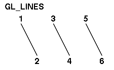
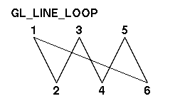
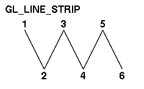
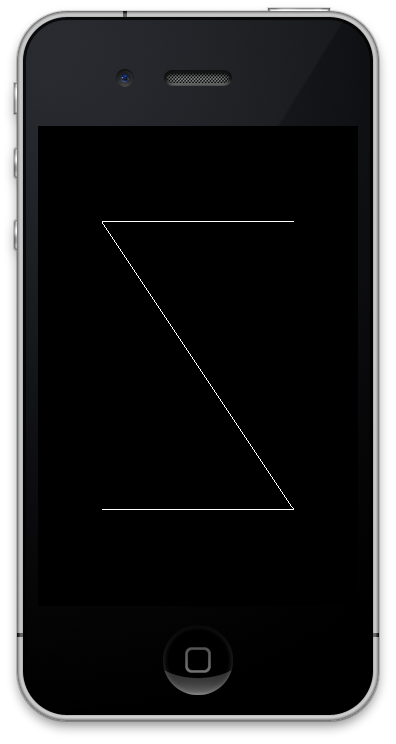
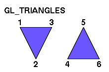
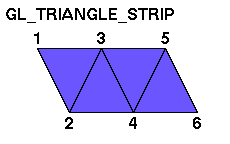
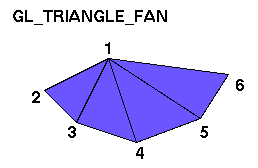

# 7장. 선분 및 삼각형 그리기

선분, 삼각형, 사각형 등 여러 폴리곤을 그려보겠습니다. 우선 선분을 그려보겠습니다. OpenGL\|ES 에서 선분을 그리는 방법은 총 3가지가 있습니다. GL\_LINES, GL\_LINE\_STRIP, GL\_LINE\_LOOP 로 아래는 각 방법을 그림으로 표현한 것입니다.

GL\_LINES 는 개개의 선분을 그리는 방법으로 각 선분마다 두 개의 정점이 필요합니다.



GL\_LINE\_LOOP 는 연결된 선분을 그리는 방법으로 선분의 끝점이 다음 선분의 시작점이 되고 마지막 점이 제일 처음 선분의 시작점과 연결됩니다.



GL\_LINE\_STRIP 도 연결된 선분을 그리는 방법으로 선분의 끝점이 다음 선분의 시작점이 되지만 마지막 점이 제일 처음 선분의 시작점과 연결되지는 않습니다.



그럼 위의 세 가지 방법에 따라 선분을 그려보겠습니다. 우선 정점을 아래와 같이 정의합니다.

```objectivec
GLfloat pointsForGL_LINES[] = {  
    0.2, 0.2, 0.0,  
    0.8, 0.2, 0.0,  
    0.2, 0.8, 0.0,  
    0.8, 0.8, 0.0,  
};
```

그리고 renderView 메서드를 아래와 같이 수정합니다.

```objectivec
-(void)renderView  
{  
    //: 배경을 검은색으로 지운다  
    glClearColor(0.0, 0.0, 0.0, 1.0);  
    glClear(GL_COLOR_BUFFER_BIT);  

    //: 행렬 모드는 모델뷰 행렬로 변경한다  
    glMatrixMode(GL_MODELVIEW);  
    //: 모델뷰 행렬을 초기화한다  
    glLoadIdentity();  

    //: 정점배열을 설정한다  
    glVertexPointer(3, GL_FLOAT, 0, pointsForGL_LINES);  
    glEnableClientState(GL_VERTEX_ARRAY);  
    {  
        //: 색상을 설정한다  
        glColor4f(1.0, 1.0, 1.0, 1.0);  
        //: 여러 선분을 그린다. 처리할 정점의 개수는 4개  
        glDrawArrays(GL_LINES, 0, 4);  
    }  
    glDisableClientState(GL_VERTEX_ARRAY);  
}
```

빌드하고 실행하면 아래와 같이 두 개의 선분이 그려진 화면을 볼 수 있습니다.


```objectivec
GLfloat pointsForGL_LINE_LOOP[] = {  
    0.2, 0.2, 0.0,   //v1  
    0.8, 0.2, 0.0,   //v2  
    0.8, 0.8, 0.0,   //v3  
    0.2, 0.8, 0.0,   //v4  
};
```

그리고 renderView를 아래와 같이 수정합니다.

```objectivec
-(void)renderView  
{  
    //: 배경을 검은색으로 지운다  
    glClearColor(0.0, 0.0, 0.0, 1.0);  
    glClear(GL_COLOR_BUFFER_BIT);  

    //: 행렬 모드는 모델뷰 행렬로 변경한다  
    glMatrixMode(GL_MODELVIEW);  
    //: 모델뷰 행렬을 초기화한다  
    glLoadIdentity();  

    //: 정점배열을 설정한다  
    glVertexPointer(3, GL_FLOAT, 0, pointsForGL_LINE_LOOP);  
    glEnableClientState(GL_VERTEX_ARRAY);  
    {  
        //: 색상을 설정한다  
        glColor4f(1.0, 1.0, 1.0, 1.0);  
        //: 사각형을 그린다. 처리할 정점의 개수는 4개  
        glDrawArrays(GL_LINE_LOOP, 0, 4);  
    }  
    glDisableClientState(GL_VERTEX_ARRAY);  
}
```

빌드하고 실행하면 아래와 같이 사각형이 그려진 화면을 볼 수 있습니다. 결과 화면을 보면 v4와 v1이 연결된 것을 확인할 수 있습니다.


이제 GL\_LINE\_STRIP을 이용해 역Z자를 그려보겠습니다. 아래와 같이 정점을 설정합니다.

```objectivec
GLfloat pointsForGL_LINE_STRIP[] = {  
    0.2, 0.2, 0.0,  //v1  
    0.8, 0.2, 0.0,  //v2  
    0.2, 0.8, 0.0,  //v3  
    0.8, 0.8, 0.0,  //v4  
};
```

그리고 renderView를 아래와 같이 수정합니다.

```objectivec
-(void)renderView  
{  
    //: 배경을 검은색으로 지운다  
    glClearColor(0.0, 0.0, 0.0, 1.0);  
    glClear(GL_COLOR_BUFFER_BIT);  

    //: 행렬 모드는 모델뷰 행렬로 변경한다  
    glMatrixMode(GL_MODELVIEW);  
    //: 모델뷰 행렬을 초기화한다  
    glLoadIdentity();  

    //: 정점배열을 설정한다  
    glVertexPointer(3, GL_FLOAT, 0, pointsForGL_LINE_STRIP);  
    glEnableClientState(GL_VERTEX_ARRAY);  
    {  
        //: 색상을 설정한다  
        glColor4f(1.0, 1.0, 1.0, 1.0);  
        //: 역Z를 그린다. 처리할 정점의 개수는 4개  
        glDrawArrays(GL_LINE_STRIP, 0, 4);  
    }  
    glDisableClientState(GL_VERTEX_ARRAY);  
}
```

빌드하고 실행하면 아래와 같이 역Z자가 그려진 화면을 볼 수 있습니다.



GL\_LINE\_LOOP와 GL\_LINE\_STRIP의 차이점이 궁금하신 분은 renderView를 아래와 같이 설정하고 실행해 보세요.

```objectivec
-(void)renderView  
{  
    //: 배경을 검은색으로 지운다  
    glClearColor(0.0, 0.0, 0.0, 1.0);  
    glClear(GL_COLOR_BUFFER_BIT);  

    //: 행렬 모드는 모델뷰 행렬로 변경한다  
    glMatrixMode(GL_MODELVIEW);  
    //: 모델뷰 행렬을 초기화한다  
    glLoadIdentity();  

    //: 정점배열을 설정한다  
    glVertexPointer(3, GL_FLOAT, 0, pointsForGL_LINE_LOOP);  
    glEnableClientState(GL_VERTEX_ARRAY);  
    {  
        //: 색상을 설정한다  
        glColor4f(1.0, 1.0, 1.0, 1.0);  
        //: 역ㄷ자를 그린다 처리할 정점의 개수는 4개  
        glDrawArrays(GL_LINE_STRIP, 0, 4);  
    }  
    glDisableClientState(GL_VERTEX_ARRAY);  
}
```

선분은 모두 그려 보았으니 이제 삼각형을 그려보겠습니다. 삼각형을 그리는 방법에는 GL\_TRIANGLES, GL\_TRIANGLE\_STRIP, GL\_TRIANGLE\_FAN 이 있습니다. 아래는 각 방법을 그림으로 표현한 것입니다.

GL\_TRIANGLES 는 한 삼각형을 그릴 때마다 3개의 정점이 필요합니다. 따라서 2개의 삼각형을 그리면 6개의 정점이 필요합니다.



GL\_TRIANGLE\_STRIP은 첫 삼각형을 그릴 때는 3개의 정점이 필요하지만 다음 삼각형을 그릴 때에는 한 개의 정점만 필요합니다. 이전 삼각형의 마지막 정점 두 개를 재 사용하기 때문입니다. 예를 들어 v1, v2, v3 로 삼각형을 그린 후 새로운 정점 v4를 추가하면 v2, v3, v4 로 삼각형이 그려집니다.



GL\_TRIANGLE\_FAN은 GL\_TRIANGLE\_STRIP과 비슷하지만 이전 삼각형의 두 점을 재 사용하는 것이 아니라 항상 첫 삼각형의 시작 정점 한 개와 이전 삼각형의 마지막 정점을 재사용합니다. 예를 들어 v1, v2, v3 로 삼각형을 그린 후 새로운 정점 v4를 추가하면 v1, v3, v4로 삼각형이 그려집니다. 여기에 다시 v5를 추가하면 v1, v4, v5로 삼각형이 그려집니다.



우선 GL\_TRIANGLES로 두 개의 삼각형을 그려보겠습니다. 두 개를 그리는 것이므로 6개의 정점이 필요합니다. 아래와 같이 정점을 선언합니다.


```objectivec
GLfloat pointsForGL_TRIANGLES[] = {  
    0.2, 0.2, 0.0,  //v1  
    0.8, 0.2, 0.0,  //v2  
    0.8, 0.8, 0.0,  //v3  

    0.2, 0.3, 0.0,  //v4  
    0.8, 0.9, 0.0,  //v5  
    0.2, 0.9, 0.0,  //v6  
};
```

그리고 renderView를 아래와 같이 수정합니다.

```objectivec
-(void)renderView  
{  
    //: 배경을 검은색으로 지운다  
    glClearColor(0.0, 0.0, 0.0, 1.0);  
    glClear(GL_COLOR_BUFFER_BIT);  

    //: 행렬 모드는 모델뷰 행렬로 변경한다  
    glMatrixMode(GL_MODELVIEW);  
    //: 모델뷰 행렬을 초기화한다  
    glLoadIdentity();  

    //: 정점배열을 설정한다  
    glVertexPointer(3, GL_FLOAT, 0, pointsForGL_TRIANGLES);  
    glEnableClientState(GL_VERTEX_ARRAY);  
    {  
        //: 색상을 설정한다  
        glColor4f(1.0, 1.0, 1.0, 1.0);  
        //: 삼각형 두개를 그린다. 처리할 정점의 개수는 6개  
        glDrawArrays(GL_TRIANGLES, 0, 6);  
    }  
    glDisableClientState(GL_VERTEX_ARRAY);  
}
```

빌드 후 실행하면 아래와 같은 화면을 볼 수 있습니다.


이제 GL\_TRIANGLE\_STRIP으로 두개의 삼각형을 그려보겠습니다. 우선 정점을 설정합니다.

```objectivec
GLfloat pointsForGL_TRIANGLE_STRIP[] = {  
    0.2, 0.8, 0.0,  //v1  
    0.2, 0.2, 0.0,  //v2  
    0.8, 0.8, 0.0,  //v3  
    0.8, 0.2, 0.0,  //v4  
};
```

그리고 renderView를 아래와 같이 설정합니다.

```objectivec
-(void)renderView  
{  
    //: 배경을 검은색으로 지운다  
    glClearColor(0.0, 0.0, 0.0, 1.0);  
    glClear(GL_COLOR_BUFFER_BIT);  

    //: 행렬 모드는 모델뷰 행렬로 변경한다  
    glMatrixMode(GL_MODELVIEW);  
    //: 모델뷰 행렬을 초기화한다  
    glLoadIdentity();  

    //: 정점배열을 설정한다  
    glVertexPointer(3, GL_FLOAT, 0, pointsForGL_TRIANGLE_STRIP);  
    glEnableClientState(GL_VERTEX_ARRAY);  
    {  
        //: 색상을 설정한다  
        glColor4f(1.0, 1.0, 1.0, 1.0);  
        //: 삼각형 두개를 그린다. 처리할 정점의 개수는 4개  
        glDrawArrays(GL_TRIANGLE_STRIP, 0, 4);  
    }  
    glDisableClientState(GL_VERTEX_ARRAY);  
}
```

빌드 후 실행하면 아래와 같은 화면을 볼 수 있습니다. 결과는 사각형이지만 삼각형 두 개가 모여 사각형으로 표현된 것입니다.


이제 GL\_TRIANGLE\_FAN으로 여러 삼각형을 그려보겠습니다. 아래와 같이 정점을 설정합니다.

```objectivec
GLfloat pointsForGL_TRIANGLE_FAN[] = {  
    0.2, 0.8, 0.0,  //v1  
    0.2, 0.2, 0.0,  //v2  
    0.8, 0.2, 0.0,  //v3  
    0.8, 0.8, 0.0,  //v4  
    0.8, 1.0, 0.0,  //v5  
};
```

그리고 renderView를 아래와 같이 수정합니다.

```objectivec
-(void)renderView  
{  
    //: 배경을 검은색으로 지운다  
    glClearColor(0.0, 0.0, 0.0, 1.0);  
    glClear(GL_COLOR_BUFFER_BIT);  

    //: 행렬 모드는 모델뷰 행렬로 변경한다  
    glMatrixMode(GL_MODELVIEW);  
    //: 모델뷰 행렬을 초기화한다  
    glLoadIdentity();  

    //: 정점배열을 설정한다  
    glVertexPointer(3, GL_FLOAT, 0, pointsForGL_TRIANGLE_FAN);  
    glEnableClientState(GL_VERTEX_ARRAY);  
    {  
        //: 색상을 설정한다  
        glColor4f(1.0, 1.0, 1.0, 1.0);  
        //: 삼각형 3개를 그린다. 처리할 정점의 개수는 5개  
        glDrawArrays(GL_TRIANGLE_FAN, 0, 5);  
    }  
    glDisableClientState(GL_VERTEX_ARRAY);  
}
```

빌드 후 실행하면 아래와 같은 화면을 볼 수 있습니다.


OpenGL에는 사각형을 그리는 GL\_QUADS 및 GL\_QUAD\_STRIP 모드가 있지만 OpenGL\|ES에는 없습니다. 따라서 사각형을 그리려면 GL\_TRIANGLES, GL\_TRIANGLE\_STRIP, GL\_TRIANGLE\_FAN을 사용해야 합니다. 위에서 살펴 보았듯이 삼각형을 이용해 사각형을 그리는 것은 어려운 일이 아닙니다. 이번 튜토리얼은 여기서 마치겠습니다. ^^

[소스코드](https://skyfe79.gitbooks.io/ios-opengles-tutorial/content/ch6/Tutorial06.zip)

