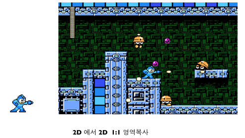

# 11장. 텍스춰 UV좌표

이번 장에서는 텍스춰의 UV좌표\(또는 ST좌표\)를 다루겠습니다. 3차원에서 이미지를 표현하려면 텍스춰 매핑이라는 과정이 필요합니다. 2D게임 제작에 익숙하신 분들은 게임 화면 내에 스프라이트를 표현할 때 copy rect 기법으로 이미지의 한 영역을 게임 화면의 한 영역으로 바로 복사했을 것입니다. 이 것이 가능한 이유는 2차원 이미지에서 2차원 화면에 복사하기 때문입니다. 즉, 같은 차원의 복사이므로 영역 복사만 해 주어도 이미지의 픽셀이 화면의 픽셀에 바로 맵핑되었던 것입니다.



하지만 OpenGL\|ES는 3차원 그래픽스를 다루는 라이브러리입니다. 우리가 2차원 이미지를 3차원 폴리곤에 복사할 때는 영역 복사만으로는 해결할 수 없는 문제점이 너무 많습니다. 지금 우리가 다루고 있는 예제는 단순한 2차원 삼각형 또는 사각형이라서 영역 복사를 해도 되지 않을까 생각하지만 만약 삼각형 또는 사각형이 아닌 주전자, 게임 캐릭터와 같은 깊이와 곡률이 있는 3차원 기하에는 영역 복사를 사용할 수 없음을 금방 알 수 있습니다.


따라서 2차원 이미지를 3차원 기하에 맵핑하는 방법이 필요하게 됩니다. 이 때 사용되는 좌표가 바로 UV좌표입니다. \(u,v\) 좌표로 정의된 텍스춰 이미지를 \(x, y, z\) 좌표로 정의된 기하에 맵핑하는 것이 텍스춰맵핑이며 이 과정에서 다양한 픽셀 연산을 거치게 됩니다. UV좌표는 일반적으로 \[0.0, 1.0\] 범위를 갖습니다. UV좌표쌍은 맵핑할 폴리곤을 정의하는 정점에 할당됩니다. 앞의 예제에서는 UV좌표를 우리가 직접 구성해 주었습니다. 하지만 복잡한 게임 캐릭터의 경우에는 거의 불가능할 것입니다. 이런 것을 도와 주는 것이 바로 3D 그래픽스 툴인 3Ds Max, Maya, Blender 등 입니다.

아래는 UV좌표로 정의된 텍스춰를 폴리곤에 맵핑한 예를 나타낸 그림입니다.


폴리곤의 각 정점에 UV좌표를 할당하여 텍스춰 이미지에서 어느 부분을 폴리곤에 맵핑할 것인지 정했습니다. 위의 예에서는 텍스춰 이미지의 1/4 을 폴리곤에 맵핑했습니다. 실제 코드로 작성해 보겠습니다. 정점 배열을 아래와 같이 수정합니다.

```objectivec
GLfloat verticesForGL_TRIANGLE_STRIP[] = {  
    0.2, 1.05, 0.0,          //v1  
    0.0, 0.5,                //UV1  

    0.2, 0.45, 0.0,          //v2  
    0.0, 0.0,                //UV2  

    0.8, 1.05, 0.0,          //v3  
    0.5, 0.5,                //UV3  

    0.8, 0.45, 0.0,          //v4  
    0.5, 0.0,                //UV4  
};
```

이제 빌드 후 실행해 보면 아래와 같이 폴리곤에 텍스춰 이미지의 1/4만 맵핑되어 나옮을 확인할 수 있습니다.


마지막으로 각 모퉁이에 텍스춰 이미지의 1/4 씩 매핑하는 코드를 작성해 보겠습니다. 아래와 같이 4개의 폴리곤으로 구성된 모델을 정의하는 정점배열을 만듭니다.

```objectivec
GLfloat model[4][20] = {  
    //top-left  
    {  
        0.0, 1.5, 0.0,          //v1  
        0.0, 1.0,               //UV1  

        0.4, 1.5, 0.0,          //v2  
        0.5, 1.0,               //UV2  

        0.0, 1.1, 0.0,          //v3  
        0.0, 0.5,               //UV3  

        0.4, 1.1, 0.0,          //v4  
        0.5, 0.5,               //UV4  
    },  
    //top-right  
    {  
        0.6, 1.5, 0.0,          //v1  
        0.5, 1.0,               //UV1  

        1.0, 1.5, 0.0,          //v2  
        1.0, 1.0,               //UV2  

        0.6, 1.1, 0.0,          //v3  
        0.5, 0.5,               //UV3  

        1.0, 1.1, 0.0,          //v4  
        1.0, 0.5,               //UV4  
    },  
    //bottom-left  
    {  
        0.0, 0.4, 0.0,          //v1  
        0.0, 0.5,               //UV1  

        0.4, 0.4, 0.0,          //v2  
        0.5, 0.5,               //UV2  

        0.0, 0.0, 0.0,          //v3  
        0.0, 0.0,               //UV3  

        0.4, 0.0, 0.0,          //v4  
        0.5, 0.0,               //UV4  
    },  
    //bottom-right  
    {  
        0.6, 0.4, 0.0,          //v1  
        0.5, 0.5,               //UV1  

        1.0, 0.4, 0.0,          //v2  
        1.0, 0.5,               //UV2  

        0.6, 0.0, 0.0,          //v3  
        0.5, 0.0,               //UV3  

        1.0, 0.0, 0.0,          //v4  
        1.0, 0.0,               //UV4  
    }  
};
```

그리고 아래와 같이 renderView 코드를 작성합니다.

```objectivec
-(void)renderView  
{  
    //: 배경을 검은색으로 지운다  
    glClearColor(0.0, 0.0, 0.0, 1.0);  
    glClear(GL_COLOR_BUFFER_BIT);  

    //: 행렬 모드는 모델뷰 행렬로 변경한다  
    glMatrixMode(GL_MODELVIEW);  
    //: 모델뷰 행렬을 초기화한다  
    glLoadIdentity();  


    for(int i=0; i<4; i++)  
    {  
        //: 정점배열을 설정한다  
        glVertexPointer(3, GL_FLOAT, sizeof(GLfloat)*5,  
                        model[i]);  
        //: 텍스춰배열을 설정한다ㅏ  
        glTexCoordPointer(2, GL_FLOAT, sizeof(GLfloat)*5,  
                          model[i]+3);  

        //: 색상 칠하기 방법을 설정한다  
        glShadeModel(GL_SMOOTH);  

        //: 텍스춰 배열 사용을 ON  
        glEnableClientState(GL_TEXTURE_COORD_ARRAY);  
        //: 정점 배열 사용을 ON  
        glEnableClientState(GL_VERTEX_ARRAY);  
        {  
            //: 처리할 정점의 개수는 4개  
            glEnable(GL_TEXTURE_2D);  
            [texture bindTexture];  
            glDrawArrays(GL_TRIANGLE_STRIP, 0, 4);  
            glDisable(GL_TEXTURE_2D);  
        }  
        //: 정점 배열 사용을 OFF  
        glDisableClientState(GL_VERTEX_ARRAY);  
        //: 텍스춰 좌표 배열 사용을 OFF  
        glDisableClientState(GL_TEXTURE_COORD_ARRAY);  
    }  
}
```

빌드하고 실행하면 아래와 같은 화면을 볼 수 있습니다.


다음 튜토리얼에서는 glTexParameter 함수를 중심으로 텍스춰 맵핑의 여러 방법에 대해서 알아보겠습니다.^^

**참고문서**

1. [OpenGL로 배우는 컴퓨터 그래픽스, 한빛미디어, 주우석 저](http://www.yes24.com/24/Goods/1945821?Acode=101)

