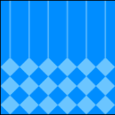
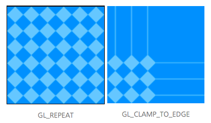
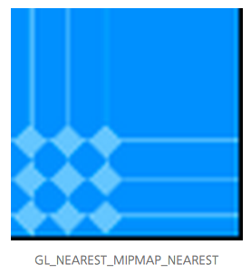
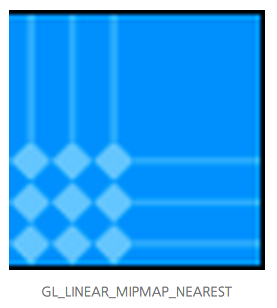
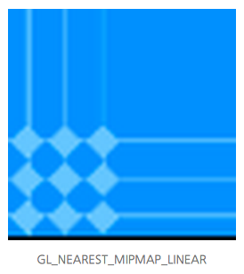
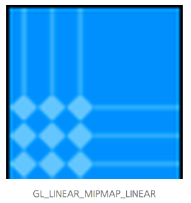

# 12장. 텍스춰매핑 파라미터

이번 장에서는 glTexParameter 함수를 조금 깊게 다뤄 보겠습니다. glTexParameter함수로 설정할 수 있는 항목은 GL\_TEXTURE\_MIN\_FILTER, GL\_TEXTURE\_MAG\_FILTER, GL\_TEXTURE\_WRAP\_S, GL\_TEXTURE\_WRAP\_T, GL\_GENERATE\_MIPMAP 입니다. 이 항목들은 무엇을 뜻하는 것일까요? 이 질문에 대한 답은 glTexParameter 함수가 하는 일을 이해하면 알 수 있습니다.

텍스춰맵핑은 2차원 이미지를 3차원 기하에 맵핑하는 작업입니다. 10편 튜토리얼에서 3차원 기하는 깊이와 곡률이 있기 때문에 2차원 이미지를 3차원 기하에 1:1로 픽셀 맵핑을 할 수 없다고 했습니다. 따라서 2차원 이미지에서 어떤 픽셀을 어떻게 가져와 3차원 기하에 맵핑할 것인가에 대한 방법이 필요합니다. 이를 샘플링이라고 한다면 glTexParameter함수는 3차원 기하에 필요한 화소를 2차원 이미지에서 샘플링하는 방법을 설정하는 함수입니다. 샘플링 방법과 샘플링을 위한 최적화 방법 등을 glTexParameter 함수를 통해 설정합니다.

#### GL\_TEXTURE\_MIN\_FILTER와 GL\_TEXTURE\_MAG\_FILTER <a id="gl-texture-min-filter%EC%99%80-gl-texture-mag-filter"></a>

2차원 이미지를 같은 3차원 기하에 텍스춰맵핑하더라도 3차원 기하의 깊이에 따라 크기가 달라집니다. 즉, 화면에 가까우면 크게 보이고 화면에서 멀면 작게 보입니다.


위의 그림처럼 가까이 있는 사각형은 크게 보이고 멀리 있는 사각형은 작게 보입니다. 만약 1:1로 2D이미지를 맵핑한다면 가까운 사각형에는 빈칸이 많을 것이고 멀리 있는 사각형에는 픽셀 뭉침이 발생할 것입니다. 이렇게 기하의 확대 및 축소에 따라 이미지의 어떤 부분에서 화소를 가져올 것인가를 선택하는 것이 GL\_TEXTURE\_MIN\_FILTER와 GL\_TEXTURE\_MAG\_FILTER 입니다.


위는 기하\(폴리곤\)가 텍스춰\(2차원 이미지에 S,T 좌표로 추출한 이미지 데이터\)보다 작을 때 적용되는 GL\_TEXTURE\_MIN\_FILTER 를 나타낸 그림입니다. GL\_TEXTURE\_MIN\_FILTER 의 값이 GL\_NEAREST이면 기하의 픽셀 중점인 빨간색점에 가까운 텍스춰의 화소를 선택하여 17번을 사용하고 GL\_LINEAR이면 17, 18, 12, 13 화소의 평균값을 사용합니다.


위는 기하가 텍스춰보다 클 때 적용되는 GL\_TEXTURE\_MAG\_FILTER를 나타낸 것입니다. GL\_TEXTURE\_MAG\_FILTER의 값이 GL\_NEAREST이면 기하의 픽셀 중점인 빨간색점에 가까운 텍스춰의 화소를 선택하여 10번을 사용하고 GL\_LINEAR이면 13, 14, 9, 10 화소의 평균값을 사용합니다.

OGLTexture.m 파일을 열어 generateTexture 메소드를 아래와 같이 수정합니다.

```objectivec
-(BOOL)generateTexture  
{  
    ...  
    //: 텍스춰 파라미터를 설정한다  
    glTexParameteri(GL_TEXTURE_2D, GL_TEXTURE_MIN_FILTER, GL_NEAREST);  
    glTexParameteri(GL_TEXTURE_2D, GL_TEXTURE_MAG_FILTER, GL_NEAREST);  
    ...  
    return YES;  
}
```

컴파일하고 실행하면 왼쪽 그림과 같이 앨리어싱이 심하게 발생한 결과를 볼 수 있습니다. 값을 GL\_LINEAR로 주고 실행하면 오른쪽 그림과 같이 결과가 부드럽게 생성됩니다.


GL\_TEXTURE\_MIN\_FILTER와 GL\_TEXTURE\_MAG\_FILTER를 항상 같은 값으로 설정해야 하는 것은 아닙니다. 축소될 때는 앨리어싱이 크게 상관 없으므로 GL\_NEAREST를 사용하고 확대되었을 때에는 부드럽게 나오도록 GL\_LINEAR를 사용할 수 있습니다.

```objectivec
glTexParameteri(GL_TEXTURE_2D, GL_TEXTURE_MIN_FILTER, GL_NEAREST);  
glTexParameteri(GL_TEXTURE_2D, GL_TEXTURE_MAG_FILTER, GL_LINEAR);
```


#### GL\_TEXTURE\_WRAP\_S와 GL\_TEXTURE\_WRAP\_T <a id="gl-texture-wrap-s%EC%99%80-gl-texture-wrap-t"></a>

10장에서 \(u,v\) 또는 \(s,t\)좌표의 범위는 \[0.0, 1.0\] 이라고 했습니다. 하지만 만약 이 범위를 벗어나게 설정하면 이미지의 어느 부분에서 화소를 가져와야 할까요? 이럴 경우에 샘플링 방법을 GL\_TEXTURE\_WRAP\_S와 GL\_TEXTURE\_WRAP\_T로 설정할 수 있습니다. 이미지 자체를 반복\(GL\_REPEAT\) 또는 이미지의 테두리 값 반복\(GL\_CLAMP\_TO\_EDGE\) 중 한 가지로 설정하면 됩니다. 예제를 통해 차이점을 알아보겠습니다.

OGLTexture.m 파일을 열어 generateTexture 메소드를 아래와 같이 수정합니다.

```objectivec
-(BOOL)generateTexture  
{  
    ...  
    //: 텍스춰 파라미터를 설정한다  
    glTexParameteri(GL_TEXTURE_2D, GL_TEXTURE_MIN_FILTER, GL_LINEAR);  
    glTexParameteri(GL_TEXTURE_2D, GL_TEXTURE_MAG_FILTER, GL_LINEAR);  
    glTexParameteri(GL_TEXTURE_2D, GL_TEXTURE_WRAP_S, GL_REPEAT);  
    glTexParameteri(GL_TEXTURE_2D, GL_TEXTURE_WRAP_T, GL_CLAMP_TO_EDGE);  
    ...  
    return YES;  
}
```

위의 코드는 가로 범위\(s\)가 \[0.0, 1.0\]을 넘으면 이미지 자체를 반복하고 세로 범위\(t\)가 \[0.0, 1.0\]을 넘으면 이미지의 테두리 값을 반복하도록 설정한 것입니다.

그리고 TextureMappedPolygonView.m 파일을 열어 아래와 같이 텍스춰좌표를 설정합니다.

```objectivec
GLfloat verticesForGL_TRIANGLE_STRIP[] = {  
    0.2, 1.05, 0.0,          //v1  
    0.0, 2.0,                //UV1  

    0.2, 0.45, 0.0,          //v2  
    0.0, 0.0,                //UV2  

    0.8, 1.05, 0.0,          //v3  
    2.0, 2.0,                //UV3  

    0.8, 0.45, 0.0,          //v4  
    2.0, 0.0,                //UV4  
};
```

컴파일하고 실행하면 아래와 같은 결과를 볼 수 있습니다.



아래는 가로, 세로를 모두 같은 값으로 주어 실행한 결과입니다.



#### GL\_GENERATE\_MIPMAP <a id="gl-generate-mipmap"></a>

밉맵은 빠른 렌더링을 위해서 여러벌의 텍스춰를 미리 만들어 놓는 것입니다. 밉맵에 대한 자세한 내용은 [위키피디아](http://en.wikipedia.org/wiki/Mipmap)에서 확인할 수 있습니다. 만약 64x64 크기의 이미지를 사용할 때, 밉맵을 생성하게 하면 32x32, 16x16, 8x8, 4x4, 1x1 크기의 이미지를 생성합니다. 64x64 텍스춰 이미지를 맵핑한 3차원 기하가 화면에서 멀어 4x4 크기를 갖는다면 4x4 텍스춰 이미지를 맵핑하는 것이 더 빠르고 더 효율적일 것입니다. 밉맵을 사용할 때는 GL\_TEXTURE\_MIN\_FILTER에 설정하는 값이 4개 더 추가 됩니다.

* GL\_NEAREST\_MIPMAP\_NEAREST
  * 현재 텍스춰 크기와 비슷한 밉맵을 선택한 다음 NEAREST방법으로 화소 추출
* GL\_LINEAR\_MIPMAP\_NEAREST
  * 현재 텍스춰 크기와 비슷한 밉맵을 선택한 다음 LINEAR방법으로 화소 추출
* GL\_NEAREST\_MIPMAP\_LINEAR
  * 현재 텍스춰 크기와 비슷한 두 개의 밉맵을 선택한 다음 각각의 밉맵에서 NEAREST 방법으로 두 개의 화소를 추출한 다음 평균을 내어 화소값으로 사용
* GL\_LINEAR\_MIPMAP\_LINEAR
  * 현재 텍스춰 크기와 비슷한 두 개의 밉맵을 선택한 다음 각각의 밉맵에서 LINEAR방법으로 두 개의 화소를 추출한 다음 평균을 내어 화소값으로 사용

아래와 같이 밉맵 사용을 활성화 하고 GL\_TEXTURE\_MIN\_FILTER에 GL\_LINEAR\_MIPMAP\_LINEAR 값을 설정합니다.

```objectivec
-(BOOL)generateTexture  
{  
    ...  
    //: 텍스춰 파라미터를 설정한다  
    glTexParameteri(GL_TEXTURE_2D, GL_GENERATE_MIPMAP, GL_TRUE);  
    glTexParameteri(GL_TEXTURE_2D, GL_TEXTURE_MIN_FILTER, GL_LINEAR_MIPMAP_LINEAR);  
    glTexParameteri(GL_TEXTURE_2D, GL_TEXTURE_MAG_FILTER, GL_LINEAR);  
    ...  
    return YES;  
}
```

그리고 밉맵을 사용하기 위해서 renderView메서드에서 glScalef를 사용해 폴리곤을 축소합니다.\(아직 변환을 다루지는 않았지만 밉맵적용을 위해 사용합니다.\)

```objectivec
-(void)renderView  
{  
    //: 배경을 검은색으로 지운다  
    glClearColor(0.0, 0.0, 0.0, 1.0);  
    glClear(GL_COLOR_BUFFER_BIT);  

    //: 행렬 모드는 모델뷰 행렬로 변경한다  
    glMatrixMode(GL_MODELVIEW);  
    //: 모델뷰 행렬을 초기화한다  
    glLoadIdentity();  

    //: 밉맵 테스트  
    glScalef(0.3, 0.3, 1.0);  

    ...  
}
```

설정값을 변경하여 실행해 보면 아래와 같은 결과를 얻을 수 있습니다. 이미지가 작아서 잘 분간이 안되지만 자세히 보면 하얀선의 표현이 조금씩 다른 것을 확인할 수 있습니다.









텍스춰맵핑에 대한 기초 부분은 여기서 마치고 다음 시간부터는 3차원 기하 표현을 다루겠습니다. 텍스춰 고급은 그 후에 다시 다룰게요^^ 긴 글 읽어 주셔서 감사합니다.

