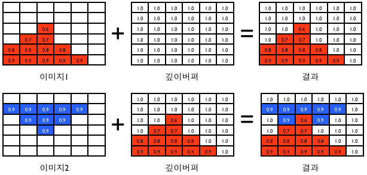
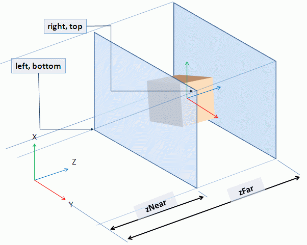
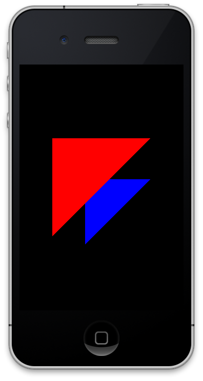

# 13장. 깊이버퍼

3D로 나아가기 위한 준비 작업으로 OGLView를 수정하고 깊이버퍼를 다루겠습니다.

그동안 결과 화면이 모두 2차원 그림이어서 정점의 z값을 무시했었습니다. 3차원 세상을 즐겨보기 위해서 이제 z값을 살려 보겠습니다 ^^ 정 점의 z 값을 살리려면 프레임 버퍼에 깊이 버퍼를 설정해야 합니다. z 값을 바탕으로 화면에서 가까운 거리에 있느냐 먼거리에 있느냐를 따집니다. 가까이 있는 물체와 멀리 있는 물체를 비교하면 깊이가 느껴지기 때문에 깊이 버퍼라 부릅니다. 또는 z값을 바탕으로 구성되는 버퍼이기 때문에 z버퍼라고도 부릅니다. 깊이 버퍼가 필요한 이유는 먼거리에 있는 그림이 가까운 거리에 있는 그림 위에 그려지지 않게 하기 위해서 입니다. 깊이 버퍼에 대해서는 OGLView를 수정하고 나서 다시 자세히 다뤄보겠습니다.

#### 깊이버퍼 추가하기 <a id="%EA%B9%8A%EC%9D%B4%EB%B2%84%ED%8D%BC-%EC%B6%94%EA%B0%80%ED%95%98%EA%B8%B0"></a>

OGLView.h 파일을 열어서 아래와 같이 작성합니다.

```objectivec
#import <UIKit/UIKit.h>  
#import <QuartzCore/QuartzCore.h>  
#import <OpenGLES/ES1/gl.h>  
#import <OpenGLES/ES1/glext.h>  

@interface OGLView : UIView  
{  
    CAEAGLLayer        *eaglLayer;  
    EAGLContext        *context;  

    //: 프레임버퍼 이름  
    GLuint          framebuffer;  
    //: 색상버퍼 이름  
    GLuint            colorRenderBuffer;  
    //: 깊이버퍼 이름  
    GLuint          depthRenderBuffer;  
}  
+(id)oglView;  
-(void)setupView;  
-(void)renderView;  
@end
```

각 버퍼의 메모리를 관리하기 위해서 각 버퍼의 이름 변수를 추가 했습니다.

이제 OGLView.m 파일을 열어 setupRenderBuffer 메서드를 아래와 같이 작성합니다.

```objectivec
-(void)setupRenderBuffer  
{  
    //: 색상렌더 버퍼 생성  
    glGenRenderbuffersOES(1, &colorRenderBuffer);  
    glBindRenderbufferOES(GL_RENDERBUFFER_OES, colorRenderBuffer);     

    //: 깊이렌더 버퍼 생성  
    glGenRenderbuffersOES(1, &depthRenderBuffer);  
    glBindRenderbufferOES(GL_RENDERBUFFER_OES, depthRenderBuffer);  
}
```

색상 버퍼와 깊이 버퍼를 생성했습니다. 이제 프레임버퍼 바인딩해 줍니다. setupFrameBuffer 메소드를 아래와 같이 작성합니다.

```objectivec
-(void)setupFrameBuffer  
{  
    glGenFramebuffersOES(1, &framebuffer);  
    glBindFramebufferOES(GL_FRAMEBUFFER_OES, framebuffer);  
    glFramebufferRenderbufferOES(GL_FRAMEBUFFER_OES, GL_COLOR_ATTACHMENT0_OES, GL_RENDERBUFFER_OES, colorRenderBuffer);  
    glFramebufferRenderbufferOES(GL_FRAMEBUFFER_OES, GL_DEPTH_ATTACHMENT_OES, GL_RENDERBUFFER_OES, depthRenderBuffer);  
}
```

이제 렌더버퍼의 공유메모리를 할당해야 합니다. 이것을 하기 위해 적당한 장소는 뷰의 프레임크기가 변경될 때 호출되는 layoutSubviews 메서드입니다. 아래와 같이 작성합니다.

```objectivec
- (void)layoutSubviews  
{  
    //: layoutSubview는 뷰의 프레임이 변경될 때 호출되므로 여기서 렌더버퍼의 스토리지 크기를 설정하는 것이 좋다  
    GLint backingWidth;  
    GLint backingHeight;  

    //: 현재 레이어의 크기를 바탕으로 렌더 버퍼의 크기를 잡는다  
    //: 색상 버퍼  
    glBindRenderbufferOES(GL_RENDERBUFFER_OES, colorRenderBuffer);  
    [context renderbufferStorage:GL_RENDERBUFFER_OES fromDrawable:eaglLayer];  
    glGetRenderbufferParameterivOES(GL_RENDERBUFFER_OES, GL_RENDERBUFFER_WIDTH_OES, &backingWidth);  
    glGetRenderbufferParameterivOES(GL_RENDERBUFFER_OES, GL_RENDERBUFFER_HEIGHT_OES, &backingHeight);  

    //: 깊이 버퍼  
    glBindRenderbufferOES(GL_RENDERBUFFER_OES, depthRenderBuffer);  
    glRenderbufferStorageOES(GL_RENDERBUFFER_OES, GL_DEPTH_COMPONENT16_OES, backingWidth, backingHeight);  
    glFramebufferRenderbufferOES(GL_FRAMEBUFFER_OES, GL_DEPTH_ATTACHMENT_OES, GL_RENDERBUFFER_OES, depthRenderBuffer);  

    if (glCheckFramebufferStatusOES(GL_FRAMEBUFFER_OES) != GL_FRAMEBUFFER_COMPLETE_OES)  
    {  
        NSLog(@"프레임버퍼 생성 실패 %x", glCheckFramebufferStatusOES(GL_FRAMEBUFFER_OES));  
        return ;  
    }  
}
```

그리고 render: 메서드를 아래와 같이 작성합니다.

```objectivec
-(void)render:(CADisplayLink *)displayLink  
{  
    [EAGLContext setCurrentContext:context];  
    [self renderView];  

    //: 렌더버퍼가 색상 버퍼로만 구성되면 아랫줄을 할 필요가 없지만  
    //: 여러 버퍼(깊이나 스텐실)를 포함하게 되면 아랫줄을 꼭 해줘야 한다  
    //: 그것은 presentRenderbuffer 메서드로 화면에 보일 렌더버퍼의 스토리지는  
    //: 반드시 renderbufferStorage:fromDrawable: 로 할당한 것만 되기 때문이다.  
    glBindRenderbufferOES(GL_RENDERBUFFER_OES, colorRenderBuffer);  
    [context presentRenderbuffer:GL_RENDERBUFFER_OES];  
}
```

위의 구현사항을 잘 보면 깊이버퍼의 스토리지는 glRenderbufferStorageOES 함수를 사용해서 할당하는데 색상버퍼의 스토리지는 EAGLContext 의 메서드인 renderbufferStorage:fromDrawable: 로 할당합니다.

그 이유는 API문서에 나와 있지만 EAGLContext의 메서드인 presentRenderbuffer: 로 화면에 렌더버퍼의 내용을 출력할 때 renderbufferStorage:fromDrawable: 메서드로 스토리지를 할당한 버퍼만이 가능하기 때문입니다.

화면에 그려지는 것은 색상버퍼의 내용이기 때문에 색상버퍼는 renderbufferStorage:fromDrawable: 로 할당하고 presentRenderbuffer: 호출하기 전에 렌더버퍼에 컬러버퍼를 바인딩하는 것입니다.

#### 깊이버퍼 또는 z버퍼 <a id="%EA%B9%8A%EC%9D%B4%EB%B2%84%ED%8D%BC-%EB%98%90%EB%8A%94-z%EB%B2%84%ED%8D%BC"></a>

깊이 버퍼 또는 z버퍼는 멀고 가까운 물체들을 올바르게 정렬하여 그리기 위해서 사용합니다. 가까운 것이 멀리 있는 것보다 위에 그려지도록 하는 것이지요. 가깝고 먼 것은 어떤 한 기준에서 젠 거리입니다. OpenGL에서 기준은 무엇이 될까요? 바로 시점입니다.\(차후 '카메라'라는 주제로 다뤄 보겠습니다.\) 시점 설정을 하지 않았기 때문에 현재 시점은 z값이 0.0 인 곳에 있다고 생각하면 됩니다.


위 의 그림에서 각 셀은 픽셀의 z값과 픽셀의 색상을 나타낸 것입니다. z값이 작을 수록 시점에 가깝고 z값이 클 수록 시점에서 멉니다. z버퍼의 범위는 \[0.0, 1.0\]이며 z버퍼의 초기값은 1.0 으로 가정했습니다. 이미지의 z값이 깊이버퍼의 값보다 작으면 가까운 것이라 판단해 해당 픽셀이 그려집니다. 그래서 빨간색 픽셀은 모두 그려졌습니다.

이제 두번째 그림을 더 그려보겠습니다.



파란색의 그림을 그릴 때에는 빨간 그림이 안그려진 픽셀은 깊이 버퍼의 z값과 비교하고 빨간색 그림이 그려진 곳은 빨간 픽셀의 z값과 비교하여 더 가까운 픽셀만 그릴 수 있습니다. 위의 결과 그림을 보면 파란색 픽셀 중에서 빨간색보다 먼 것은 안 그려졌습니다.

glEnable 함수에 GL\_DEPTH\_TEST 플래그를 통해 OpenGL\|ES에서 깊이 버퍼를 활성화 할 수 있습니다.

```objectivec
glEnable(GL_DEPTH_TEST);
```

위의 그림에서 깊이 버퍼의 값이 1.0이라고 가정했는데 이 초기화 값은 glClearDepthf 함수로 설정할 수 있습니다.

```objectivec
glClearDepthf(1.0f);
```

그리고 z값이 작은 것이 화면에 가까운 것이라고 가정했는데 때에 따라서는 z값이 큰 경우가 화면에 가까운 것으로 결정하고 싶을 때도 있습니다. 이렇게 z값을 비교하는 방법을 설정하는 일은 glDepthFunc 함수로 할 수 있습니다.

```objectivec
glDepthFunc(GL_LESS);
```

이 함수에 설정할 수 있는 값은 아래와 같습니다.

* GL\_NEVER
  * 값에 상관 없이 깊이 테스트를 통과시키지 않는다.
* GL\_LESS
  * 테스트 받을 깊이 값이 저장되어 있는 깊이 값보다 작으면 통과
* GL\_EQUAL
  * 테스트 받을 깊이 값이 저장되어 있는 깊이 값보다 같으면 통과
* GL\_LEQUAL
  * 테스트 받을 깊이 값이 저장되어 있는 깊이 값보다 작거나 같으면 통과
* GL\_GREATER
  * 테스트 받을 깊이 값이 저장되어 있는 깊이 값보다 크면 통과
* GL\_NOTEQUAL
  * 테스트 받을 깊이 값이 저장되어 있는 깊이 값과 같지 않으면 통과
* GL\_GEQUAL
  * 테스트 받을 깊이 값이 저장되어 있는 깊이 값보다 크거나 같으면통과
* GL\_ALWAYS
  * 값에 상관 없이 깊이 테스트를 항상 통과한다.

#### 깊이버퍼 적용하기 <a id="%EA%B9%8A%EC%9D%B4%EB%B2%84%ED%8D%BC-%EC%A0%81%EC%9A%A9%ED%95%98%EA%B8%B0"></a>

아래와 같이 2개의 삼각형을 정의한 다음 깊이 버퍼를 설정하고 실행해 봅시다.

```objectivec
GLfloat verticesForGL_TRIANGLE_STRIP[2][7*3] = {  
    {  
        0.2, 1.05, 0.1,          //v1  
        1.0, 0.0, 0.0, 1.0,      //RED  

        0.2, 0.45, 0.1,          //v2  
        1.0, 0.0, 0.0, 1.0,      //RED  

        0.8, 1.05, 0.1,          //v3     
        1.0, 0.0, 0.0, 1.0       //RED  
    },  

    {  
        0.4, 0.8, 0.9,          //v1  
        0.0, 0.0, 1.0, 1.0,      //BLUE  

        0.4, 0.4, 0.9,          //v2  
        0.0, 0.0, 1.0, 1.0,      //BLUE  

        0.8, 0.8, 0.9,          //v3     
        0.0, 0.0, 1.0, 1.0       //BLUE  
    },  
};
```

정점을 정의하고 파란색 삼각형이 z값을 바탕으로 더 멀리 정의하였습니다. 이제 setupView와 renderView를 아래와 같이 작성합니다.

```objectivec
-(void)setupView  
{  
    //: 깊이 테스트 실시  
    glEnable(GL_DEPTH_TEST);  
    //: 작거나 같으면 깊이 테스트 통과  
    glDepthFunc(GL_LEQUAL);  

    //: 행렬 모드는 투영 행렬로 변경한다  
    glMatrixMode(GL_PROJECTION);  

    //: 투영행렬을 초기화 한다  
    glLoadIdentity();  

    //: 직교투영으로 설정한다.  
    //: 종횡비를 맞춘다  
    glOrthof(0.0f, 1.0f, 0.0f, 1.5f, -1.0f, 1.0f);  

    //: 뷰포트의 크기를 전체 화면으로 설정한다.  
    glViewport(0, 0, self.bounds.size.width, self.bounds.size.height);  
}
```

```objectivec
-(void)renderView  
{  
    //: 배경을 검은색으로 지운다  
    glClearColor(0.0, 0.0, 0.0, 1.0);  

    //: 깊이 버퍼를 1.0으로 초기화 한다.  
    glClearDepthf(1.0f);  

    //: 렌더링을 할 때마다 컬러버퍼와 깊이버퍼를 지운다  
    glClear(GL_COLOR_BUFFER_BIT | GL_DEPTH_BUFFER_BIT);  

    //: 행렬 모드는 모델뷰 행렬로 변경한다  
    glMatrixMode(GL_MODELVIEW);  
    //: 모델뷰 행렬을 초기화한다  
    glLoadIdentity();  

    for(int i=0; i<2; i++)  
    {  

        //: 정점배열을 설정한다  
        glVertexPointer(3, GL_FLOAT, sizeof(GLfloat)*7,  
                        verticesForGL_TRIANGLE_STRIP[i]);  
        //: 색상배역을 설정한다  
        glColorPointer(4, GL_FLOAT, sizeof(GLfloat)*7,  
                       verticesForGL_TRIANGLE_STRIP[i]+3);  

        //: 색상 칠하기 방법을 설정한다  
        glShadeModel(GL_SMOOTH);  

        //: 정점 배열 사용을 ON  
        glEnableClientState(GL_VERTEX_ARRAY);  
        //: 색상 배열 사용을 ON  
        glEnableClientState(GL_COLOR_ARRAY);  
        {  
            //: 처리할 정점의 개수는 4개  
            glDrawArrays(GL_TRIANGLE_STRIP, 0, 3);  
        }  
        //: 색상 배열 사용을 OFF  
        glDisableClientState(GL_COLOR_ARRAY);  

    }  
}
```

실행해 보면 파란 삼각형위에 빨간 삼각형이 그려질 것이라고 생각할 것입니다. 그러나 실행 결과 화면을 보면 예상과 다르다는 것을 확인할 수 있습니다.


오히려 먼거리에 있다고 생각한 파란 삼각형이 빨간 삼각형 위에 올라와 있습니다. 이것은 왜 그런 것일까요?

#### glOrtho 이해하기 <a id="glortho-%EC%9D%B4%ED%95%B4%ED%95%98%EA%B8%B0"></a>

OpenGL\|ES 는 로컬, 월드, 카메라 좌표계까지 오른손좌표계를 사용하다가 투영 변환을 거치면 왼손좌표계를 사용합니다. 아래는 왼손좌표계와 오른손 좌표계를 그림으로 표현한 것입니다.


오른손 좌표계에서 왼손 좌표계로의 좌표 변환은 z값에 -1을 곱해주면 됩니다. 투영변환을 거치게 되면 z값의 부호가 바뀌고 정규화 변환을 거쳐 투상공간이 x,y,z 모두 \[-1, 1\] 범위를 갖는 클립핑 정규 공간이 됩니다. 정점이 투영변환을 거쳤을 때 범위가 \[-1,1\] 범위를 벗어나면 클립핑 되어 화면에 표현되지 않습니다.

아래는 glOrtho의 함수 원형과 glOrho로 만들어지는 가시부피를 그림으로 표현한 것입니다.

```objectivec
void glOrthof(GLfloat left, GLfloat right, GLfloat bottom, GLfloat top, GLfloat znear, GLfloat z
```



위의 그림에서 파란평면은 클립평면으로 zNear와 zFar는 위치가 아니라 시점에서 클립평면까지의 거리를 나타냅니다. 우리가 설정한 glOrtho의 코드는 아래와 같습니다.

```objectivec
glOrthof(0.0f, 1.0f, 0.0f, 1.5f, -1.0f, 1.0f);
```

위 코드처럼 zNear와 zFar를 설정하면 음수값을 갖는 zNear는 관측자\(viewer\)의 뒷편에 near 클립핑 평면을 만듭니다.[\[참고\]](http://www.opengl.org/sdk/docs/man/xhtml/glOrtho.xml) glOrtho를 통한 투영변환은 카메라변환까지 끝낸 정점에 아래의 투영행렬을 곱해서 실행되는데 우리가 정한 정점이 어떻게 변환되는지 직접 계산해 보고 z값의 변화를 살펴보겠습니다.


이제 정점1 \(0.2, 1.05, 0.1\) 과 정점2 \(0.2, 1.05, 0.9\) 를 위의 행렬에 곱해 투영시키면 아래와 같습니다. 참고로 위의 예제에서는 월드변환과 시점변환이 없어 로컬, 월드, 카메라 좌표계가 모두 동일하기 때문에 정점에 바로 투영행렬을 곱해도 됩니다.

```text
right - left = 1.0  
top - bottom = 1.5  
far - near   = 2.0  

right + left = 1.0  
top   + bottom = 1.5  
far   + near   = 0  

계산한 투영행렬  
2    0      0       -1.0  
0    1.3    0       -1.0  
0    0      -1.0    0  
0    0      0       1  

정점1 (0.2, 1.05, 0.1, 1) 변환 (마지막 1.0은 동차좌표계의 w성분임)  
 => (-0.6, 0.15, -0.1, 1)  

정점2 (0.2, 1.05, 0.9, 1) 변환 (마지막 1.0은 동차좌표계의 w성분임)  
 => (-0.6, 0.15, -0.9, 1)
```

정점1과 정점2의 z좌표 성분을 보면 부호가 뒤집혀 있는 것을 알 수 있습니다. 즉 정규좌표계로 오면서 z좌표가 뒤집어져 오른손좌표계에서 왼손좌표계로 변경된 것입니다. 따라서 -0.1 이 -0.9보다 크기 때문에 깊이 테스트를 통과하지 못하고 -0.9 를 z 값으로 갖는 물체가 앞에 그려지는 것입니다. 이렇게 되는 이유는 우리가 깊이 버퍼 테스트 방법을 GL\_LEQUAL 로 설정했기 때문입니다. 이를 바탕으로 위의 두 삼각형을 보면 파란 삼각형이 왜 빨간 삼각형 앞에 출력되는지 이해할 수 있습니다. 더 자세한 내용은 많은 OpenGL 서적을 참고하는 것이 나을 것 같습니다.

약간 혼란스럴울 수도 있습니다. 정점을 정의할 때 z값이 크면 당연히 거리가 멀겠지라고 생각할 수 있기 때문입니다. 하지만 glOrtho는 2차원 GUI를 나타낼 때 많이 쓰기 때문에 실제로 z값이 크게 의미는 없습니다. 하지만 깊이버퍼를 써야할 때\(예를들어 2D게임을 만들 때 z값을 통해서 스프라이트를 정렬\) 아래와 같이 glOrtho의 near와 far값을 바꿔서 정점에 정의한 z값이 큰 것이 먼 것이라고 설정할 수 있습니다.

```objectivec
glOrthof(0.0f, 1.0f, 0.0f, 1.5f, 1.0f, -1.0f);
```

이렇게 변경하고 실행하거나 glOrho는 수정하지 않고 깊이 테스트하는 방법을 바꿔도 됩니다.

```objectivec
glDepthFunc(GL_GEQUAL);  
glClearDepthf(0.0f);
```

위의 둘 중 하나를 적용하면 정점의 z값이 작은 빨간삼각형이 제일 위에 그려지는 결과를 얻을 수 있습니다.




이번 장은 여기서 마치고 다음 튜토리얼에서는 원근투영에 대해서 알아보겠습니다^^

#### 이미지출처 <a id="%EC%9D%B4%EB%AF%B8%EC%A7%80%EC%B6%9C%EC%B2%98"></a>

* [http://msdn.microsoft.com/en-us/library/windows/desktop/bb324490%28v=vs.85%29.aspx](http://msdn.microsoft.com/en-us/library/windows/desktop/bb324490%28v=vs.85%29.aspx)
* [http://arkham46.developpez.com/articles/office/vbaopengl/?page=page\_3](http://arkham46.developpez.com/articles/office/vbaopengl/?page=page_3)

