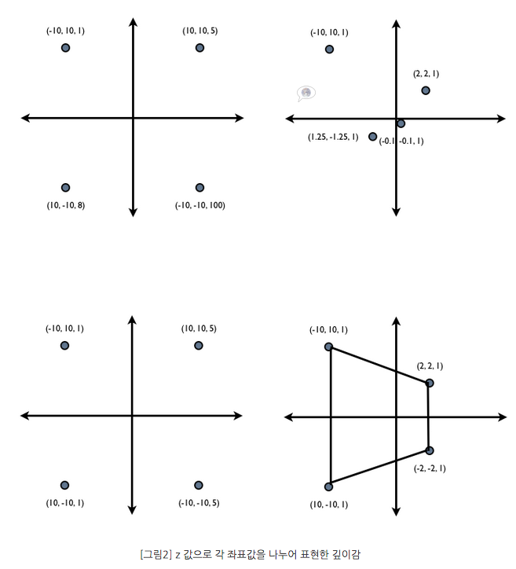
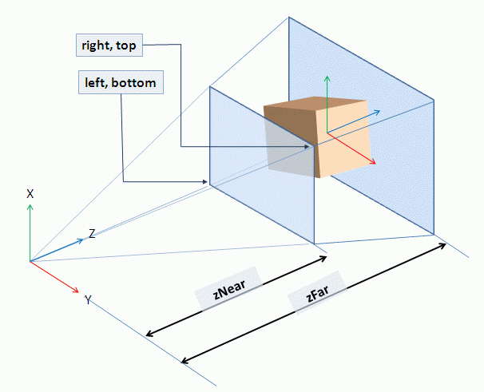
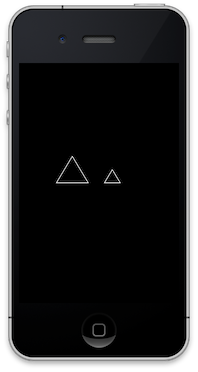
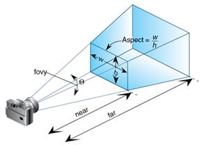
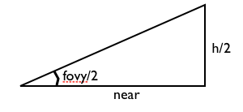
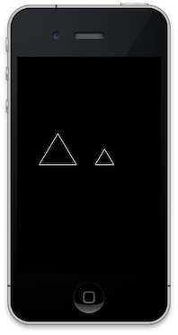

# 14장. 원근투영

이번 장에서는 원근투영을 다루겠습니다. OpenGL은 직교투영, 원근투영 두 가지 투영법을 지원합니다. 직교투영은 2D렌더링에 주로 사용되고 원근투영은 3D렌더링에 주요 사용됩니다. 그 이유는 직교투영에는 원근감이 없고 원근투영에는 원근감이 있기 때문입니다. 그렇다면 원근감은 무엇이며 어떻게 생기는 것일까요?

#### 원근감이란? <a id="%EC%9B%90%EA%B7%BC%EA%B0%90%EC%9D%B4%EB%9E%80"></a>

원근은 멀리 있는 것은 작게 보이고 가까운 것은 크게 보이는 현상입니다. 그림으로 원근감을 표현할 때는 소실점을 사용합니다. 아래 그림처럼 소실점에 가까울 수록 그림을 작게 그리고 멀수록 그림을 크게 그리면 원근감이 표현됩니다.


그렇다면 위의 그림처럼 소실점을 컴퓨터 그래픽스에서 표현하려면 어떻게 해야할까요?

#### 소실점 표현하기 <a id="%EC%86%8C%EC%8B%A4%EC%A0%90-%ED%91%9C%ED%98%84%ED%95%98%EA%B8%B0"></a>

컴퓨터 그래픽스에서 소실점을 표현하는 것은 어렵지 않습니다. 3차원 공간 속에 아주 많은 점이 있다고 생각했을 때, 각 점의 좌표를 \(x, y, z\) 성분으로 나타낸다고 가정하면 멀리 있는 점일 수록 z 값이 클 것입니다. x와 y좌표값을 z좌표값으로 나눠주면 어떻게 될까요? 단 0으로 수를 나눌 수는 없으므로 z 는 0이 될 수 없다고 가정합니다.



각 점들의 x,y 좌표를 z값으로 나눠주자 좌표계의 원점으로 모이는 것을 볼 수 있습니다. 즉, 소실점을 수학적으로 표현한 것입니다. 3차원의 좌표를 z 좌표로 나눠 주면 되는 것이죠. 이렇게 소실점을 표현하여 원근투영을 만듭니다. 만약 직교투영이라면 z값을 모두 같게 하거나\(예를들어 1\) 아예 z 값을 무시하여 x,y 좌표값만 사용하는 것입니다. 이것이 바로 3차원 표현법의 핵심입니다.\[주석1\] OpenGL\|ES의 파이프라인 중 라이팅 및 텍스춰 맵핑을 제외하고 살펴보면 위의 방법으로 3차원 정점을 2차원 정점으로 변환한 다음, 어떤 정점만을 그릴 것인가하고 걸러내는 것이 전부입니다. 그러나 서점에서 3차원 그래픽스 책을 살펴보면 복잡한 수학 식으로 가득합니다. 그것은 라이팅과 텍스춰 맵핑에 관한 내용으로 현실감을 만드는 것은 거리감도 있지만 색상, 빛, 재질 등 여러 물성도 포함하기 때문입니다. 파이프라인 얘기가 나왔으니 잠시 OpenGL\|ES 1.x 와 OpenGL\|ES 2.x 의 차이점을 아주 간략하게 알아보겠습니다.

#### OpenGL\|ES1.x 와 OpenGL\|ES 2.x 의 차이 <a id="opengl-es1-x-%EC%99%80-opengl-es-2-x-%EC%9D%98-%EC%B0%A8%EC%9D%B4"></a>

OpenGL\|ES 1.x 와 OpenGL\|ES 2.x 의 차이점은 그래픽스 파이프라인의 유연성입니다. 그래픽스 파이프라인은 3차원 기하를 2차원 기하로 변경하는 과정입니다. OpenGL\|ES 1.x 의 파이프라인은 유연성이 전혀 없는 고정 그래픽스 파이프라인으로 OpenGL\|ES 1.x 가 제공하는 API 만 사용하여 3차원 현실감을 만들 수 있습니다. 그에 반해 OpenGL\|ES 2.x 는 유연성이 있는 그래픽스 파이프라인을 사용합니다. 흔히 프로그래머블\(Programmable\) 하다라고 말하는데 파이프라인의 과정을 크게 정점 변환과 텍스춰와 라이팅변환으로 나누어 두 단계에 적용되는 과정을 직접 프로그래머가 작성할 수 있습니다. 카툰렌더링이 대표적인 예입니다. 따라서 OpenGL\|ES 1.x 보다 OpenGL\|ES 2.x 가 더 많은 효과를 낼 수 있고 사실감도 증폭시킬 수 있습니다. OpenGL 1.x 튜토리얼이 끝나면 OpenGL 2.x 의 튜토리얼을 작성하면서 더 깊은 내용을 다루겠습니다.

#### glFrustum 이해하기 <a id="glfrustum-%EC%9D%B4%ED%95%B4%ED%95%98%EA%B8%B0"></a>

OpenGL은 원근투영을 나타내는 함수로 gluPerspective 와 glFrustum 가 있습니다. 하지만 OpenGL\|ES 1.x 는 glFrustum 함수만 존재합니다. gluPerspective 함수와 glFrustum 함수 모두 같은 원근 투영 행렬을 만들지만 gluPerspective가 좀 더 사용하기 직관적입니다. gluPerspective는 시야각과 종횡비를 사용하여 원근투영행렬을 만들고 glFrustum 은 절두체를 정의하는 성분으로 원근투영행렬을 만듭니다. 다행인 것은 gluPerspective 함수를 구현하는 것이 어려운 일이 아닙니다. glFrustum 함수를 이해하고 예제를 작성해 본 다음 gluPerspective 함수도 구현해 보겠습니다.

아래 그림은 glFrustum 으로 정의되는 관측공간 즉, 절두체의 모양입니다.



glFrustum 함수의 원형은 아래와 같습니다. [\[참고\]](http://www.khronos.org/opengles/sdk/1.1/docs/man/glFrustum.xml)

```c
void glFrustumf(GLfloat left,  
                GLfloat right,  
                GLfloat bottom,  
                GLfloat top,  
                GLfloat zNear,  
                GLfloat zFar);
```

함수의 인자와 절두체 그림을 비교하여 보면 이해하기 쉽습니다. glFrustum 함수를 사용할 때 주의할 점은 투상평면의 거리를 정하는 near 와 far 값은 반드시 양수이어야 합니다. near와 far 값은 거리를 나타내는데 누구와의 거리일까요? 바로 카메라 렌즈와의 거리입니다. near 값이 음수 값이면 카메라가 바라보는 시점 뒤편에 near 평면이 존재하게 됩니다. 화면에 그려지는 그림은 카메라 렌즈에 담기는 그림이고 카메라 렌즈에 담기는 그림은 near 평면에 담기는 그림입니다. 그러므로 near값이 음수가 되어 near 평면이 카메라 렌즈 뒤에 있으면 카메라 렌즈에는 아무것도 그려지지 않을 것입니다.

#### glFrustum 사용하기 <a id="glfrustum-%EC%82%AC%EC%9A%A9%ED%95%98%EA%B8%B0"></a>

glFrustum 함수를 사용하여 원근투영을 만든 후 화면에 똑 같은 크기이지만 거리가 서로 다른 두 개의 삼각형을 그려보겠습니다. 거리가 더 먼 삼각형이 더 작게 그려질 것입니다.

아래와 같이 두 개의 삼각형을 구성하는 정점을 정의합니다.

```objectivec
//: 로컬객체를 정의할 때는 왼손좌표계를 기준으로 정의한다  
//: 카메라의 디폴트 위치는 (0,0,0)이고 바라보는 방향은 -z 방향이다.  
GLfloat verticesForGL_TRIANGLE_STRIP[2][3*3] =  
{  
    //: 삼각형1  
    {  
        -0.5,  0.5, -1.5,          //v1  
        -0.8,  0.0, -1.5,          //v2         
        -0.2,  0.0, -1.5,          //v3    
    },  
    //:삼각형2  
    {  
         0.5,  0.5, -3.0,          //v1    
         0.2,  0.0, -3.0,          //v2            
         0.8,  0.0, -3.0,          //v3    
    },  
};
```

setupView 메서드내에서 행렬 모드를 투영 행렬로 변경한 다음 glFrustum 함수를 사용하여 원근투영행렬을 만듭니다.

```objectivec
-(void)setupView  
{  
    ...  

    //: 행렬 모드는 투영 행렬로 변경한다  
    glMatrixMode(GL_PROJECTION);  

    //: 투영행렬을 초기화 한다  
    glLoadIdentity();  

    //: 원교투영으로 설정한다.  
    //: near, far값은 카메라 렌즈와의 거리이지 위치가 아니다.  
    //: 음의 near 또는 far 값은 디폴트 카메라 렌즈의 방향에서 벗어나게 되어  
    //: 화면에 아무것도 그려지지 않는다.  
    //: 따라서 near, far 모두 양수로 설정해야 한다.  
    glFrustumf(-1.0f, 1.0f, -1.5f, 1.5f, 1.0f, 20.0f);  

    ...  
}
```

그리고 renderView 메서드를 아래와 같이 구현하여 정점으로 두 개의 삼각형을 그립니다.

```objectivec
-(void)renderView  
{  
    //: 배경을 검은색으로 지운다  
    glClearColor(0.0, 0.0, 0.0, 1.0);  

    //: 깊이 버퍼를 1.0으로 초기화 한다.  
    glClearDepthf(1.0f);  

    //: 렌더링을 할 때마다 컬러버퍼와 깊이버퍼를 지운다  
    glClear(GL_COLOR_BUFFER_BIT | GL_DEPTH_BUFFER_BIT);  

    //: 행렬 모드는 모델뷰 행렬로 변경한다  
    glMatrixMode(GL_MODELVIEW);  
    //: 모델뷰 행렬을 초기화한다  
    glLoadIdentity();  
    for(int i=0; i<2; i++)  
    {  
        //: 정점배열을 설정한다  
        glVertexPointer(3, GL_FLOAT, sizeof(GLfloat)*3,  
                        verticesForGL_TRIANGLE_STRIP[i]);  

        //: 색상 칠하기 방법을 설정한다  
        glShadeModel(GL_SMOOTH);  

        //: 정점 배열 사용을 ON  
        glEnableClientState(GL_VERTEX_ARRAY);  
        {  
            //: 처리할 정점의 개수는 4개  
            glDrawArrays(GL_LINE_LOOP, 0, 3);  
        }  
        glDisableClientState(GL_VERTEX_ARRAY);  
    }  
}
```

코드를 실행하면 아래와 같이 두 개의 삼각형이 그려지고 거리에 따라 크기가 다르게 나오는 것을 확인할 수 있습니다.



#### gluPerspective 구현하기 <a id="gluperspective-%EA%B5%AC%ED%98%84%ED%95%98%EA%B8%B0"></a>

gluPerspective 함수는 glFrustum 과 동일한 관측공간을 생성합니다. 차이가 있다면 gluPurspective함수는 항상 관측공간의 중심이 z축이 되지만 glFrustum은 그렇지 않다는 것입니다. glFrustum 함수의 left, right, bottom, top 인자를 조절하면 관측공간의 중심이 z축을 벗어나게 할 수 있겠죠. 별로 중요한 내용은 아닙니다. :\) gluPerspective 함수를 사용하는 이유는 glFrustum 함수보다 직관적이기 때문입니다. gluPerspective 함수의 원형은 아래와 같습니다.

```c
void gluPerspective(GLdouble  fovy,  
                    GLdouble  aspect,  
                    GLdouble  zNear,  
                    GLdouble  zFar);
```

glFrustum 함수의 left, right, bottom, top 인자 대신에 fovy 와 aspective 인자를 사용하여 관측공간을 생성하는데 각 인자의 의미를 알아보겠습니다. [\[참고\]](http://www.opengl.org/sdk/docs/man/xhtml/gluPerspective.xml)

* fovy
  * y축 시야각입니다. 즉, 시야각의 수직 범위입니다.
* aspect
  * 시야의 종횡비입니다. 너비와 높이의 비율입니다.
* near, far
  * glFrustum 함수의 near, far 인자와 동일한 인자로 관측공간의 near, far 클립핑 평면의 거리입니다.

gluPerspective 함수가 사용하는 인자로 관측공간을 그림으로 표현하면 아래와 같습니다.



gluPerspective 함수의 구현은 별로 어렵지 않습니다. fovy 인자와 aspect 인자로부터 glFrustum 함수에 쓰이는 left, right, bottom, top 인자를 구하고 구한 인자로 glFrustum 함수를 호출하면 되기 때문입니다. 그렇다면 fovy 와 aspect 인자로부터 left, right, bottom, top 인자를 어떻게 구할까요? \[그림3\] 절두체 그림을 보면 left, right, bottom, top 인자가 near 평면의 것임을 알 수 있습니다. 따라서 삼각함수를 사용하면 쉽게 필요한 인자값을 구할 수 있습니다.




```c
fovy 는 라디안 단위의 각도입니다.  
따라서 tan(fovy/2) = (h/2)/near 입니다.  
h = 2 * near * tan(fovy/2)  
z축을 중점으로 하므로   
top = h 이고  
bottom = -h 입니다.  
aspect = w/h 이고 z축을 중심으로 하므로  
left = -w 이고  
right = w 입니다.  
그러므로  
left = aspect * bottom  
top = aspect * top  
입니다.
```

위의 내용대로 C언어 함수를 만들면 아래와 같습니다.

```c
#define DEGREES_TO_RADIANS(angle) ( angle * 3.141592 / 180.0 )  
void gluPerspectivef(GLfloat fovy, GLfloat aspect, GLfloat near, GLfloat far)  
{  
    GLfloat h = 2 * near * tanf(DEGREES_TO_RADIANS(fovy/2));  
    GLfloat top = h;  
    GLfloat bottom = -h;  
    GLfloat left = aspect * bottom;  
    GLfloat right = aspect * top;  
    glFrustumf(left, right, bottom, top, near, far);  
}
```

이제 이전 예제에서 glFrustum 함수 호출 대신에 gluPerspective 함수 호출로 변경해 보겠습니다.

```objectivec
-(void)setupView  
{  
    ...  

    //: 원교투영으로 설정한다.  
    //: near, far값은 카메라 렌즈와의 거리이지 위치가 아니다.  
    //: 음의 near 또는 far 값은 디폴트 카메라 렌즈의 방향에서 벗어나게 되어  
    //: 화면에 아무것도 그려지지 않는다.  
    //: 따라서 near, far 모두 양수로 설정해야 한다.  
    //: glFrustumf(-1.0f, 1.0f, -1.5f, 1.5f, 1.0f, 20.0f);  

    //: glFrustum 함수 호출 대신에 시야각과 종횡비를 설정하여  
    //: 원근투영행렬을 만든다  
    gluPerspectivef(60, 320.0/480.0, 1.0, 20.0);  

    ...  
}
```

코드를 실행하면 아래와 같은 결과 화면을 볼 수 있습니다.



지금까지 원근투영을 이해하고 원근투영을 구현해 보았습니다. 다음 튜토리얼에서는 카메라 즉 뷰잉변환과 모델 변환에 대해서 살펴보겠습니다. 부족한 튜토리얼이지만 항상 응원해 주셔서 감사합니다. 그럼 다음 튜토리얼 때 뵐게요 ^^

#### 그림 출처 <a id="%EA%B7%B8%EB%A6%BC-%EC%B6%9C%EC%B2%98"></a>

* [http://www.longtail.com/the\_long\_tail/2008/10/the-vanishing-p.html](http://www.longtail.com/the_long_tail/2008/10/the-vanishing-p.html)
* [http://arkham46.developpez.com/articles/office/vbaopengl/?page=page\_3](http://arkham46.developpez.com/articles/office/vbaopengl/?page=page_3)
* [http://www.codersource.net/MFC/OpenGL/Workingwith3DEnvironmentOpenGLTutorial.aspx](http://www.codersource.net/MFC/OpenGL/Workingwith3DEnvironmentOpenGLTutorial.aspx)

