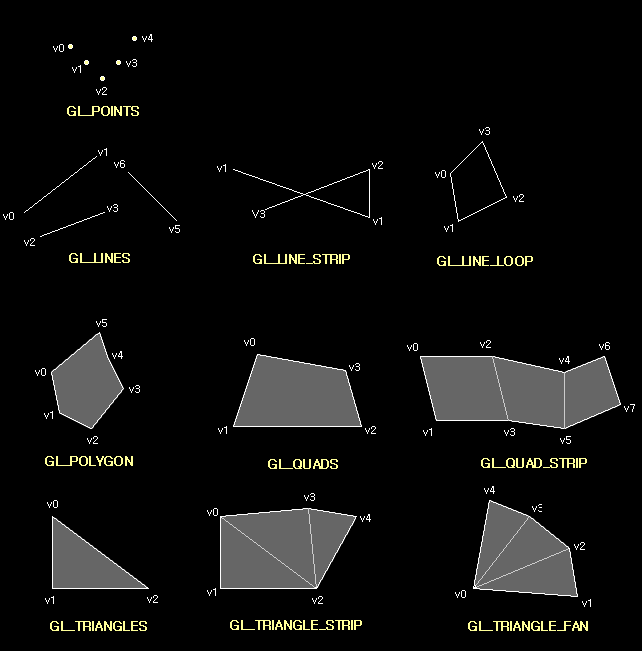
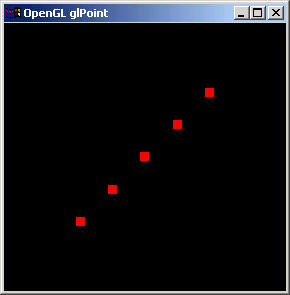
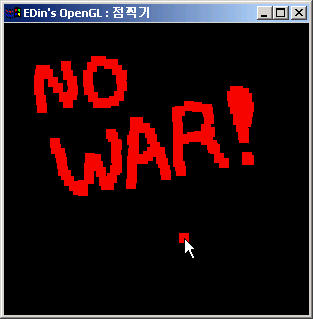

# 4장. 점그리기

* GL\_POINTS
* glPointSize\(\)
* glVertex2f\(\), glVertex3f\(\)

앞 장에서는 윈도우즈에서 쉽게 OpenGL 을 이용한 어플리케이션을 만들기 위해서 윈도우용 OpenGL 프레임웤을 만들어 보았다. 그 프레임웤을 사용해서 OpenGL 에 대해서 알아보자. 그 첫번재 과정으로 점\(Point\) 그리기부터 알아볼 것이다. 점\(Point\)은 정점\(Vertex\)이라고 부르는 2차원 이상의 좌표계 위치 조합으로 나타낸다. X축과 Y축으로 표현되는 2D 정점은 OpenGL 에 의해서 Z 축도 포함하게 된다. OpenGL 은 모든 정점을 4가지 좌표축의 위치 조합\(X축, Y축, Z축, W축\)으로 나타낸다. 이 좌표계를 동차좌표계\(homogeneous coordinate system\) 이라고 하는데 자세한 내용은 OpenGL 전문서적을 참고하자. 만약 W 가 0 이 아니라면 이 정점은 유클리드 3D 좌표계\(X/W, Y/W, Z/W\) 의 점에 해당된다. OpenGL 명령어에서 W 를 사용할 수 있으나 거의 쓰이지 않는다. 만약 W 가 쓰이지 않는다면 그 값을 1.0 으로 생각하면 된다. 즉, glVertex2f\(1.0f, 1.0f\) 라 하면 \(1.0, 1.0, 0.0, 1.0\) 의 정점을 나타내는 것이다. 다음은 정점을 나타내는 OpenGL 의 함수 그룹이다. 함수는 두 그룹으로 나뉘는데 직접 좌표계 위치를 받는 것과 각 좌표계 위치의 배열을 받는 것이 있다. 배열을 받는 것은 함수의 이름 끝에 v 자 붙는다.

```cpp
void glVertex2d( GLdouble x, GLdouble y ) 
void glVertex2f( GLfloat x, GLfloat y ) 
void glVertex2i( GLint x, GLint y ) 
void glVertex2s( GLshort x, GLshort y ) 
void glVertex3d( GLdouble x, GLdouble y, GLdouble z ) 
void glVertex3f( GLfloat x, GLfloat y, GLfloat z ) 
void glVertex3i( GLint x, GLint y, GLint z ) 
void glVertex3s( GLshort x, GLshort y, GLshort z ) 
void glVertex4d( GLdouble x, GLdouble y, GLdouble z, GLdouble w ) 
void glVertex4f( GLfloat x, GLfloat y, GLfloat z, GLfloat w ) 
void glVertex4i( GLint x, GLint y, GLint z, GLint w ) 
void glVertex4s( GLshort x, GLshort y, GLshort z, GLshort w )
```

```cpp
void glVertex2dv( const GLdouble *v )
void glVertex2fv( const GLfloat *v ) 
void glVertex2iv( const GLint *v ) 
void glVertex2sv( const GLshort *v ) 
void glVertex3dv( const GLdouble *v ) 
void glVertex3fv( const GLfloat *v ) 
void glVertex3iv( const GLint *v ) 
void glVertex3sv( const GLshort *v ) 
void glVertex4dv( const GLdouble *v ) 
void glVertex4fv( const GLfloat *v ) 
void glVertex4iv( const GLint *v ) 
void glVertex4sv( const GLshort *v )
```

OpenGL 에서 그리기는 glBegin\(\) 함수와 glEnd\(\) 함수 사이에서 할 수 있는데 그릴 수 있는 것은 다음과 같은 종류가 있다.

```cpp
glBegin( GL_POINT);
    점을 그린다.
glEnd();

glBegin( GL_LINES );
    선을 그린다.
glEnd();

glBegin( GL_POLYGON );
    다각형을 그린다.
glEnd();

glBegin( GL_TRIANGLES );
    삼각형을 그린다.
glEnd();

glBegin( GL_QUADS );
    사각형을 그린다.
glEnd();

glBegin( GL_LINE_STRIP );
    겹친 선을 그린다.
glEnd();

glBegin( GL_LINE_LOOP );
    겹치지 않고 연결 된 선을 그린다.
glEnd();

glBegin( GL_TRIANGLE_STRIP );
    삼각형이 연결된 도형을 그린다.
glEnd();

glBegin( GL_TRIANBLE_FAN );
    한점을 중심으로 삼각형이 연결된 도형을 그린다.
glEnd();

glBegin( GL_QUAD_STRIP );
    사각형이 이어진 도형을 그린다.
glEnd();
```

아래의 그림을 보면 이해하는데 도움이 될 것이다.



5 개의 점을 그리는 코드를 쓰면 아래와 같다.

```cpp
glBegin( GL_POINTS )
    glVertex2f( 1.0f, 1.0f ); //v0
    glVertex2f( 1.5f, 0.5f ); //v1
    glVertex2f( 2.0f, 0.0f ); //v2
    glVertex2f( 2.5f, 0.5f ); //v3
    glVertex2f( 3.0f, 1.0f ); //v4
glEnd();
```

점의 크기는 항상 일정한 것이 아니라 변경가능하다. 점의 크기를 변경하는 OpenGL 함수는 아래와 같다. 점의 크기로 설정할 수 있는 최대값은 MS 에서 구현한 OpenGL 에서는 10.0 까지이다. OpenGL 스펙에서는 1.0 만지원된다.

```cpp
void glPointSize( GLfloat size );
```

이 내용을 바탕으로 점이 커졌다 작아졌다 하는 프로그램을 만들어보자.



위의 그림은 프로그램을 실행시킨 결과 이고 아래의 코드는 위 프로그램의 코드이다. 앞에서 만든 프레임웤을 바탕으로 만들어진 것임을 기억하자.

```cpp
#include <windows.h>
#include "lib\egl.h"

struct Point3D
{
    GLfloat x, y, z;
};

class eglSubWindow : public eglWindow
{
private:
    GLfloat mPointSize; //점의 크기
    Point3D mPointList[5]; //점의 리스트 
public:
    virtual void RenderGLScene(void);
    virtual void OnCreate(WPARAM wParam, LPARAM lParam);
};

void eglSubWindow::OnCreate(WPARAM wParam, LPARAM lParam)
{
    //점의 위치를 초기화한다.
    mPointList[0].x = 0.0f;
    mPointList[0].y = 0.0f;
    mPointList[0].z = -10.0f;

    mPointList[1].x = 1.0f;
    mPointList[1].y = 1.0f;
    mPointList[1].z = -10.0f;

    mPointList[2].x = 2.0f;
    mPointList[2].y = 2.0f;
    mPointList[2].z = -10.0f;

    mPointList[3].x = -1.0f;
    mPointList[3].y = -1.0f;
    mPointList[3].z = -10.0f;

    mPointList[4].x = -2.0f;
    mPointList[4].y = -2.0f;
    mPointList[4].z = -10.0f;

    //점의 크기를 초기화한다.
    mPointSize = 1.0f;
}

void eglSubWindow::RenderGLScene(void)
{
    static int i=0;
    static GLfloat step=0.1f;

    eglWindow::RenderGLScene();

    glColor3f(1.0f, 0.0f, 0.0f); //점의 색을 빨강색으로 설정한다.
    glPointSize(mPointSize); //점의 크기를 설정한다.
    glBegin(GL_POINTS); //점을 그린다.
        for(i=0; i<sizeof(mPointList)/sizeof(Point3D); ++i)
        {
            glVertex3f(mPointList[i].x, mPointList[i].y, mPointList[i].z);
        }
    glEnd();

    mPointSize += step;

    if(mPointSize >= 10.0f)
    {
        step = -step;
    }
    else if(mPointSize <= 0.0f)
    {
        step = -step;
    }
}

int APIENTRY WinMain(HINSTANCE hInstance, HINSTANCE hPrevInstance, LPSTR lpCmdLine, int nShowCmd)
{
    eglSubWindow app;
    app.Create(FALSE,"OpenGL glPoint");
    return app.Run();
}
```

다음은 마우스 커서가 위치한 곳에서 마우스 왼쪽 버튼을 누르면 점을 찍는 프로그램을 만들어보자.



아래는 이 프로그램의 소스이며 주석과 굵은 글씨로 적혀있는 코드를 주의해서 보자. 참고로 프레임웤에 몇가지의 파일이 추가되어 내용이 업데이트 되었다.

```cpp
#define EGL_USE_STL
#include "lib\egl.h"

struct Point3D
{
    GLfloat x, y, z;
    Point3D(GLfloat ax, GLfloat ay, GLfloat az) { x=ax; y=ay; z=az; }
};

typedef vector<Point3D> point_list;
typedef vector<Point3D>::iterator piter;

class eglSubWindow : public eglWindow
{
private:
    point_list mPointList;
    GLsizei ClientWidth; //윈도우의 너비
    GLsizei ClientHeight; //윈도우의 높이
    GLfloat Range; //클리핑 영역의 범위
public:
    virtual void RenderGLScene(void);
    virtual void OnCreate(WPARAM wParam, LPARAM lParam);
    virtual void OnLButtonDown(WPARAM wParam, LPARAM lParam);
    virtual void OnSize(WPARAM wParam, LPARAM lParam);
};
void eglSubWindow::OnCreate(WPARAM wParam, LPARAM lParam)
{
    ClientWidth = ClientHeight = 0;
    Range = 5.0f; //클리핑 영역의 범의를 5 로 초기화한다.
}
void eglSubWindow::OnSize(WPARAM wParam, LPARAM lParam)
{
    GLsizei width = LOWORD(lParam);
    GLsizei height = HIWORD(lParam);

    if (height == 0)
        height = 1; 

    ClientWidth = width;
    ClientHeight = height;

    glViewport( 0, 0, width, height ); 

    glMatrixMode(GL_PROJECTION); 
    glLoadIdentity(); 

    glOrtho(-Range, Range, -Range, Range, 1.0f, 100.0f);

    glMatrixMode(GL_MODELVIEW); 
    glLoadIdentity(); 
}

void eglSubWindow::OnLButtonDown(WPARAM wParam, LPARAM lParam)
{
    GLfloat xPos = (GLfloat)(LOWORD(lParam));
    GLfloat yPos = (GLfloat)(HIWORD(lParam));

    GLfloat glX = ((xPos * (2*Range)) / ClientWidth) - Range;
    GLfloat glY = ((yPos * (2*Range)) / ClientHeight) - Range;

    mPointList.push_back(Point3D(glX, -glY, 0.0f));
    //-glY 인 것은 윈도우즈의 기본 좌표계에서는 Y 축이 아래로 내려 갈 수록 Y 축의 값이 증가한다. 하지만 OpenGL 좌표축은 그와 반대이므로 - 를 해준다.

    TRACE("glVertex3f[ %f , %f , %f ]\n", glX, -glY, 0.0f);
}

void eglSubWindow::RenderGLScene(void)
{
    eglWindow::RenderGLScene();

    glTranslatef(0.0f, 0.0f, -10.0f);
    glColor3f(1.0f, 0.0f, 0.0f);
    glPointSize(10.0f);
    glBegin(GL_POINTS);
        for(piter i=mPointList.begin(); i!=mPointList.end(); ++i)
        {
            glVertex3f((*i).x, (*i).y, (*i).z); 
        }
    glEnd();
}

int APIENTRY WinMain(HINSTANCE hInstance, HINSTANCE hPrevInstance, LPSTR lpCmdLine, int nShowCmd)
{
    eglSubWindow app;
    app.Create(FALSE,"EDin's OpenGL : 점찍기");
    return app.Run();
}
```

