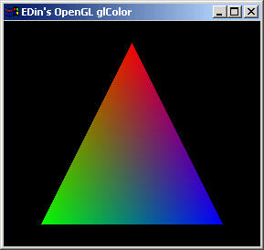
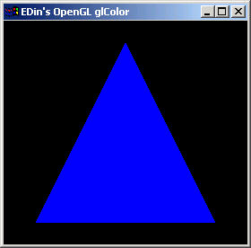

# 7장. 색 표현하기

* glColor3f\(\)
* glShadeModel\(\)
* GL\_SMOOTH
* GL\_FLAT

OpenGL 에서의 색\(color\)은 세가지 색의 혼합으로 이루어진다. 그 세가지 색은 적색\(RED\), 녹색\(GREEN\), 청색\(BLUE\) 이고 흔히 부르는 RGB 이다. 컴퓨터에서 이 세가지 색으로 모든 색을 표현하는 것은 우리 인간의 눈이 이 세가지 색에 가장 민감하기 때문이다. 즉 이 세가지 색의 변화를 가장 잘 느낀다는 것이다. 아래는 OpenGL 에서 색을 나타내는 함수의 목록이다.

```cpp
void glColor3b( GLbyte red, GLbyte green, GLbyte blue ) 
void glColor3d( GLdouble red, GLdouble green, GLdouble blue ) 
void glColor3f( GLfloat red, GLfloat green, GLfloat blue ) 
void glColor3i( GLint red, GLint green, GLint blue ) 
void glColor3s( GLshort red, GLshort green, GLshort blue ) 
void glColor3ub( GLubyte red, GLubyte green, GLubyte blue ) 
void glColor3ui( GLuint red, GLuint green, GLuint blue ) 
void glColor3us( GLushort red, GLushort green, GLushort blue ) 
void glColor4b( GLbyte red, GLbyte green, GLbyte blue, GLbyte alpha ) 
void glColor4d( GLdouble red, GLdouble green, Ldouble blue, GLdouble alpha ) 
void glColor4f( GLfloat red, GLfloat green, GLfloat blue, GLfloat alpha ) 
void glColor4i( GLint red, GLint green, GLint blue, GLint alpha ) 
void glColor4s( GLshort red, GLshort green, GLshort blue, GLshort alpha ) 
void glColor4ub( GLubyte red, GLubyte green, GLubyte blue, GLubyte alpha ) 
void glColor4ui( GLuint red, GLuint green, GLuint blue, GLuint alpha ) 
void glColor4us( GLushort red, GLushort green, GLushort blue, GLushort alpha )
```

```cpp
void glColor3bv( const GLbyte *v ) 
void glColor3dv( const GLdouble *v ) 
void glColor3fv( const GLfloat *v ) 
void glColor3iv( const GLint *v ) 
void glColor3sv( const GLshort *v ) 
void glColor3ubv( const GLubyte *v ) 
void glColor3uiv( const GLuint *v ) 
void glColor3usv( const GLushort *v ) 
void glColor4bv( const GLbyte *v ) 
void glColor4dv( const GLdouble *v ) 
void glColor4fv( const GLfloat *v ) 
void glColor4iv( const GLint *v ) 
void glColor4sv( const GLshort *v ) 
void glColor4ubv( const GLubyte *v ) 
void glColor4uiv( const GLuint *v ) 
void glColor4usv( const GLushort *v )
```

위의 함수들을 보면 정수형의 컬러값을 인자로 받는 함수와 부동소수형 컬러값을 인자로 받는 함수로 나눌 수 있다. 정수형은 컬러값을 0~255 값 즉 각 색깔마다 색을 256단계로 설정할 수 있다. 따라서 256_256_256 = 16777216 의 색을 표현할 수 있다. 부동소수형은 0.0 ~ 1.0 까지 컬러값을 설정할 수 있다. 0.0 과 1.0 의 사이의 수는 무한대이기 때문에 이론상으로는 무한대의 단계로 색을 표현할 수 있다. 정수형보다는 더욱 세밀하게 색을 표현할 수 있다는 것을 기억하면 될 것이다. 그리고 알파\(alpha\) 값이 있는데 이 것은 색의 투명도를 나타낸다.



```cpp
BOOL eglSubWindow::InitGL(void)
{
    eglWindow::InitGL();

    glShadeModel(GL_SMOOTH);
    return TRUE;
}
void eglSubWindow::RenderGLScene(void)
{
    eglWindow::RenderGLScene();

    glTranslatef(0.0f, 0.0f, -3.0f);
    glBegin(GL_TRIANGLES);
        glColor3f(1.0f, 0.0f, 0.0f); //RED
        glVertex3f( 0.0f, 1.0f, 0.0f);
        glColor3f(0.0f, 1.0f, 0.0f); //GREEN
        glVertex3f(-1.0f,-1.0f, 0.0f);
        glColor3f(0.0f, 0.0f, 1.0f); //BLUE 
        glVertex3f( 1.0f,-1.0f, 0.0f);
    glEnd();
}
```

윗 코드의 실행 결과를 보면 색이 각 정점에서 시작해서 삼각형의 중심에서는 서로의 색이 고르게 혼합되어 있다. 이 것은 쉐이딩 모델을 설정하는 glShadeModel\(\) 함수에 의해서 결정되는 것이다. 이 함수의 원형은 아래와 같다.

```cpp
glShadeModel( GLenum mode )
```

mode 값으로는 GL\_SMOOTH 와 GL\_FLAT 이 있다. GL\_SMOOTH 는 두 정점 간에 설정된 색을 부드럽게 이어주며 GL\_FLAT 은 마지막 정점에 설정된 색으로 폴리곤의 내부를 채운다.



```cpp
BOOL eglSubWindow::InitGL(void)
{
    eglWindow::InitGL();

    glShadeModel(GL_FLAT);
    return TRUE;
}
void eglSubWindow::RenderGLScene(void)
{
    eglWindow::RenderGLScene();

    glTranslatef(0.0f, 0.0f, -3.0f);
    glBegin(GL_TRIANGLES);
        glColor3f(1.0f, 0.0f, 0.0f); //RED
        glVertex3f( 0.0f, 1.0f, 0.0f);
        glColor3f(0.0f, 1.0f, 0.0f); //GREEN
        glVertex3f(-1.0f,-1.0f, 0.0f);
        glColor3f(0.0f, 0.0f, 1.0f); //BLUE 
        glVertex3f( 1.0f,-1.0f, 0.0f);
    glEnd();
}
```

쉐이딩 모델을 GL\_FLAT 으로 설정하자 폴리곤의 내부가 마지막 정점에 설정된 청색으로 채워졌다.

