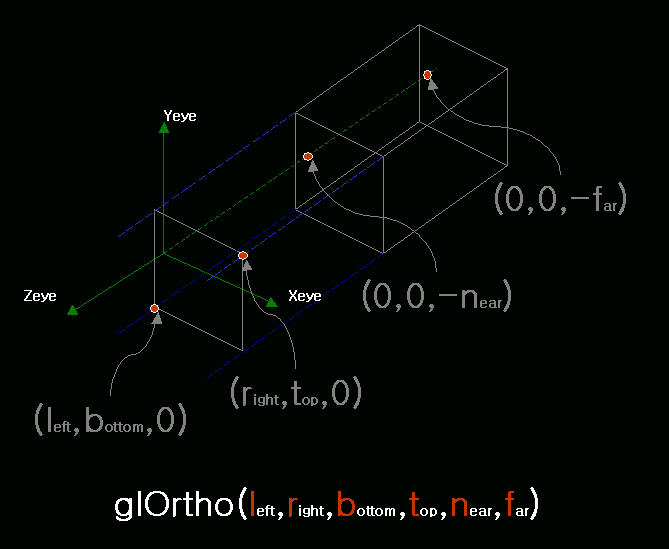
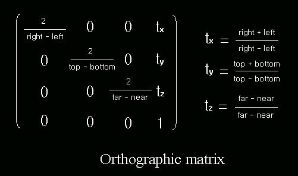
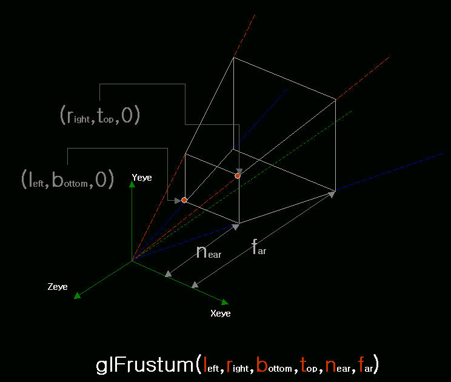
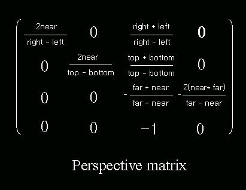
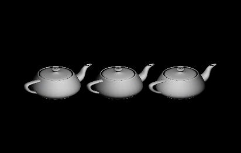
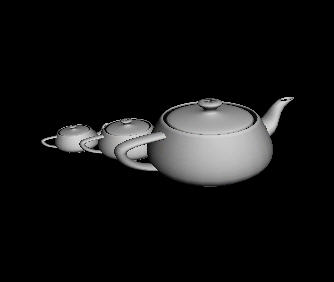

# 9장. 투영변환

* GL\_PROJECTION
* glOrtho\(\)
* glFrustum\(\)
* gluPerspective\(\)

OpenGL 의 렌더링 파이프 안에서 변환이 일어나는 것 중에 아핀 변환과 투영 변환이 있다. 아핀 변환\(affine transformation\)은 정점의 이동, 회전, 스케일 등의 변환를 말하며 이 변환의 특징은 변환 후에도 변환 전의 평행성과 비율을 보존해 준다는 것이다. 자세한 설명은 'OpenGL 을 통한 3차원 그래픽스 프로그래밍 기초편 - 임인성\[도서출판그린\]' 을 읽어보길 바란다. 투영 변환\(projection transformation\)은 n &gt; m 이라 할 때 n 차원 공간의 점을 m 차원 공간의 점으로 바꾸어주는 변환을 말한다. 3차원의 한 점 p\(x, y, z\) 를 2차원의 한 점 p'\(x, y\) 로 변환하는 것을 예로 들 수 있다. OpenGL 의 렌더링 파이프 라인에서는 아핀 변환 후에 투영 변환이 일어난다. OpenGL 에서 아핀 변환에 쓰이는 함수는 glTranslatef\(\), glRotatef\(\), glScalef\(\) 등이 있으며 투영 변환에 쓰이는 함수는 glOrtho\(\) 함수와 glFrustum\(\) 함수가 있고 glFrustum\(\) 함수를 쓰기 쉽게 만들어 놓은 gluPerspective\(\) 함수가 있다. OpenGL 에서의 투영 변환에는 2 가지의 변환이 있으며 하나는 직교 투영이고 다른 하나는 원근 투영이다. 이 두가지 외의 투영을 하려면 커스텀 투영 행렬을 만들어 현재 투영 행렬 스택에 glMultMatrix\(\) 라는 함수를 이용해서 투영 행렬 스택의 최상단에 올려 놓으면 된다.

직교투영을 만드는 함수 glOrtho\(\) 의 원형은 다음과 같다.

```cpp
void glOrtho( GLdouble left, 
              GLdouble right, 
              GLdouble bottom, 
              GLdouble top, 
              GLdouble near, 
              GLdouble far )
```

이 함수에서 인자들의 의미는 아래 그림에 자세하게 설명되어 있다.



위의 그림에서 \(left, bottom\) - \(right, top\) 에 의해서 정의 되는 면은 클립핑된 영역이며 이 면에 2D 의 그림이 그려지게 된다. 즉 뒤의 육면체에서 우리가 생각하는 3D 의 폴리곤이 그려지고 아핀변환이 일어난 후에 클리핑된 면으로 투영 변환\(여기서는 직교 변환, 3D 에서 2D 로 변환\)이 일어나게 된다. 이 직교 투영의 변환 행렬은 아래와 같다.



원근투영을 만드는 함수 glFrustum\(\) 의 원형은 다음과 같다.

```cpp
void glFrustum( GLdouble left, 
                GLdouble right, 
                GLdouble bottom, 
                GLdouble top, 
                GLdouble near, 
                GLdouble far )
```

이 함수에서 인자들의 의미는 아래 그림에 자세하게 설명되어 있다.



위의 그림에서 \(left, bottom\) - \(right, top\) 에 의해서 정의 되는 면은 클립핑된 영역이며 이 면에 2D 의 그림이 그려지게 된다. 즉 육면체\(절두체\)에서 우리가 생각하는 3D 의 폴리곤이 그려지고 아핀변환이 일어난 후에 클리핑된 면으로 투영 변환\(여기서는 원근변환, 3D 에서 2D 로 변환\)이 일어나게 된다. 이 원근 투영의 변환 행렬은 아래와 같다.



glFrustum\(\) 함수를 좀 더 쉽게 쓰기 위해서 gluPerspective\(\) 함수가 있는데 이 함수에 의해서 생성되는 원근 투영 행렬은 위의 행렬과는 다르다. 이는 직접 책을 찾아 보는 것이 좋을 것 같다. ;\]

위의 두 행렬을 비교해 보면 아핀 변환을 할 수 있는 아핀 공간의 점은 p\(x, y, z, w\) 에서 w = 1 이다. 직교 투영 행렬은 w = 1 인 반면에 원근 투영 행렬은 w 가 1 이 아니다. 이 때문에 직교 투영은 아핀 변환의 특징인 평행성과 비율이 보존 되지만 원근 투영은 보존되지 않는다. 그렇다면 원근 투영에서 아핀 변환은 어떻게 할 수 있을까? 이에 대한 해답은 위에서 언급한 서적을 읽어보길 바란다.

아래의 그림은 아주 간단하게 만들어 본 직교 투영의 예제 프로그램 그림과 소스 코드이다. 원근감이 느껴지지 않는다.



```cpp
void RenderWindow::OnSize(WPARAM wParam, LPARAM lParam)
{
    GLsizei width = LOWORD(lParam);
    GLsizei height = HIWORD(lParam);

    if (height == 0)
        height = 1;

    glViewport( 0, 0, width, height ); 

    glMatrixMode(GL_PROJECTION);
    glLoadIdentity();

    glOrtho(-3.0f, 3.0f, -3.0f, 3.0, 1.0f, 100.0f); //!

    glMatrixMode(GL_MODELVIEW);
    glLoadIdentity();
}

BOOL RenderWindow::InitGL(void)
{
    Window::InitGL();

    glEnable(GL_LIGHTING);

    GLfloat lightPos[4] = { 0.5f, 0.5f, 0.5f, 1.0f };
    glLightfv(GL_LIGHT0, GL_POSITION, lightPos);
    glEnable(GL_LIGHT0);

    return TRUE;
}

void RenderWindow::RenderGLScene(void)
{
    Window::RenderGLScene();

    glPushMatrix();
        glTranslatef(0.0f, 0.0f, -2.0f);
        glRotatef(33.0f, 1.0f, 0.0f, 0.0f);
        glRotatef(33.0f, 0.0f, 1.0f, 0.0f);
        glColor3f(0.5f, 0.5f, 0.5f);
        glutSolidTeapot(0.4f);
    glPopMatrix();

    glPushMatrix();
        glTranslatef(1.0f, 0.0f, -4.0f);
        glRotatef(33.0f, 1.0f, 0.0f, 0.0f);
        glRotatef(33.0f, 0.0f, 1.0f, 0.0f);
        glColor3f(0.3f, 0.3f, 0.3f);
        glutSolidTeapot(0.4f);
    glPopMatrix();

    glPushMatrix();
        glTranslatef(-1.0f, 0.0f, -6.0f);
        glRotatef(33.0f, 1.0f, 0.0f, 0.0f);
        glRotatef(33.0f, 0.0f, 1.0f, 0.0f);
        glColor3f(0.1f, 0.1f, 0.1f);
        glutSolidTeapot(0.4f);
    glPopMatrix();
}
```

아래의 그림은 아주 간단하게 만들어 본 원근 투영의 예제 프로그램 그림과 소스 코드이다. 원근감이 느껴진다.



```cpp
void RenderWindow::OnSize(WPARAM wParam, LPARAM lParam)
{
    GLsizei width = LOWORD(lParam);
    GLsizei height = HIWORD(lParam);

    if (height == 0)
        height = 1;

    glViewport( 0, 0, width, height );

    glMatrixMode(GL_PROJECTION);
    glLoadIdentity();

    glFrustum(-1.0f, 1.0f, -1.0f, 1.0, 1.0f, 10.0f);

    glMatrixMode(GL_MODELVIEW);
    glLoadIdentity();
}

BOOL RenderWindow::InitGL(void)
{
    Window::InitGL();

    glEnable(GL_LIGHTING);

    GLfloat lightPos[4] = { 0.5f, 0.5f, 0.5f, 1.0f };
    glLightfv(GL_LIGHT0, GL_POSITION, lightPos);
    glEnable(GL_LIGHT0);

    return TRUE;
}

void RenderWindow::RenderGLScene(void)
{
    Window::RenderGLScene();

    glPushMatrix();
        glTranslatef(0.0f, 0.0f, -2.0f);
        glRotatef(33.0f, 1.0f, 0.0f, 0.0f);
        glRotatef(33.0f, 0.0f, 1.0f, 0.0f);
        glColor3f(0.5f, 0.5f, 0.5f);
        glutSolidTeapot(0.4f);
    glPopMatrix();

    glPushMatrix();
        glTranslatef(1.0f, 0.0f, -4.0f);
        glRotatef(33.0f, 1.0f, 0.0f, 0.0f);
        glRotatef(33.0f, 0.0f, 1.0f, 0.0f);
        glColor3f(0.3f, 0.3f, 0.3f);
        glutSolidTeapot(0.4f);
    glPopMatrix();

    glPushMatrix();
        glTranslatef(-1.0f, 0.0f, -6.0f);
        glRotatef(33.0f, 1.0f, 0.0f, 0.0f);
        glRotatef(33.0f, 0.0f, 1.0f, 0.0f);
        glColor3f(0.1f, 0.1f, 0.1f);
        glutSolidTeapot(0.4f);
    glPopMatrix();
}
```

