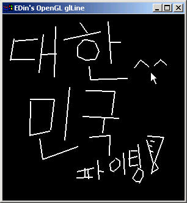

# 5장. 선 그리기

* GL\_LINES
* GL\_LINE\_STRIP
* GL\_LINE\_LOOP
* glLineWidth\(\)
* glLineStipple\(\)

앞에서는 점을 그려보았다. 선을 그리려면 선의 길이만큼 점을 그려줘야하는데 일일이 그것을 해준다는 것은 생각만해도 질릴 일이다. OpenGL 에서 그 일을 쉽게 해주는 것이 glBegin\(\) 함수에 GL\_LINES 나 GL\_LINE\_STRIP , GL\_LINE\_LOOP 를 설정하는 것이다. 이렇게 함으로써 선을 쉽게 그릴 수 있다. 선을 그리기 위해서는 두 개의 정점이 필요한데, 하나는 선의 시작 위치점이고 나머지 하나는 선이 끝나는 위치 점이다. OpenGL 에서는 가는 선만 그릴 수 있는 것이 아니라 glLineWidth\(\) 함수로 선의 굵기를 조절할 수 있다 또, 직선만 그릴 수 있는 것이 아니라 glLineStipple\(\) 함수를 이용해 패턴이 있는 선을 그릴 수 있다. 예를 들면 점선과 같이 패턴이 있는 선을 쉽게 그릴 수 있는 것이다.



이 예제는 앞에서의 점찍기와 아주 비슷한 예제다. 단 틀린 점은 마우스 오른쪽 버튼을 누르면 선의 굵기가 점점 굵어 지도록 해 놓은 것 뿐이다.

```cpp
#define EGL_USE_STL
#include "lib\egl.h"

struct Point3D
{
    GLfloat x, y, z;
    Point3D() { x = y = z = 0.0f; }
    Point3D(GLfloat ax, GLfloat ay, GLfloat az) { x=ax; y=ay; z=az; }
};

struct Line
{
    Point3D startPoint;
    Point3D endPoint;
    Line(Point3D aStartPoint, Point3D aEndPoint) { startPoint=aStartPoint; endPoint=aEndPoint; }
};

typedef vector<Line> line_list;
typedef vector<Line>::iterator liter;

class eglSubWindow : public eglWindow
{
private:
    line_list mLineList;
    GLfloat Range;
    GLsizei ClientWidth;
    GLsizei ClientHeight;
    GLfloat LineWidth;
public:
    virtual void RenderGLScene(void);
    virtual void OnSize(WPARAM wParam, LPARAM lParam);
    virtual void OnCreate(WPARAM wParam, LPARAM lParam);
    virtual void OnLButtonDown(WPARAM wParam, LPARAM lParam);
    virtual void OnLButtonUp(WPARAM wParam, LPARAM lParam);
    virtual void OnRButtonUp(WPARAM wParam, LPARAM lParam);
};

void eglSubWindow::OnCreate(WPARAM wParam, LPARAM lParam)
{
    ClientWidth = ClientHeight = 0.0f;
    Range = 5.0f;
    LineWidth = 1.0f;
}

void eglSubWindow::OnSize(WPARAM wParam, LPARAM lParam)
{
    GLsizei width = LOWORD(lParam);
    GLsizei height = HIWORD(lParam);

    if (height == 0)
        height = 1; 

    ClientWidth = width;
    ClientHeight = height;

    glViewport( 0, 0, width, height ); 

    glMatrixMode(GL_PROJECTION); 
    glLoadIdentity(); 

    glOrtho(-Range, Range, -Range, Range, 1.0f, 100.0f);

    glMatrixMode(GL_MODELVIEW); 
    glLoadIdentity(); 
}

void eglSubWindow::OnLButtonDown(WPARAM wParam, LPARAM lParam)
{
    GLfloat xPos = (GLfloat)(LOWORD(lParam));
    GLfloat yPos = (GLfloat)(HIWORD(lParam));

    GLfloat glX = ((xPos * (2*Range)) / ClientWidth) - Range;
    GLfloat glY = ((yPos * (2*Range)) / ClientHeight) - Range;

    mLineList.push_back(Line(Point3D(glX, glY, 0.0f), Point3D(glX, glY, 0.0f)));
    SetCapture(GetHWND());
}

void eglSubWindow::OnLButtonUp(WPARAM wParam, LPARAM lParam)
{
    GLfloat xPos = (GLfloat)(LOWORD(lParam));
    GLfloat yPos = (GLfloat)(HIWORD(lParam));

    GLfloat glX = ((xPos * (2*Range)) / ClientWidth) - Range;
    GLfloat glY = ((yPos * (2*Range)) / ClientHeight) - Range;

    if(!mLineList.empty())
    {
        mLineList[mLineList.size()-1].endPoint.x = glX;
        mLineList[mLineList.size()-1].endPoint.y = glY;
        mLineList[mLineList.size()-1].endPoint.z = 0.0f;
    }
    ReleaseCapture();
}

void eglSubWindow::OnRButtonUp(WPARAM wParam, LPARAM lParam)
{
    LineWidth += 1.0f;
    if(LineWidth > 10.0f)
    {
        LineWidth = 10.0f;
    }
}

void eglSubWindow::RenderGLScene(void)
{
    eglWindow::RenderGLScene();

    glTranslatef(0.0f, 0.0f, -10.0f);
    glLineWidth(LineWidth);

    glBegin(GL_LINES);
        for(liter i=mLineList.begin(); i!=mLineList.end(); ++i)
        {
            glVertex3f((*i).startPoint.x, -(*i).startPoint.y, (*i).startPoint.z);
            glVertex3f((*i).endPoint.x, -(*i).endPoint.y, (*i).endPoint.z);
        }
    glEnd();
}

int APIENTRY WinMain(HINSTANCE hInstance, HINSTANCE hPrevInstance, LPSTR lpCmdLine, int nShowCmd)
{
    eglSubWindow app;
    app.Create(FALSE, "EDin's OpenGL glLine");
    return app.Run();
}
```

GL\_LINES 와 GL\_LINE\_STRIP 그리고 GL\_LINE\_LOOP 의 차이점을 알기 위해서, 위의 코드 중에서 RenderGLScene\(\) 함수를 다음과 같이 수정하고 실행해 보자. 그러면 차이점을 금방 알게 될 것이다.

```cpp
void eglSubWindow::RenderGLScene(void)
{
    eglWindow::RenderGLScene();

    glTranslatef(0.0f, 0.0f, -10.0f);
    glLineWidth(LineWidth);

    glBegin(GL_LINE_STRIP);
        for(liter i=mLineList.begin(); i!=mLineList.end(); ++i)
        {
            glVertex3f((*i).startPoint.x, -(*i).startPoint.y, (*i).startPoint.z);
            glVertex3f((*i).endPoint.x, -(*i).endPoint.y, (*i).endPoint.z);
        }
    glEnd();
}
```

```cpp
void eglSubWindow::RenderGLScene(void)
{
    eglWindow::RenderGLScene();

    glTranslatef(0.0f, 0.0f, -10.0f);
    glLineWidth(LineWidth);

    glBegin(GL_LINE_LOOP);
        for(liter i=mLineList.begin(); i!=mLineList.end(); ++i)
        {
            glVertex3f((*i).startPoint.x, -(*i).startPoint.y, (*i).startPoint.z);
            glVertex3f((*i).endPoint.x, -(*i).endPoint.y, (*i).endPoint.z);
        }
    glEnd();
}
```

glLineStipple\(\) 을 이용해서 패턴이 있는 선을 그려보자. glLineStipple\(\) 함수의 원형은 다음과 같다.

```cpp
void glLineStipple ( GLint factor, GLushort pattern )
```

factor 는 pattern 에 정의한 선의 패턴이 몇 픽셀에 나타나게 할 것인지를 말한다. 예를 들어 0xAAAA 라는 패턴이 있으면 이를 2진수로 표현하면 1010101010101010 이다. 여기서 factor 를 1로 설정하면 앞의 패턴이 1 픽셀 안에서 나타나는 것이고 2이면 2픽셀 안에서 4이면 4픽셀 안에서 패턴이 나타난다. 따라서 factor 의 값이 작을 수록 촘촘한 패턴이 나타나게 된다. 또 한가지 중요한 점은 위의 패턴이 거꾸로 적용된다는 것이다. 즉 1010101010101010 패턴이 적용될 때에는 0101010101010101 이 된다. 우리가 패턴을 사용할 경우에 위의 함수에 패턴을 정의하면 모든 선에 패턴이 적용될 것이다. 하지만 그렇게 되면 패턴이 적용되지 않는 선은 그릴 수가 없다. 그래서 OpenGL 에서는 여러 상태들 중 LineStipple 의 사용 가능 여부의 상태를 설정하는 glEnable\( GL\_LINE\_STIPPLE \) 과 glDisable\( GL\_LINE\_STIPPLE \) 을 제공한다. 여기서 glEnable\(\) 과 glDisable\(\) 의 함수는 OpenGL 의 여러가지 상태들을 ON / OFF 하는 함수다.


위의 예제는 좌표계의 각 축을 그려본 것이다. 점선은 각축의 음의 부분을 나타내고 실선은 양의 부분을 나타낸다. 빨간색은 X 축 녹색은 Y 축 파란색은 Z 축이다.

```cpp
#include "lib\egl.h"

class eglSubWindow : public eglWindow
{
private:
    GLushort pattern;
    POINT oldPoint;
    GLfloat xrot, yrot;
public:
    virtual void RenderGLScene(void);
    virtual void OnSize(WPARAM wParam, LPARAM lParam);
    virtual void OnCreate(WPARAM wParam, LPARAM lParam);
    virtual void OnLButtonDown(WPARAM wParam, LPARAM lParam);
    virtual void OnLButtonUp(WPARAM wParam, LPARAM lParam);
    virtual void OnMouseMove(WPARAM wParam, LPARAM lParam);
};

void eglSubWindow::OnCreate(WPARAM wParam, LPARAM lParam)
{
    pattern = 0xAAAA;
    xrot = yrot = 0.0f;
}

void eglSubWindow::OnSize(WPARAM wParam, LPARAM lParam)
{
    GLsizei width = LOWORD(lParam);
    GLsizei height = HIWORD(lParam);
    if (height == 0)
        height = 1; 

    glViewport( 0, 0, width, height ); 
    glMatrixMode(GL_PROJECTION); 
    glLoadIdentity(); 

    glOrtho(-5, 5, -5, 5, 1.0f, 100.0f);

    glMatrixMode(GL_MODELVIEW); 
    glLoadIdentity(); 
}

void eglSubWindow::OnLButtonDown(WPARAM wParam, LPARAM lParam)
{
    oldPoint.x = LOWORD(lParam);
    oldPoint.y = HIWORD(lParam);
    SetCapture(GetHWND());
}

void eglSubWindow::OnLButtonUp(WPARAM wParam, LPARAM lParam)
{
    oldPoint.x = 0;
    oldPoint.y = 0;
    ReleaseCapture();
}

void eglSubWindow::OnMouseMove(WPARAM wParam, LPARAM lParam)
{
    if(GetCapture()==GetHWND())
    {
        yrot = LOWORD(lParam) - oldPoint.y/3.6;
        xrot = HIWORD(lParam) - oldPoint.x/3.6;
    }
}

void eglSubWindow::RenderGLScene(void)
{
    eglWindow::RenderGLScene();

    glTranslatef(0.0f, 0.0f, -10.0f);
    glRotatef(xrot, 1.0f, 0.0f, 0.0f);
    glRotatef(yrot, 0.0f, 1.0f, 0.0f);

    glLineStipple(4, pattern);

    glEnable(GL_LINE_STIPPLE);
    glBegin(GL_LINES);
        glColor3f(1.0f, 0.0f, 0.0f);
        glVertex3f(-4.0f, 0.0f, 0.0f);
        glVertex3f( 0.0f, 0.0f, 0.0f);
    glEnd();
    glDisable(GL_LINE_STIPPLE);

    glBegin(GL_LINES);
        glVertex3f( 0.0f, 0.0f, 0.0f);
        glVertex3f( 4.0f, 0.0f, 0.0f);
    glEnd();

    glEnable(GL_LINE_STIPPLE);
    glBegin(GL_LINES);
        glColor3f(0.0f, 1.0f, 0.0f);
        glVertex3f(0.0f, 4.0f, 0.0f);
        glVertex3f(0.0f, 0.0f, 0.0f);
    glEnd();
    glDisable(GL_LINE_STIPPLE);

    glBegin(GL_LINES);
        glVertex3f(0.0f, 0.0f, 0.0f);
        glVertex3f(0.0f,-4.0f, 0.0f);
    glEnd();

    glEnable(GL_LINE_STIPPLE);
    glBegin(GL_LINES);
        glColor3f(0.0f, 0.0f, 1.0f);
        glVertex3f(0.0f, 0.0f, -4.0f);
        glVertex3f(0.0f, 0.0f, 0.0f);
    glEnd();
    glDisable(GL_LINE_STIPPLE);

    glBegin(GL_LINES);
        glVertex3f(0.0f, 0.0f, 0.0f);
        glVertex3f(0.0f, 0.0f, 4.0f);
    glEnd();
}

int APIENTRY WinMain(HINSTANCE hInstance, HINSTANCE hPrevInstance, LPSTR lpCmdLine, int nShowCmd)
{
    eglSubWindow app;
    app.Create(FALSE, "EDin's OpenGL glLineStipple");
    return app.Run();
}
```

