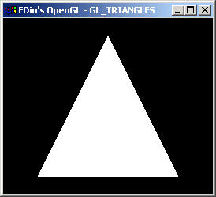

# 6장. 다각형 그리기

* GL\_POLYGON
* GL\_TRIANGLES
* GL\_QUADS

점의 집합이 선을 이루고 선의 집합이 다각형을 이루며 다각형의 집합은 다면체를 이룬다. 오늘은 2D 의 다각형을 그려보자. 다각형은 3개 이상의 정점으로 구성된다. 2개의 정점은 선을 이루고 3개의 정점은 삼각형을 이루며 4개의 정점은 사각형을 이룬다. 이 처럼 정점이 늘어나면 늘어날 수록 다각형이 그려지게 된다. OpenGL 에서는 다각형의 종류를 3 가지로 분류해 놓는다. 삼각형, 사각형, 다각형. 사각형까지만 있고 5각형 6각형 등이 없는 이유는 삼각형을 조합하면 얼마든지 우리가 원하는 다각형을 그릴 수 있기 때문이다. OpenGL 에서 삼각형을 그리려면 GL\_TRIANGLES 를 사용해야하고 사각형은 GL\_QUADS 그리고 다각형은 GL\_POLYGON 을 사용하면 된다.



위의 그림은 삼각형을 그린 것이며 아래는 소스 코드다. 코드가 간단하므로 코드 모음은 올리지 않겠다.

```cpp
void eglSubWindow::RenderGLScene(void)
{
    eglWindow::RenderGLScene();

    glTranslatef(0.0f, 0.0f, -3.0f);

    glBegin( GL_TRIANGLES );
        glVertex3f( -1.0f, -1.0f, 0.0f );
        glVertex3f(  1.0f, -1.0f, 0.0f );
        glVertex3f(  0.0f,  1.0f, 0.0f );
    glEnd();
}
```

연결된 삼각형을 그리려 할 때 어떻게 해야할까? 물론 6 개의 정점으로 만들 수도 있겠지만 4 개의 정점만으로도 연결된 삼각형을 만들 수 있다. 그렇게 그리는 것이 GL\_TRIANGLE\_STRIP 이며 아래는 이를 이용한 예제의 그림이다.


```cpp
void eglSubWindow::RenderGLScene(void)
{
    eglWindow::RenderGLScene();

    glTranslatef(0.0f, 0.0f, -3.0f);

    glBegin( GL_TRIANGLE_STRIP );
        glVertex3f( -1.0f, -1.0f, 0.0f );
        glVertex3f(  1.0f, -1.0f, 0.0f );
        glVertex3f(  0.0f,  1.0f, 0.0f );
        glVertex3f(  1.0f,  0.5f, 0.0f ); // 하나의 점을 추가했다.
    glEnd();
}
```

GL\_TRIANGLE\_STRIP 처럼 연결된 삼각형을 그리지만 하나의 점을 중심으로 그려나가려면 GL\_TRIANGLE\_FAN 을 사용하면 된다. 아래의 그림은 이를 이용하여 그린 것이다. 위의 그림과 비교해보자.


아래의 이 예제의 소스 코드다.

```cpp
void eglSubWindow::RenderGLScene(void)
{
    eglWindow::RenderGLScene();

    glTranslatef(0.0f, 0.0f, -3.0f);

    glBegin( GL_TRIANGLE_FAN );
        glVertex3f( -1.0f, -1.0f, 0.0f );
        glVertex3f(  1.0f, -1.0f, 0.0f );
        glVertex3f(  0.0f,  1.0f, 0.0f );
        glVertex3f(  1.0f,  0.5f, 0.0f ); // 하나의 점을 추가했다.
    glEnd();
}
```

이제 사각형을 그려보자. 사각형을 그리려면 GL\_QUADS 를 사용하고 정점을 4 개 설정하면 된다.


아래는 위 예제의 소스코드다.

```cpp
void eglSubWindow::RenderGLScene(void)
{
    eglWindow::RenderGLScene();

    glTranslatef(0.0f, 0.0f, -3.0f);

    glBegin( GL_QUADS );
        glVertex3f( -1.0f, -1.0f, 0.0f ); //사각형을 그리기 위해 4개의 정점을 설정한다.
        glVertex3f(  1.0f, -1.0f, 0.0f );
        glVertex3f(  1.0f,  1.0f, 0.0f );
        glVertex3f( -1.0f,  1.0f, 0.0f );
    glEnd();
}
```

4각형 이상의 다각형을 그리려면 GL\_POLYGON 을 이용하면 된다. 다각형에는 유효한 다각형과 유효하지 않은 다각형이 있는데 선이 서로 겹쳐져서 그려지는 다각형이나 다각형내에 다각형이 들어있는 다각형은 유효하지 않은 다각형이다. GL\_LINE\_LOOP 와 GL\_POLYGON 이 서로 비슷하게 느껴지지만 차이점이 있다. 그것은 내부가 채워지느냐 그렇지 않느냐이며 GL\_LINE\_LOOP 는 내부를 채우지 않고 GL\_POLYGON 은 내부를 채우게 된다. 아래의 예제 실행 예는 이 차이를 보여준다.


```cpp
void eglSubWindow::RenderGLScene(void)
{
    eglWindow::RenderGLScene();

    glTranslatef(0.0f, 0.0f, -6.0f);

    glBegin( GL_LINE_LOOP );
        for(int i=0; i<360; ++i)
        {
            glVertex3f( 1.0f*cos(i*(3.14152/180)), 1.0f*sin(i*(3.14152/180)), 0.0f );
        }
    glEnd();
}
```


```cpp
void eglSubWindow::RenderGLScene(void)
{
    eglWindow::RenderGLScene();

    glTranslatef(0.0f, 0.0f, -6.0f);

    glBegin( GL_POLYGON );
        for(int i=0; i<360; ++i)
        {
            glVertex3f( 1.0f*cos(i*(3.14152/180)), 1.0f*sin(i*(3.14152/180)), 0.0f );
        }
    glEnd();
}
```

GL\_POLYGON 으로 그려진 그림이 항상 내부가 채워지는 것은 아니다. 이는 glPolyginMode\(\) 함수로 설정할 수가 있다.

```cpp
glPolygonMode( GL_FRONT, GL_FILL ); // 앞 면을 채운다.
glPolygonMode( GL_BACK, GL_LINE); // 뒷면은 선으로 이어진 다각형을 그린다.
```

이 함수의 적용은 직접 실행해 보길 바란다.

