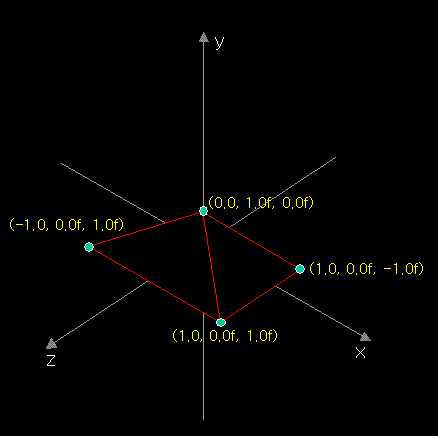
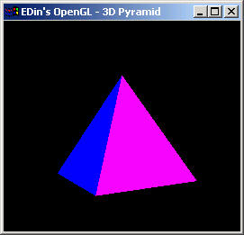
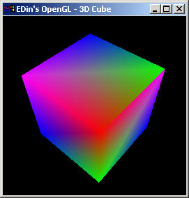
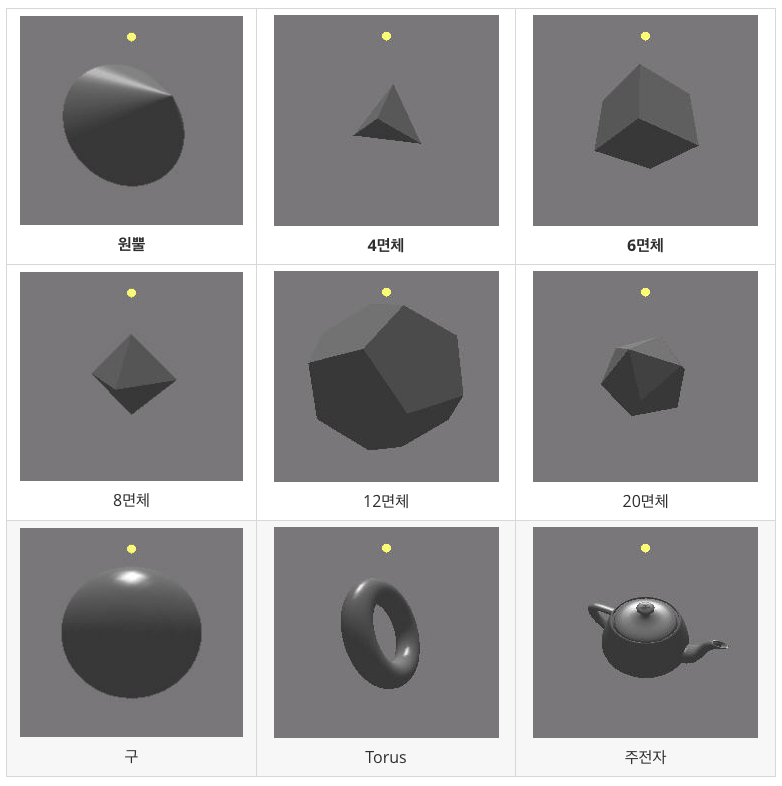

# 8장. 3차원 폴리곤 그리기

* glBegin\(\)
* glEnd\(\)
* GL\_TRIANGLES
* GL\_QUADS
* glut Objects

우리는 지금까지 2D 의 평면 폴리곤을 그려왔다. 2D 의 평면에서는 점이 X, Y 축의 좌표로 표현되었다. X 축은 폭, Y 축은 높이다. 3D 에서는 하나의 좌표축을 더 추가해 점이 X, Y, Z 축의 좌표로 표현된다. 여기서 X 축은 폭, Y 축은 높이 Z 축은 깊이를 나타낸다.



위의 그림은 피라미드\(각뿔\)를 그리는 과정의 일부를 그려본 것이다. 피라미드를 그리기 위해서는 4개의 삼각형면이 필요한데 OpenGL 에서는 glBegin\(\) 과 glEnd\(\) 사이에 삼각형 4개를 그려주면 자연스러운 3D 피라미드가 그려진다. 프레임웤의 내용이 조금 변경이 되었다. 몇몇 클래스의 이름이 바뀌었고 egl 이라느 네임스페이스를 사용한다. 때문에 전체 소스 코드를 적어보았다.



```cpp
#include <windows.h>
#include "lib\egl.h"

using namespace egl;

class RenderWindow : public Window
{
private:
    GLfloat rot;
public:
    virtual void RenderGLScene(void);
    virtual void OnCreate(WPARAM wParam, LPARAM lParam);
};

void RenderWindow::OnCreate(WPARAM wParam, LPARAM lParam)
{
    rot = 0.0f;
}

void RenderWindow::RenderGLScene(void)
{
    Window::RenderGLScene();

    glTranslatef(0.0f, 0.0f, -5.0f);
    glRotatef(rot, 0.0f, 1.0f, 0.0f);

    glBegin( GL_TRIANGLES );
        glColor3f(1.0f, 0.0f, 0.0f);
        glVertex3f( 0.0f, 1.0f, 0.0f); // { Front }
        glVertex3f(-1.0f,-1.0f, 1.0f); // { Front }
        glVertex3f( 1.0f,-1.0f, 1.0f); // { Front }

        glColor3f(0.0f, 1.0f, 0.0f);
        glVertex3f( 0.0f, 1.0f, 0.0f); // { Right }
        glVertex3f( 1.0f,-1.0f, 1.0f); // { Right }
        glVertex3f( 1.0f,-1.0f,-1.0f); // { Right }

        glColor3f(0.0f, 0.0f, 1.0f);
        glVertex3f( 0.0f, 1.0f, 0.0f); // { Back }
        glVertex3f( 1.0f,-1.0f,-1.0f); // { Back }
        glVertex3f(-1.0f,-1.0f,-1.0f); // { Back }

        glColor3f(1.0f, 0.0f, 1.0f);
        glVertex3f( 0.0f, 1.0f, 0.0f); // { Left }
        glVertex3f(-1.0f,-1.0f,-1.0f); // { Left }
        glVertex3f(-1.0f,-1.0f, 1.0f); // { Left }
    glEnd();

    rot += 0.01f;
}

int APIENTRY WinMain(HINSTANCE hInstance, HINSTANCE hPrevInstance, LPSTR lpCmdLine, int nShowCmd)
{
    RenderWindow app;
    app.Create(FALSE,"EDin's OpenGL - 3D Pyramid");
    return app.Run();
}
```

큐브\(정육면체\)를 그리기 위해서는 사각형면 6 개를 그려야한다. 이 또한 glBegin\(\) 과 glEnd\(\) 사이에 6 개의 사각형을 그려주면 자연스런 큐브가 그려진다.



```cpp
void RenderWindow::RenderGLScene(void)
{
    Window::RenderGLScene();

    glTranslatef( 0.0f, 0.0f, -5.0f);

    glRotatef(rot, 1.0f, 0.0f, 0.0f);
    glRotatef(rot, 0.0f, 1.0f, 0.0f);

    glBegin( GL_QUADS );
        glColor3f(1.0f, 0.0f, 0.0f); glVertex3f(-1.0f, 1.0f, 1.0f); // { Front }
        glColor3f(0.0f, 1.0f, 0.0f); glVertex3f(-1.0f,-1.0f, 1.0f); // { Front }
        glColor3f(0.0f, 0.0f, 1.0f); glVertex3f( 1.0f,-1.0f, 1.0f); // { Front }
        glColor3f(1.0f, 0.0f, 1.0f); glVertex3f( 1.0f, 1.0f, 1.0f); // { Front }

        glColor3f(1.0f, 0.0f, 1.0f); glVertex3f( 1.0f, 1.0f, 1.0f); // { Right }
        glColor3f(0.0f, 0.0f, 1.0f); glVertex3f( 1.0f,-1.0f, 1.0f); // { Right }
        glColor3f(0.0f, 1.0f, 0.0f); glVertex3f( 1.0f,-1.0f,-1.0f); // { Right }
        glColor3f(1.0f, 0.0f, 0.0f); glVertex3f( 1.0f, 1.0f,-1.0f); // { Right }

        glColor3f(1.0f, 0.0f, 0.0f); glVertex3f( 1.0f, 1.0f,-1.0f); // { Back }
        glColor3f(0.0f, 1.0f, 0.0f); glVertex3f( 1.0f,-1.0f,-1.0f); // { Back }
        glColor3f(0.0f, 0.0f, 1.0f); glVertex3f(-1.0f,-1.0f,-1.0f); // { Back }
        glColor3f(1.0f, 0.0f, 1.0f); glVertex3f(-1.0f, 1.0f,-1.0f); // { Back }

        glColor3f(1.0f, 0.0f, 1.0f); glVertex3f(-1.0f, 1.0f,-1.0f); // { Left }
        glColor3f(0.0f, 0.0f, 1.0f); glVertex3f(-1.0f,-1.0f,-1.0f); // { Left }
        glColor3f(0.0f, 1.0f, 0.0f); glVertex3f(-1.0f,-1.0f, 1.0f); // { Left }
        glColor3f(1.0f, 0.0f, 0.0f); glVertex3f(-1.0f, 1.0f, 1.0f); // { Left }

        glColor3f(1.0f, 0.0f, 0.0f); glVertex3f(-1.0f, 1.0f, 1.0f); // { Top }
        glColor3f(0.0f, 1.0f, 0.0f); glVertex3f( 1.0f, 1.0f, 1.0f); // { Top }
        glColor3f(0.0f, 0.0f, 1.0f); glVertex3f( 1.0f, 1.0f,-1.0f); // { Top }
        glColor3f(1.0f, 0.0f, 1.0f); glVertex3f(-1.0f, 1.0f,-1.0f); // { Top }

        glColor3f(1.0f, 0.0f, 1.0f); glVertex3f( 1.0f,-1.0f, 1.0f); // { Bottom }
        glColor3f(0.0f, 0.0f, 1.0f); glVertex3f(-1.0f,-1.0f, 1.0f); // { Bottom }
        glColor3f(0.0f, 1.0f, 0.0f); glVertex3f(-1.0f,-1.0f,-1.0f); // { Bottom }
        glColor3f(1.0f, 0.0f, 0.0f); glVertex3f( 1.0f,-1.0f,-1.0f); // { Bottom }
    glEnd();

    rot += 0.01f;
}
```

이 밖에도 glut 라이브러리는 우리들에게 복잡한 3D 폴리곤 객체를 쉽게 그릴 수 있는 함수를 제공한다. glut 에서 제공하는 3D 폴리곤 객체는 다음과 같다.

* 원뿔\( Cone \)
* 4면체 \( Tetrahedron \)
* 6면체 \( Cube \)
* 8면체\( Octahedron \)
* 12면체 \( Dodecahedron \)
* 20면체 \( Icosahedron \)
* 구 \( Sphere \)
* Torus
* 주전자 \( Teapot \)

이들을 그려주는 프로그램과 소스코드는 [https://github.com/skyfe79/OpenGLTutorial/tree/master/gl02/vc/ExLight](https://github.com/skyfe79/OpenGLTutorial/tree/master/gl02/vc/ExLight)를 참고한다. 아래의 그림에서 노란색 원은 광원\(후에 설명할...\)이다.



