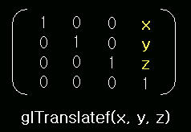
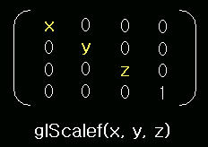
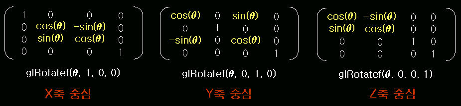
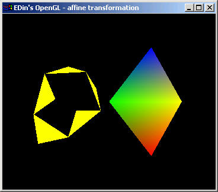

# 10장. 이동, 회전, 크기 변환

* GL\_MODELVIEW
* glMatrixMode\(\)
* glTranslatef\(\)
* glRotatef\(\)
* glScalef\(\)

앞 장에서 아핀 공간에서 일어 날 수 있는 변환 중에 이동 변환, 회전 변환, 크기 변환이 있다고 얘기했었다. OpenGL 에서는 이러한 변환을 위해서 변환 행렬을 만들어 주는 몇몇 함수가 있으며 그 함수의 목록은 아래에 나열되어 있다. 이 함수들에 의해서 만들어진 변환행렬은 OpenGL 의 모델뷰 행렬 스택\(MODEL-VIEW Matrix Stack\)의 최상단에 곱해지게 된다. 따라서 이러한 변환을 수행하려 한다면 현재 행렬 스택 모드를 모델뷰 행렬 스택으로 설정해 주어야 하며 그 후에 변환 함수등을 이용해 정점의 변환을 조작해야 한다.

```cpp
glMatrixMode( GL_MODELVIEW ); //모델뷰 행렬 스택 선택
...변환 조작...
```

OpenGL 에서 정점의 이동은 glTranslatef\(\) 함수를 이용한다. glTranslatef\(\) 함수의 원형은 아래와 같다.

```cpp
void glTranslatef( GLfloat x, GLfloat y, GLfloat z )
```

이 함수에 의해서 생성되는 변환 행렬은 아래와 같다.



이 행렬이 현재 모델뷰행렬에 곱해져 정점의 이동 변환이 이뤄진다.

glScalef\(\) 함수는 크기를 변환하는데 정점의 크기를 변환하는 것이 아니라 정점간의 거리, 즉 벡터의 길이를 늘리고 줄이는 것이다. 이 스케일 변환은 glScalef\(\) 함수를 이용한다.

```cpp
void glScalef( GLfloat x, GLfloat y, GLfloat z )
```

이 함수에 의해서 생성되는 변환 행렬은 아래와 같다.



회전 변환은 glRotatef\(\) 함수를 이용한다. 이 함수의 원형은 아래와 같다.

```cpp
void glRotatef( GLfloat angle, GLfloat x, GLfloat y, GLfloat z )
```

이 함수는 지정된 angle 만큼 한 축을 기준으로 회전한다. 즉 glRotatef\( 30.0f, 1.0f, 0.0f, 0.0f\) 라 하면 x 축을 중심으로 30 도 회전하는 것이다. 각각의 축에 따라 회전 변환 행렬이 다르게 생성된다. 아래는 이 함수에 의해서 생성되는 각각의 회전 변환 행렬이다.



아래의 프로그램은 위의 아핀 변환을 이용하여 만든 것이다.



```cpp
void RenderWindow::RenderGLScene(void)
{
    Window::RenderGLScene();

    static GLfloat rot=1.0f;
    static GLfloat scale=1.0f,factor=0.01f;
    glTranslatef(-2.0f, 0.0f, -10.0f);

    //5개의 삼각형 이용해서 별만들기
    glRotatef(rot,0.0f, 0.0f, 1.0f); //별 전체 회전
    for(int i=1; i<=5; i++)
    {
        glPushMatrix(); 
            glRotatef(72*(i-1), 0.0f, 0.0f, 1.0f); //5각형을 중심으로 삼각형 배치
            glTranslatef(0.0f, 1.35, 0.0f); //삼각형이 겹침을 막기 위해서 약간 이동
            glRotatef(i*rot, 1.0f, 0.0f, 0.0f); //각각회전
            glBegin(GL_TRIANGLES);
                glVertex3f(-1.0f, 0.0f, 0.0f);
                glVertex3f( 1.0f, 0.0f, 0.0f);
                glVertex3f( 0.0f, 1.0f, 0.0f);
            glEnd();
        glPopMatrix();
    }
    //모델뷰행렬초기화
    glLoadIdentity();
    glTranslatef(2.0f, 0.0f, -10.0f);
    glScalef(scale, scale, scale); //크기변환
    glRotatef(rot, 0.0f, 1.0f, 0.0f); //Y축을 중심으로 회전
    glRotatef(45.0f, 0.0f, 0.0f, 1.0f); //Z축을 중심으로 45도회전, 마름모
    glBegin(GL_QUADS);
        glColor3f(1.0f, 0.0f, 0.0f); glVertex3f(-0.4f, -0.4f, 0.0f);
        glColor3f(0.0f, 1.0f, 0.0f); glVertex3f( 0.4f, -0.4f, 0.0f);
        glColor3f(0.0f, 0.0f, 1.0f); glVertex3f( 0.4f,  0.4f, 0.0f);
        glColor3f(1.0f, 1.0f, 0.0f); glVertex3f(-0.4f,  0.4f, 0.0f);
    glEnd();

    rot += 0.1f; //회전각도증가
    scale += factor; //크기 변환 배율

    if(scale >= 5.0f)
    {
        factor = -factor;
    }
    else if(scale <= 0.0f)
    {
        factor = -factor;
    }
}
```

