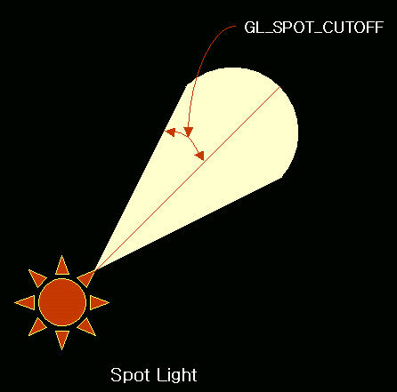

# 11장. 빛, 재질 표현하기

* GL\_LIGHTING
* GL\_LIGHT
* GL\_AMBIENT
* GL\_DIFFUSE
* GL\_SPECULAR
* GL\_POSITION
* GL\_SPOT\_CUTOFF
* GL\_SPOT\_DIRECTION
* glEnable\(\)
* glLightfv\(\)
* glNormal
* glMaterialfv\(\)

3D 그래픽스에서 빛이란 없어서는 안 될 존재이다. 3D 그래픽에서 사실감은 무척 중요한 요소인데 이 사실감을 만들어주는 요소 중의 하나가 빛이기 때문이다. OpenGL 은 이렇게 중요한 빛을 몇몇 함수만을 사용하면 표현할 수 있게 아주 쉽게 만들어져 있다. OpenGL 의 빛은 영화 촬영장의 조명을 생각하면 쉽게 이해할 수 있다. 촬영장에서 조명은 배우들만 집중적으로 비추는 것이 있을 것이고, 촬영 배경을 밝게만 해주는 조명 등이 있을 것이다. 이렇게 촬영장에 각각 다른 성질을 부여하여 여러개의 조명을 설치하듯 OpenGL 에서도 여러 성질의 여러개의 조명을 설정할 수 있다. OpenGL 에서는 총 8개의 조명만 설치할 수 있고 각각의 조명이 가질 수 있는 성질에는 주변광, 발산광, 반사광, 스포트라이트가 있다.

아래는 각각의 조명에 대한 설명이며 'OpenGL 프로그래밍 우상수/사이버출판사' 의 내용을 인용했다.

### 주변광 \( Ambient Light \) <a id="%EC%A3%BC%EB%B3%80%EA%B4%91-ambient-light"></a>

모든 방향에서 나타나는 조명이다. 즉, 전체적인 분위기를 만들어 내며 단일 지점에서 사방으로 균등하게 광원을 방출하는 조명을 뜻한다. 갓을 씌우지 않은 백열등과 태양이 좋은 예이다.


### 발산광\( Diffuse Light \) <a id="%EB%B0%9C%EC%82%B0%EA%B4%91-diffuse-light"></a>

이 조명은 한 방향으로부터 나온다. 그리고 특정한 방향과 위치를 가지고 있다. 그러므로 오브젝트의 표면을 비스듬이 비추는 것보다 직각으로 비추는 것이 더욱 강렬한 조명이 된다. 그러나 이 조명의 광선이 오브젝트의 표면에 부딪치면 시야가 어디에 있든지 모든 방향으로 똑같이 반사된다. 테이블을 비추는 램프의 빛을 예로 들 수 있다.


### 반사광\( Specular Light \) <a id="%EB%B0%98%EC%82%AC%EA%B4%91-specular-light"></a>

반사광은 일정한 방향으로부터 나온다. 일반적으로 높은 반사율을 가진 오브젝트의 표면에서 흰색에 가까운 색상으로 밝은 지점을 형성한다. 반사되는 빛이 해당 면을 바라보는 방향과 일치하는 경우 밝게 빛나게 되는데, 이 경우 밝게 빛나는 빛의 색상을 설정한다. 이 조명은 빛을 방출하는 방향이 있을 뿐 아니라, 태양의 흑점 중앙의 암흑부\(Umbra\) 라는 초점 개념도 있다. 레이저 빔이 가장 좋은 예이다.


### 스포트라이트\( Spot Light \) <a id="%EC%8A%A4%ED%8F%AC%ED%8A%B8%EB%9D%BC%EC%9D%B4%ED%8A%B8-spot-light"></a>

가장 쉽게 인식할 수 있는 광원이다. 무대 위의 한 인물 혹은 한 곳에 집중된 광선을 말한다.



### 조명 켜기 <a id="%EC%A1%B0%EB%AA%85-%EC%BC%9C%EA%B8%B0"></a>

OpenGL 에서 조명을 사용하려면 다음과 같이 glEnable\(\) 함수를 이용해서 조명에 관련 된 상태 변수를 ON 해줘야한다.

```cpp
glEnable( GL_LIGHTING ); //조명을 사용할 것이다.
glEnable( GL_LIGHT0 ); //조명 중 0 번 조명을 사용할 것이다.
```

조명을 사용하려면 사용할 조명의 성질을 glLightfv\(\) 함수를 통해서 설정해 주어야 한다.

```cpp
glLightfv( GL_LIGHT0, GL_AMBIENT, AmbientLightValue ); //Ambient 조명의 성질을 설정한다.
glLightfv( GL_LIGHT0, GL_DIFFUSE, DiffuseLightValue ); //Diffuse 조명의 성질을 설정한다.
glLightfv( GL_LIGHT0, GL_SPECULAR, SpecularLightValue ); //Specular 조명의 성질을 설정한다. 
glLightfv( GL_LIGHT0, GL_POSTION, PotionLightValue ); //조명의 위치(광원)를 설정한다.
```

위에서 사용하는 각각의 성질값은 아래처럼 정의할 수 있다.

```cpp
GLfloat AmbientLightValue[] = { 0.3f, 0.3f, 0.3f, 1.0f };
GLfloat DiffuseLightValue[] = { 0.7f, 0.7f, 0.7f, 1.0f };
GLfloat SpecularLightValue[] = { 1.0f, 1.0f, 1.0f, 1.0f };
GLfloat PositionLightValue[] = { 0.0f, 0.0f, 1.0f, 0.0f };
```

값을 위처럼 설정할 수도 있지만 조명을 켜기만하면 조명을 사용할 수 있도록 OpenGL 에서는 각각의 성질에 대한 기본 설정값을 가진다. 다른 기본 설정값도 있는데 이 것은 링크 싸이트의 OpenGL Programming Guide 싸이트를 참고하길 바란다.

```cpp
GL_AMBIENT (0.0, 0.0, 0.0, 1.0) //Ambient 조명의 기본 설정값
GL_DIFFUSE (1.0, 1.0, 1.0, 1.0) //Diffuse 조명의 기본 설정값
GL_SPECULAR (1.0, 1.0, 1.0, 1.0) //Specular 조명의 기본 설정값
GL_POSITION (0.0, 0.0, 1.0, 0.0) //광원 위치의 기본 설정값
GL_SPOT_CUTOFF 180.0 //Spot 조명의 Cutoff 기본 설정값
```

다음 그림은 조명을 설치하여 폴리곤을 그려본 프로그램이다.


위 프로그램의 코드는 다음과 같다.

```cpp
#include "lib\egl.h"

using namespace egl;

class RenderWindow : public Window
{
private:
    GLfloat ambientLight[4];
    GLfloat diffuseLight[4];
    GLfloat lightPosition[4];
    GLfloat specular[4];
    GLfloat yrot;
public:
    virtual BOOL InitGL(void);
    virtual void RenderGLScene(void);
    virtual void OnCreate(WPARAM wParam, LPARAM lParam);
};

void RenderWindow::OnCreate(WPARAM wParam, LPARAM lParam)
{
    //조명의 성질 설정
    ambientLight[0] = 0.3f; 
    ambientLight[1] = 0.3f;
    ambientLight[2] = 0.3f;
    ambientLight[3] = 1.0f;

    diffuseLight[0] = 0.7f;
    diffuseLight[1] = 0.7f;
    diffuseLight[2] = 0.7f;
    diffuseLight[3] = 1.0f;

    lightPosition[0] = 0.0f;
    lightPosition[1] = 0.0f;
    lightPosition[2] = 5.0f;
    lightPosition[3] = 1.0f;

    specular[0] = 1.0f;
    specular[1] = 1.0f;
    specular[2] = 1.0f;
    specular[3] = 1.0f;

    yrot = 0.0f;
}

BOOL RenderWindow::InitGL(void)
{
    Window::InitGL();

    glClearColor(0.5f, 0.5f, 0.5f, 1.0f); //밝은 회색을 배경색으로 설정 
    glFrontFace(GL_CCW); //반시계방향으로 감은 폴리곤이 앞면
    glEnable(GL_CULL_FACE); //가려진 부분은 그려지지 않게 한다.

    glEnable(GL_LIGHTING); //조명 켜기
    glLightfv(GL_LIGHT0, GL_AMBIENT, ambientLight); //설정
    glLightfv(GL_LIGHT0, GL_DIFFUSE, diffuseLight); //설정
    glLightfv(GL_LIGHT0, GL_SPECULAR, specular); //설정
    glLightfv(GL_LIGHT0, GL_POSITION, lightPosition); //설정
    glEnable(GL_LIGHT0); // 0번 조명 사용

    return TRUE;
}

void RenderWindow::RenderGLScene(void)
{
    Window::RenderGLScene();

    glTranslatef(0.0f, 0.0f, -5.0f);
   glRotatef(yrot, 0.0f, 1.0f, 0.0f);
    //glColor3f(0.7f, 0.7f, 0.0f);

    glBegin( GL_TRIANGLES );
        //{ Front }
        glVertex3f( 0.0f, 1.0f, 0.0f); 
        glVertex3f(-1.0f,-1.0f, 1.0f);
        glVertex3f( 1.0f,-1.0f, 1.0f);

        //{ Right }
        glVertex3f( 0.0f, 1.0f, 0.0f );
        glVertex3f( 1.0f,-1.0f, 1.0f );
        glVertex3f( 1.0f,-1.0f,-1.0f );

        //{ Back }
        glVertex3f( 0.0f, 1.0f, 0.0f );
        glVertex3f( 1.0f,-1.0f,-1.0f );
        glVertex3f(-1.0f,-1.0f,-1.0f );

        //{ Left }
        glVertex3f( 0.0f, 1.0f, 0.0f );
        glVertex3f(-1.0f,-1.0f,-1.0f );
        glVertex3f(-1.0f,-1.0f, 1.0f );
    glEnd(); 

   yrot += 0.1f;
}

int APIENTRY WinMain(HINSTANCE hInstance, HINSTANCE hPrevInstance, LPSTR lpCmdLine, int nShowCmd)
{
    RenderWindow app;
    if(!app.Create(FALSE,"EDin's OpenGL - Light"))
        return EXIT_FAILURE;
    return app.Run();
}
```

위의 그림을 보면 조명을 설정했는데 폴리곤이 반짝 거리지도 않고 전혀 조명을 설정한 것 같지가 않다. 하지만 조명은 설정되었다. 주변광\(Ambient Light\)가 어두운 회색으로 설정 되었는데 폴리곤이 그 조명으로 인해서 어두운 회색으로 그려졌다. 그럼 이게 사실적인 모습인가? 아니다. 사실적인 모습을 그리려면 몇가지를 더 설정해 주어야한다. 그 하나는 빛이 반사될 방향을 설정할 수 있는 법선벡터를 정하는 것이고 다른 하나는 재질의 설정이다. 우선 법선 벡터를 설정한다는 것이 무엇인지 알아보자.

### 법선 벡터 설정 <a id="%EB%B2%95%EC%84%A0-%EB%B2%A1%ED%84%B0-%EC%84%A4%EC%A0%95"></a>

빛의 반사각은 입사각과 같다. 다음 그림을 보자.


빛은 어디로 반사될까? 해답은 법선벡터를 알면 구할 수 있다.


위 그림에서 파란색 벡터가 법선 벡터로 폴리곤의 평면에 수직이다. 빛은 법선 벡터를 중심으로 반사각을 계산하여 반사된다. 그렇다면 위의 소스코드에서 임의의 법선 벡터를 설정해보자.


```cpp
void RenderWindow::RenderGLScene(void)
{
    Window::RenderGLScene();

    glTranslatef(0.0f, 0.0f, -5.0f);
   glRotatef(yrot, 0.0f, 1.0f, 0.0f);
    //glColor3f(0.7f, 0.7f, 0.0f);

    glBegin( GL_TRIANGLES );
        //{ Front }
        glNormal3f(0.0f, 0.0f, -1.0f); 
        glVertex3f( 0.0f, 1.0f, 0.0f); 
        glVertex3f(-1.0f,-1.0f, 1.0f);
        glVertex3f( 1.0f,-1.0f, 1.0f);

        //{ Right }
        glVertex3f( 0.0f, 1.0f, 0.0f );
        glVertex3f( 1.0f,-1.0f, 1.0f );
        glVertex3f( 1.0f,-1.0f,-1.0f );

        //{ Back }
        glVertex3f( 0.0f, 1.0f, 0.0f );
        glVertex3f( 1.0f,-1.0f,-1.0f );
        glVertex3f(-1.0f,-1.0f,-1.0f );

        //{ Left }
        glVertex3f( 0.0f, 1.0f, 0.0f );
        glVertex3f(-1.0f,-1.0f,-1.0f );
        glVertex3f(-1.0f,-1.0f, 1.0f );
    glEnd(); 

   yrot += 0.1f;
}
```

위의 그림을 보면 사실감이 약간 더 가미되었다. 코드를 보자. 사각뿔의 앞면에만 임의의 법선벡터를 설정했다. 하지만 법선 벡터는 평면에 수직해야하는데 위에서 설정한 법선벡터는 그렇지 못하다. 그렇다면 어떻게 해야하는가? OpenGL 에서 각 정점에 대해서 법선벡터를 구해주는 기능이 있지만 성능 저하로 많이 쓰지 않고 직접 법선 벡터를 구하는 루틴을 사용한다. 아래의 코드에 Vector 라는 객체를 사용하는데 여기서 사용할 벡터에 관련된 코드이다. 수학책의 내용을 그대로 옮겨 놓았으니\(따라서 최적화는 없다 ;\]\)분석하는데 어려움은 없을 것이다. 이 코드에서 getNormal\(\) 함수가 법선 벡터를 구해준다.


위의 그림처럼 세 정점을 이용해서 법선 벡터를 구해서 프로그램을 실행시켰을 때의 그림이다.


```cpp
void RenderWindow::RenderGLScene(void)
{
    Window::RenderGLScene();

    static Vector nv; //법선벡터

    glTranslatef(0.0f, 0.0f, -5.0f);
    glRotatef(yrot, 0.0f, 1.0f, 0.0f);

    //glColor3f(0.7f, 0.7f, 0.0f);
    glBegin( GL_TRIANGLES );
        //{ Front }
        nv = getNormal( Vector(0.0f, 1.0f, 0.0f), Vector(-1.0f,-1.0f, 1.0f), Vector(1.0f, -1.0f, 1.0f) );
        glNormal3f(nv.x, nv.y, nv.z);
        glVertex3f( 0.0f, 1.0f, 0.0f); // Top Of Triangle (Front)
        glVertex3f(-1.0f,-1.0f, 1.0f); // Left Of Triangle (Front)
        glVertex3f( 1.0f,-1.0f, 1.0f); // Right Of Triangle (Front)

        //{ Right }
        nv = getNormal( Vector(0.0f, 1.0f, 0.0f), Vector(1.0f,-1.0f, 1.0f), Vector(1.0f,-1.0f,-1.0f) );
        glNormal3f(nv.x, nv.y, nv.z);
        glVertex3f( 0.0f, 1.0f, 0.0f );
        glVertex3f( 1.0f,-1.0f, 1.0f );
        glVertex3f( 1.0f,-1.0f,-1.0f );

        //{ Back }
        nv = getNormal( Vector(0.0f, 1.0f, 0.0f), Vector(1.0f,-1.0f,-1.0f), Vector(-1.0f,-1.0f,-1.0f) );
        glNormal3f(nv.x, nv.y, nv.z);
        glVertex3f( 0.0f, 1.0f, 0.0f );
        glVertex3f( 1.0f,-1.0f,-1.0f );
        glVertex3f(-1.0f,-1.0f,-1.0f );

        //{ Left }
        nv = getNormal( Vector(0.0f, 1.0f, 0.0f), Vector(-1.0f,-1.0f,-1.0f), Vector(-1.0f,-1.0f,1.0f) );
        glNormal3f(nv.x, nv.y, nv.z);
        glVertex3f( 0.0f, 1.0f, 0.0f );
        glVertex3f(-1.0f,-1.0f,-1.0f );
        glVertex3f(-1.0f,-1.0f, 1.0f );
    glEnd(); 

   yrot += 0.1f;
}
```

### 재질 설정 <a id="%EC%9E%AC%EC%A7%88-%EC%84%A4%EC%A0%95"></a>

빛과 마찬가지로 재질도 사실감을 표현하는데 빠질 수 없는 요소다. 아래는 재질에 대한 설명이며 'OpenGL 프로그래밍 우상수/사이버출판사' 의 내용을 인용했다.

재질이란 오브젝트가 빛을 얼마나 반영하는지 혹은 얼마나 반사하는지에 대한 성질을 의미한다. 두 개의 사과중에 잘 닦은 사과는 윤기가 흘러 반짝반짝하지만 닦지 않은 사과는 윤기가 없어 탁하다. 여기서 중요한 점은 두 개의 사과가 색깔이 같더라도 껍질의 성질에 의해서 차이가 분명하다는 것이다. 과학적으로 생각하면 간단하다. 사과를 닦아 놓았다는 것은 껍질에 붙어 있는 이물질의 제거를 의미하고 있는 것이다. 그리고 물질의 이물질의 제거는 껍질에 대한 빛의 반사율을 높였던 것이다. 그렇다면 3D 광경에서도 반짝반짝 빛나는 사과와 그렇지 않은 사과 모두를 나타낼 수 있어야 된다는 것이다. 다행스럽게 OpenGL 은 재실의 설정을 쉽게 할 수 있도록 지원하고 있다.

오브젝트의 표면이 어떻게 빛을 흐트리는가에 따라 OpenGL 은 다섯가지 재질을 준비하고 있다. 이러한 재질은 흩어지는 빛의 색상을 설정하는 RGBA 값에 의해서 표현된다. 예를 들어, 빨간색 사과는 빨간색 조명만이 반영되고, 녹색이나 파란색은 다른 영향을 끼칠 것이다. 만약 흰색이나 빨간색 조명으로 사과를 비춰 주면 당연히 빨간색으로 보일 것이다. 그러나 녹색의 조명으로 빨간 사과를 비추면 사과가 검은색에 가깝게 보이게 된다. 즉, 조명의 변화에 따라서 오브젝트의 색상도 변하게 된다. 그리고 오브젝트가 가진 빛의 반사율과 비춰 주는 각도에 따라서 상이한 변화를 가져 올 수 있다.

### 주변광\(Ambient\) 재질과 발산광\(Diffuse\) 재질 <a id="%EC%A3%BC%EB%B3%80%EA%B4%91-ambient-%EC%9E%AC%EC%A7%88%EA%B3%BC-%EB%B0%9C%EC%82%B0%EA%B4%91-diffuse-%EC%9E%AC%EC%A7%88"></a>

발산광 재질과 주변광 재질은 빛을 반사시키는 성질을 가지고 있으며 관점으로부터 독립적이다. 그렇기 때문에 사람의 시각 변동에 의해서 오브젝트의 광경이 크게 변화되지는 않는다. 우선 오브젝트 표면의 속성이 발산광 재질이라면 빛을 주변으로 발산하게 한다. 그리고 이 경우에 퍼뜨리는 빛은 주로 직사광원\(Direct Light Source\)이다. 주변광 재질은 오브젝트 표면이 주변광에 의해서 반사되는 속성을 가졌다. 발산광 재질은 주변으로 직사 광선을 반사하지만, 주변광은 간접적으로 광원\(Indirect Light\)을 반사시킨다는 점이 차이점이다.

### 반사광\(Specular\) 재질과 광택\(Shininess\) 재질 <a id="%EB%B0%98%EC%82%AC%EA%B4%91-specular-%EC%9E%AC%EC%A7%88%EA%B3%BC-%EA%B4%91%ED%83%9D-shininess-%EC%9E%AC%EC%A7%88"></a>

만약 오브젝트 표면의 재질이 반사광 재질과 광택 재질로 되어 있으면 빛을 반사시키는 효과를 가지고 있으며 관점\(Viewport\)으로부터 비독립적이라는 의미이다. 여기서 발산광 혹은 주변광 재질과 다른 차이점이 발견된다. 즉, 관점이 변경되면 그 오브젝트의 속성이 다르게 보인다는 것이다. 반사광 재질은 표면에서 가장 반사율이 높은 표면에서 나오는 빛의 반사 효과를 나타낸다. 그리고 광택 재질은 빛을 반사하는 속성의 집중도를 의미한다. 예를 들어 세라믹 주전자는 플라스틱 주전자보다 반사광을 적게 반사할 것이다. 반면 금속성 주전자는 세라믹 주전자와 플라스틱 주전자보다 더욱 높은 광택값을 가질 것이다.

### 발광\(Emissive\) 재질 <a id="%EB%B0%9C%EA%B4%91-emissive-%EC%9E%AC%EC%A7%88"></a>

오브젝트 스스로가 빛을 나타내는 것을 발광 재질이라고 한다. 바로 광원의 원천이 오브젝트인 것이다. 예를 들어 반딧불을 생각해 보자. 캄캄한 밤에도 자신의 몸을 이용해 빛을 내고 있다. 또한 모닥불과 램프 같은 조명 기구들도 스스로 빛을 발산하고 있는 경우이다. 3D 광경에서 태양과 같이 자신 스스로 발광하는 것을 표현하려면 발광값이 설정되어야 한다. 그리고 3D 광경에 램프를 그리고자 할 때 발광값을 설정하여 렌더링을 하는 동시에 광원을 램프 속에 위치시켜야 한다. 램프에서 발광값은 불이 타오르는 것을 나타내고 광원은 램프 주변의 오브젝트를 비추는 역할을 한다.

### 재질의 반응 색상 설정하기 <a id="%EC%9E%AC%EC%A7%88%EC%9D%98-%EB%B0%98%EC%9D%91-%EC%83%89%EC%83%81-%EC%84%A4%EC%A0%95%ED%95%98%EA%B8%B0"></a>

각각의 조명에 반응하는 오브젝트를 만들려면 재질의 색상을 설정해 주어야한다.

```text
GLfloat materialAmbient[] = { 0.0f, 0.7f, 0.0f, 1.0f };
GLfloat materialSpecular[] = { 1.0f, 1.0f, 1.0f, 1.0f };
```

### 재질의 색상 <a id="%EC%9E%AC%EC%A7%88%EC%9D%98-%EC%83%89%EC%83%81"></a>

사과를 표현하는 경우 골격만 그린다고 해결되는 것은 아니다. 앞서 언급했듯이 빨간 색상을 칠해줘야 한다.

```text
glColor3f(1.0f, 0.0f, 0.0f);
```

### 재질 정의하기 <a id="%EC%9E%AC%EC%A7%88-%EC%A0%95%EC%9D%98%ED%95%98%EA%B8%B0"></a>

OpenGL 에서 재질을 정의하기 위해서는 glMaterialfv\(\) 함수를 쓴다. 인자값으로 위에서 설정한 재질의 배열값이 쓰인다.

```text
glMaterialfv( GL_FRONT, GL_AMBIENT_AND_DIFFUSE, materialAmbient );
glMaterialfv( GL_FORNT, GL_SPECULAR, materialSpecular );
```

glMaterialfv\(\) 함수는 첫째 정의한 재질의 다각형 면을 상수값으로 갖는다. 둘째 재질의 속성을 결정한다. 셋째 재질의 속성을 설정한 배열의 포인터를 갖는다. 첫번째 인자로 GL\_FRONT, GL\_BACK 그리고 GL\_FRONT\_AND\_BACK 이 올수 있다. 이 것은 오브젝트로 만들어진 다각형의 앞면과 뒷면 그리고 양쪽 모두를 선택한다. 직육면체와 같이 속이 채워진 오브젝트는 속을 볼 필요가 없기 때문에 GL\_FRONT 로 설정할 것이고, 어떤 특정한 광경의 경우에 속면과 겉면을 모두 보기 위해서는 GL\_FRONT\_AND\_BACK 을 사용할 것이다. 두번째 인자는 GL\_AMBIENT, GK\_AMBIENT\_AND\_DIFFUSE, GL\_COLOR\_INDEXES, GL\_DIFFUSE, GL\_EMISSION, GL\_SHININESS 및 GL\_SPECULAR 중 하나가 쓰인다. 만약 반사광이 반영된 조명을 쓰고 싶다면 먼저 재질의 밝기를 설정해야 한다. 재질의 밝기는 반사율 정도를 반영하는 결정적 요소이다. 그래서 glMaterialf\(\) 함수를 사용해서 재질의 밝기를 꼭 설정하도록 한다.

```text
glMaterialf( GL_FRONT, GL_SHININESS, 60.0f );
```

이 함수의 인자는 정의된 오브젝트 앞면의 재질을 말하고 있으며, GL\_SHININESS 상수값은 재질의 밝음을 설정한다. 이 값의 범위는 0.0 에서 128.0 까지이다.

위의 설명을 적용한 프로그램과 코드를 보자.


```cpp
#include "lib\egl.h"

using namespace egl;

class RenderWindow : public Window
{
private:
    GLfloat ambientLight[4];
    GLfloat diffuseLight[4];
    GLfloat lightPosition[4];
    GLfloat specular[4];
    GLfloat specref[4]; //전반사 반사율 
    GLfloat yrot;
public:
    virtual BOOL InitGL(void);
    virtual void RenderGLScene(void);
    virtual void OnCreate(WPARAM wParam, LPARAM lParam);
};

void RenderWindow::OnCreate(WPARAM wParam, LPARAM lParam)
{
    ... 
    specular[0] = 1.0f;
    specular[1] = 1.0f;
    specular[2] = 1.0f;
    specular[3] = 1.0f;
    ...
}

BOOL RenderWindow::InitGL(void)
{
   ... 
   glEnable(GL_COLOR_MATERIAL); //재질의 색을 폴리곤의 색으로한다.
   glColorMaterial(GL_FRONT, GL_AMBIENT_AND_DIFFUSE); //주변광, 발산광 재질에 대해서만
   glMaterialfv(GL_FRONT, GL_SPECULAR, specref); //전반사 반사율 설정
   glMateriali(GL_FRONT, GL_SHININESS, 128); //재질의 밝기 설정

   return TRUE;
}

void RenderWindow::RenderGLScene(void)
{
    Window::RenderGLScene();

    static Vector nv; //법선벡터


    glTranslatef(0.0f, 0.0f, -5.0f);
    glRotatef(yrot, 0.0f, 1.0f, 0.0f);
    glColor3f(0.7f, 0.7f, 0.0f); //폴리곤의 색 설정. 이 색에 따라서 재질의 색이 설정된다.

    glBegin( GL_TRIANGLES );
        //{ Front }
        nv = getNormal( Vector(0.0f, 1.0f, 0.0f), Vector(-1.0f,-1.0f, 1.0f), Vector(1.0f, -1.0f, 1.0f) );
        glNormal3f(nv.x, nv.y, nv.z);
        glVertex3f( 0.0f, 1.0f, 0.0f); // Top Of Triangle (Front)
        glVertex3f(-1.0f,-1.0f, 1.0f); // Left Of Triangle (Front)
        glVertex3f( 1.0f,-1.0f, 1.0f); // Right Of Triangle (Front)

        //{ Right }
        nv = getNormal( Vector(0.0f, 1.0f, 0.0f), Vector(1.0f,-1.0f, 1.0f), Vector(1.0f,-1.0f,-1.0f) );
        glNormal3f(nv.x, nv.y, nv.z);
        glVertex3f( 0.0f, 1.0f, 0.0f );
        glVertex3f( 1.0f,-1.0f, 1.0f );
        glVertex3f( 1.0f,-1.0f,-1.0f );

        //{ Back }
        nv = getNormal( Vector(0.0f, 1.0f, 0.0f), Vector(1.0f,-1.0f,-1.0f), Vector(-1.0f,-1.0f,-1.0f) );
        glNormal3f(nv.x, nv.y, nv.z);
        glVertex3f( 0.0f, 1.0f, 0.0f );
        glVertex3f( 1.0f,-1.0f,-1.0f );
        glVertex3f(-1.0f,-1.0f,-1.0f );

        //{ Left }
        nv = getNormal( Vector(0.0f, 1.0f, 0.0f), Vector(-1.0f,-1.0f,-1.0f), Vector(-1.0f,-1.0f,1.0f) );
        glNormal3f(nv.x, nv.y, nv.z);
        glVertex3f( 0.0f, 1.0f, 0.0f );
        glVertex3f(-1.0f,-1.0f,-1.0f );
        glVertex3f(-1.0f,-1.0f, 1.0f );
    glEnd(); 

    yrot += 0.1f;
}

int APIENTRY WinMain(HINSTANCE hInstance, HINSTANCE hPrevInstance, LPSTR lpCmdLine, int nShowCmd)
{
    RenderWindow app;
    if(!app.Create(FALSE,"EDin's OpenGL - Light"))
        return EXIT_FAILURE;
    return app.Run();
}
```

