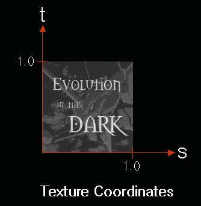
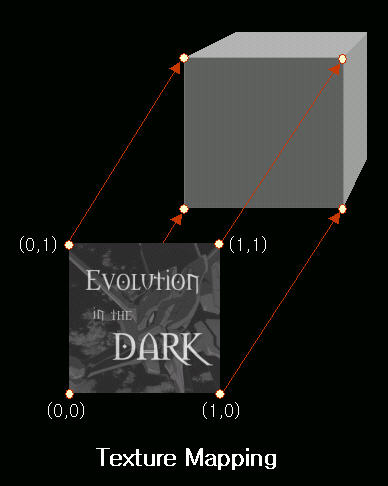
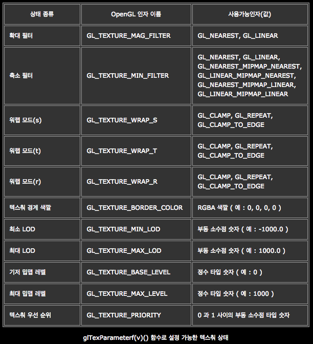
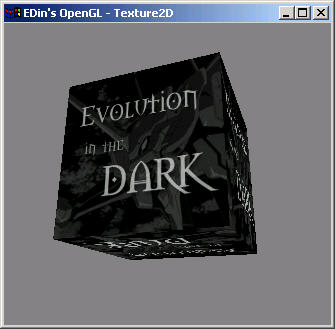
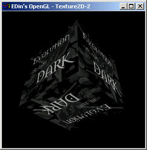
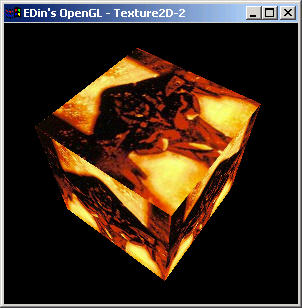

# 12장. 텍스춰매핑

* GL\_TEXTURE\_2D
* glTexCoord2f\(\)
* glTexImage2D\(\)
* glTexParameterf\(\)
* glGenTexture\(\)
* glBindTexture\(\)
* glDeleteTexture\(\)
* 참고 자료 : OpenGL 을 통한 3차원 그래픽스 프로그래밍 기초편, 임인성 저 / 도서출판 그린

컴퓨터 그래픽스 렌더링에 있어 가장 중요한 목표는 실제의 상황을 카메라로 촬영한 듯한 사실적인 영상을 생성하는 것이다. 다면체 모델을 사용하는 렌더링 시스템에서 물체의 사실성을 높이기 위한 방법 중의 하나는 더 많은 수의 다각형을 사용하여 정교하게 물체를 표현하는 것이다. 하지만 비교적 복잡한 물체를 표현하려고 하면 쉽게 수만-수십만 개의 다각형이 필요하고는 한다. 따라서 많은 시간과 메모리를 사용해야 하고 이는 실시간 렌더링의 그래픽스에서 좋은 방법이 아니다. 반면에 비교적 적은 추가 비용으로 이미지의 사실성을 상당히 높일 수 있는 방법 중의 하나는 다면체 모델을 렌더링 할 때 미리 생성해 놓은 다양한 부류의 이미지 데이터를 적절하게 적용하여 이미지를 생성하는 것이다. 그러한 방법의 대표적인 것이 텍스춰 매핑\(texture mapping\)인데, 우리가 가장 보편적으로 접하는 텍스춰 매핑 기법은 2차원 텍스춰 매핑이라 할 수 있다. 이 방법에서는 물체 표면의 텍스춰, 즉 색깔, 패턴, 형태 등을 표현해주는 2차원 이미지를 미리 생성해 놓고, 이를 다면체 물체에 덮어 씨운 후 렌더링을 하여, 물체 표면에 마치 그러한 텍스춰가 존재하는 것처럼 보이도록 하는 기법이다. 텍스춰 매핑을 하기 위해서 가장 먼저 생각해야할 일은 텍스춰 이미지와 물체간의 대응 관계를 설정하는 것이다. 이는 텍스춰 이미지의 좌표 설정, 텍스춰 이미지의 특성 등을 정하는 것이다.

OpenGL 에서는 텍스춰 좌표를 표현하기 위하여 3차원 공간의 동차 좌표 \( s, t, r, q \) 를 사용한다. 이 좌표는 기하 물체를 표현하기 위한 3차원 공간의 점 \( x, y, z, w \) 에 대응이 되는데, OpenGL 에서 2차원 공간의 점 \( x, y \) 가 z = 0 이고 w = 1 인 특수한 경우로 취급이 되는 것처럼, 2차원 텍스춰 이미지에 대한 좌표 \( s, t \) 는 마찬가지로 r = 0 , q = 1 인 특수한 경우로 취급이 된다. 물론 r 과 q 좌표는 3 차원 텍스춰 매핑이나 투영 텍스춰와 같은 고급 기법에 유용하게 쓰인다. 텍스춰 좌표의 범위는 텍스춰 이미지의 크기와 상관없이 0.0 에서 1.0 까지이다. 아래의 그림은 텍스춰 좌표계를 보여준다.



아래의 그림은 위의 텍스쳐 이미지와 물체간의 매핑을 보여준다.



텍스춰 매핑의 좌표를 설정하는 함수는 glTexCoord2f\(\) 함수다. 이 함수의 원형은 다음과 같다. 인자는 따로 설명하지 않는다.

```cpp
void glTexCoord2f( GLfloat s, GLfloat t )
```

텍스춰 매핑을 하기 위해서는 텍스춰 이미지를 준비해야하고 OpenGL 에 어떤 이미지를 사용할지를 알려줘야한다. 이러한 역할을 하는 함수는 glTexImage2D\(\) 함수이다. 1차원 3차원의 함수도 있지만 여기서는 2차원의 텍스춰 매핑만 살펴볼 것이다. 1차원, 3차원의 텍스쳐 매핑은 다른 OpenGL 서적을 참고하자. 아래는 glTexImage2D\(\) 함수의 원형이다.

```cpp
void glTexImage2D( GLenum target, 
                   GLint level, 
                   GLint components, 
                   GLsizei width, 
                   GLsizei height, 
                   GLint border, 
                   GLenum format, 
                   GLenum type, 
                   const GLvoid *pixels )
```

각각의 인자를 설명하자면, target 에 대하여 상수 GL\_TEXTURE\_2D 를 넘기면, 이 함수는 마지막 인자 pixels 이 가리키는 메모리 영역에 저장이 되어 있는 2차원 이미지 데이터를 텍스춰 메모리에 올려주게 된다. 여기서 네 번째와 다섯 번째 인자 width 와 height 는 그 이름이 나타내듯이 텍스춰 이미지의 해상도를 설정하는데 사용이 되는데, 이 때 이 두 인자는 항상 2의 멱급수 값, 즉 0보다 같거나 큰 정수 n 에 대하여 2n 형태의 값을 가져야 한다. 여섯 번째 인자 border 는 0 또는 1 값을 가지는데, 만약 이 값이 1 이라면 현재 올리려하는 텍스춰 이미지 둘레로 한 화소의 폭을 가지는 경계가 있음을 의미한다. 따라서 width 가 256 이고 height 가 128, 그리고 border 가 1 값을 가질 경우, \( 256 + 1 \) x \( 128 + 1 \) 의 해상도를 가지는 텍스춰를 사용함을 의미하게 된다. 물론 border 에 0 값이 설정되면 경계가 없음을 의미하는데, 텍스춰의 경계에 나타나는 색깔은 필요에 따라 추후 필터링 과정에서 사용이 된다. 이 함수의 두 개의 인자 format 과 type 는 메인 메모리에 저장되어 있는 텍스춰 이미지 데이터의 저장 형식을 나타낸다. 우선 format 은 각 이미지의 픽셀을 구성하는 요소 값들을 나타낸다. OpenGL 에서는 GL\_RGB, GL\_BGR, GL\_RGBA, GL\_BGRA, GL\_RED, GL\_GREEN, GL\_ALPHA, GL\_LUMINACE, GL\_LUMINACE\_ALPHA 등의 값을 가질 수 있다. 어떤 상수 값을 사용하는가에 따라 메인 메모리에 저장된 텍스춰 이미지의 픽셀이 몇 개의 필드로 구성이 되어 있는지, 그리고 각 필드가 어떠한 의미를 내포하는지가 결정된다. 이 때 각 필드의 요소 데이터가 실제로 저장이 되어 있는 타입은 type 인자에 의해 결정이 되는데, 가능한 상수 값으로 GL\_BYTE, GL\_UNSIGNED\_BYTE, GL\_SHORT, GL\_UNSIGNED\_SHORT, GL\_INT, GL\_UNSIGNED\_INT, GL\_FLOAT, GL\_BITMAP 등이 있다. 마지막으로 level 인자는 현재 설정하려는 텍스춰 이미지의 상세 레벨을 설정하는데 사용이 된다. 텍스춰 매핑을 통한 레더링을 할 때 뒤에서 밉매핑 기능을 사용하려면 동일한 텍스춰 이미지를 여러개의 해상도로 텍스춰 메모리에 올려준다. 이 때 원래의 텍스춰, 즉 해상도가 가장 높은 이미지의 레벨이 0 이 되고, 해상도가 낯아질수록 레벨 값이 1, 2, 3, ... 과 같이 증가한다. 따라서 밉매핑을 하지 않는다면 이 인자에 0 값을 설정하면 된다.

이 함수를 수행하면 텍스춰 매핑에 필요한 정보 중 텍스춰 이미지의 해상도, 경계 두께, 내부 형식, 그리고 각 요소 필드에 할당된 비트 수 등이 갖추어진다. 이 정보만으로는 텍스춰 매핑을 할 수가 없고 다른 정보가 더 필요하다. 그 것은 현재 프래그먼트의 텍스춰 좌표가 주어졌을 때, 텍스춰 이미지를 액세스하여 텍스춰 색깔을 계산하는 방식에 영향을 미치는 정보가 갖추어져야한다. 이 정보를 설정하는 함수가 glTexParameterf\(\) 함수다. 아래에 이 함수의 원형이 있다.

```cpp
void glTexParameterf( GLenum target, GLenum pname, GLfloat param )
```

이 함수의 첫 번째 인자 target 에는 GL\_TEXTURE\_2D 를 사용하면 되고, 두 번째와 세 번째 인자 pname 과 param 에는 각각 이 표의 인자 이름과 그에 해당하는 사용 가능 인자를 사용하면 되는데, pname 은 설정한 값의 이름이고 이 인자에 올 수 있는 이르들은 GL\_TEXTURE\_MIN\_FILTER, GL\_TEXTURE\_MAG\_FILTER, GL\_TEXTURE\_WRAP\_S, GL\_TEXTURE\_WRAP\_T 등이다. 그리고 param 은 각각의 이름에 대한 실제 값이 온다. 아래의 표는 이 함수로 설정 가능한 텍스춰의 상태이다.



이상의 내용으로 텍스춰 매핑을 한 프로그램과 소스 코드를 보자.



```cpp
#include "lib\egl.h"

using namespace egl;

class RenderWindow : public Window
{
private:
    Dib image; //DIBitmap 을 핸들링할 Dib 클래스 인스턴스
    GLfloat rot; //큐브의 회전각
public:
    virtual BOOL InitGL(void);
    virtual void RenderGLScene(void);
    virtual void OnCreate(WPARAM wParam, LPARAM lParam);
};

void RenderWindow::OnCreate(WPARAM wParam, LPARAM lParam)
{
    rot = 0.0f;
}

BOOL RenderWindow::InitGL(void)
{
    Window::InitGL();

    //텍스춰 이미지로 사용할 이미지를 파일로부터 읽어 온다.
    if(!image.LoadFromFile("edin01.bmp"))
    {
        MessageBox(NULL, "edin01.bmp 파일을 불러올 수 없습니다", "오류", MB_OK);
        return FALSE;
    }

    //텍스춰 상태 설정
    glTexParameteri(GL_TEXTURE_2D, GL_TEXTURE_MIN_FILTER, GL_LINEAR);
    glTexParameteri(GL_TEXTURE_2D, GL_TEXTURE_MAG_FILTER, GL_LINEAR);

    //텍스춰 이미지 설정
    glTexImage2D(GL_TEXTURE_2D, 0, 3, image.GetWidth(), image.GetHeight(), 0, GL_BGR_EXT, GL_UNSIGNED_BYTE, image.GetRawData());

    //2D 텍스춰를 사용할 것임을 설정한다.
    glEnable(GL_TEXTURE_2D);

    glFrontFace(GL_CCW);
    glEnable(GL_CULL_FACE);
    return TRUE;
}

void RenderWindow::RenderGLScene(void)
{
    Window::RenderGLScene();

    glTranslatef(0.0f, 0.0f, -5.0f);
    glRotatef(rot, 1.0f, 0.0f, 0.0f); //큐브 X 축 중심 회전
    glRotatef(rot, 0.0f, 1.0f, 0.0f); //큐브 Y 축 중심 회전

    //텍스춰 좌표 설정을 잘 보자.
    glBegin(GL_QUADS);
        // Front Face
        glTexCoord2f(0.0f, 0.0f); glVertex3f(-1.0f, -1.0f, 1.0f);
        glTexCoord2f(1.0f, 0.0f); glVertex3f( 1.0f, -1.0f, 1.0f);
        glTexCoord2f(1.0f, 1.0f); glVertex3f( 1.0f, 1.0f, 1.0f);
        glTexCoord2f(0.0f, 1.0f); glVertex3f(-1.0f, 1.0f, 1.0f);
        // Back Face
        glTexCoord2f(1.0f, 0.0f); glVertex3f(-1.0f, -1.0f, -1.0f);
        glTexCoord2f(1.0f, 1.0f); glVertex3f(-1.0f, 1.0f, -1.0f);
        glTexCoord2f(0.0f, 1.0f); glVertex3f( 1.0f, 1.0f, -1.0f);
        glTexCoord2f(0.0f, 0.0f); glVertex3f( 1.0f, -1.0f, -1.0f);
        // Top Face
        glTexCoord2f(0.0f, 1.0f); glVertex3f(-1.0f, 1.0f, -1.0f);
        glTexCoord2f(0.0f, 0.0f); glVertex3f(-1.0f, 1.0f, 1.0f);
        glTexCoord2f(1.0f, 0.0f); glVertex3f( 1.0f, 1.0f, 1.0f);
        glTexCoord2f(1.0f, 1.0f); glVertex3f( 1.0f, 1.0f, -1.0f);
        // Bottom Face
        glTexCoord2f(1.0f, 1.0f); glVertex3f(-1.0f, -1.0f, -1.0f);
        glTexCoord2f(0.0f, 1.0f); glVertex3f( 1.0f, -1.0f, -1.0f);
        glTexCoord2f(0.0f, 0.0f); glVertex3f( 1.0f, -1.0f, 1.0f);
        glTexCoord2f(1.0f, 0.0f); glVertex3f(-1.0f, -1.0f, 1.0f);
        // Right face
        glTexCoord2f(1.0f, 0.0f); glVertex3f( 1.0f, -1.0f, -1.0f);
        glTexCoord2f(1.0f, 1.0f); glVertex3f( 1.0f, 1.0f, -1.0f);
        glTexCoord2f(0.0f, 1.0f); glVertex3f( 1.0f, 1.0f, 1.0f);
        glTexCoord2f(0.0f, 0.0f); glVertex3f( 1.0f, -1.0f, 1.0f);
        // Left Face
        glTexCoord2f(0.0f, 0.0f); glVertex3f(-1.0f, -1.0f, -1.0f);
        glTexCoord2f(1.0f, 0.0f); glVertex3f(-1.0f, -1.0f, 1.0f);
        glTexCoord2f(1.0f, 1.0f); glVertex3f(-1.0f, 1.0f, 1.0f);
        glTexCoord2f(0.0f, 1.0f); glVertex3f(-1.0f, 1.0f, -1.0f);
    glEnd();

    rot += 0.1f; //회전각 증가
}

int APIENTRY WinMain(HINSTANCE hInstance, HINSTANCE hPrevInstance, LPSTR lpCmdLine, int nShowCmd)
{
    RenderWindow app;
    if(!app.Create(FALSE, "EDin's OpenGL - Texture2D"))
        return EXIT_FAILURE;
    return app.Run();
}
```

대개의 물체들을 사실적으로 표현하기 위해서는 여러장의 텍스춰 이미지를 사용한다. 이를 위해서 필요한 텍스춰를 그리기 위해서 매번 glTexImage2D\(\) 함수를 호출해 주면 부하가 무척 크다. 이에 대한 해결책으로 OpenGL 에서는 텍스춰 객체를 제공해준다. 텍스춰 객체란 텍스춰를 다루기 위한 일련의 정보들을 가지고 있는 것으로 특정 번호로 된 id로 구분이 되며 한번 텍스춰 이미지를 설정하면 텍스춰 그리기가 필요할 때 텍스춰 객체의 id 만 호출해 주면 된다. 따라서 glTexImage2D\(\) 함수를 매번 호출해주는 부담이 해결된다. 텍스춰 객체의 고유한 이름을 생성하기 위해서는 glGenTextures\(\) 함수를 사용한다. 아래는 이 함수의 원형이 있다.

```cpp
void glGenTexture( GLsizei n, GLuint *textureNames )
```

이 함수를 수행하면 이름을 할당 받을 수 있다. n 개의 이름이 필요할 경우 이 함수를 수행시키면, OpenGL 시스템이 사용 가능한 객체 이름 n 개를 생성하여 두 번째 인자 textureNames 가 가리키는 배열에 저장을 해 준다. 이름을 할당을 받으면 텍스춰 객체를 생성할 수가 있다. 이러한 과정은 glBienTexture\(\) 함수를 통하여 수행된다. 아래는 이 함수의 함수 원형이다.

```cpp
void glBindTexture( GLenum target, GLuint textureName );
```

이 함수의 첫 번째 인자 target 은 현재 2차원 텍스춰 매핑을 고려하고 있으므로 GL\_TEXTURE\_2D 값을 넘기고, 두 번째 인자 textureName 은 생성을 하려하는 텍스춰 객체에 붙일 이름을 넘기면 된다. 이 함수를 최초로 부를 경우에는 우선 객체에 대한 자료 구조가 생성이 된 후, 이 객체의 텍스춰가 현재 텍스춰로 설정이 된다. 한편 이미 만들어진 객체에 대하여 이 함수를 호출하면 해당 텍스춰가 현재 텍스춰로 지정이 된다. 렌더링 과정에서 텍스춰 객체가 더이상 필요가 없으면 glDeleteTexture\(\) 함수를 사용하여 동적으로 해당 텍스춰를 제거할 수 있다. 아래는 glDeleteTexture\(\) 함수의 원형이다.

```cpp
void glDeleteTexture( GLsizei n, const GLuint *textureNames );
```

이 함수는 textureNames 에 연달아 저장되어 있는 n 개의 이름에 대한 텍스춰 객체를 제거한다. OpenGL 에서는 현재 텍스춰로 지정된 객체를 제거하면 자동적으로 0 번 텍스춰 객체가 현재 텍스춰로 지정이 된다. 이를 이용한 예제프로그램과 소스코드를 보자. 아래의 프로그램은 두 개의 텍스춰 이미지를 사용하며 F1 키를 누르면 텍스쳐를 번갈아 가면서 매핑한다.





```cpp
#include "lib\egl.h"

using namespace egl;

class RenderWindow : public Window
{
private:
    GLuint textures[2]; //텍스춰 객체의 id 배열
    Dib image1, image2; //2개의 텍스춰 이미지를 위한 Dib 객체
    GLfloat rot; //큐브 회전 각도
    GLuint currentTexId; //현재 선택된 텍스춰 id
public:
    virtual BOOL InitGL(void);
    virtual void RenderGLScene(void);
    virtual void OnCreate(WPARAM wParam, LPARAM lParam);
    virtual void OnKeyDown(WPARAM wParam, LPARAM lParam);
    virtual void OnClose(WPARAM wParam, LPARAM lParam);
};

void RenderWindow::OnCreate(WPARAM wParam, LPARAM lParam)
{
    rot = 0.0f;
    currentTexId = 0;
}

void RenderWindow::OnKeyDown(WPARAM wParam, LPARAM lParam)
{
    if(wParam == VK_F1) // F1 키를 누르면 다른 텍스춰 객체로 교환한다.
    {
        if(currentTexId == textures[0])
        {
            currentTexId = textures[1];
        }
        else if(currentTexId == textures[1])
        {
            currentTexId = textures[0];
        }
        else
        {
            currentTexId = textures[0];
        }
    }
    Window::OnKeyDown(wParam, lParam);
}

void RenderWindow::OnClose(WPARAM wParam, LPARAM lParam)
{
    glDeleteTextures(2, textures); // 2개의 텍스춰 객체를 시스템에 반환한다.(메모리해제)
    Window::OnClose(wParam, lParam);
}

BOOL RenderWindow::InitGL(void)
{
    Window::InitGL();

    if(!image1.LoadFromFile("edin01.bmp")) //첫번째 텍스춰 이미지를 파일에서 읽어 온다.
    {
        MessageBox(NULL, "edin01.bmp 파일을 불러올 수 없습니다", "오류", MB_OK);
        return FALSE;
    }
    if(!image2.LoadFromFile("eva.bmp")) //두번째 텍스춰 이미지를 파일에서 읽어 온다.
    {
        MessageBox(NULL, "eva.bmp 파일을 불러올 수 없습니다", "오류", MB_OK);
        return FALSE;
    }

    glGenTextures(2, textures); //2개의 텍스춰 객체를 위하여 고유 id 를 생성한다.

    glBindTexture(GL_TEXTURE_2D, textures[0]); //첫번째 텍스춰 객체를 생성한다.
    glTexParameteri(GL_TEXTURE_2D, GL_TEXTURE_MIN_FILTER, GL_LINEAR);
    glTexParameteri(GL_TEXTURE_2D, GL_TEXTURE_MAG_FILTER, GL_LINEAR);
    glTexImage2D(GL_TEXTURE_2D, 0, 3, image1.GetWidth(), image1.GetHeight(), 0, GL_BGR_EXT, GL_UNSIGNED_BYTE, image1.GetRawData());

    glBindTexture(GL_TEXTURE_2D, textures[1]); //두번째 텍스춰 객체를 생성한다.
    glTexParameteri(GL_TEXTURE_2D, GL_TEXTURE_MIN_FILTER, GL_LINEAR);
    glTexParameteri(GL_TEXTURE_2D, GL_TEXTURE_MAG_FILTER, GL_LINEAR);
    glTexImage2D(GL_TEXTURE_2D, 0, 3, image2.GetWidth(), image2.GetHeight(), 0, GL_BGR_EXT, GL_UNSIGNED_BYTE, image2.GetRawData());

    glEnable(GL_TEXTURE_2D); //2D 텍스춰를 사용할 수 있도록 설정한다.

   currentTexId = textures[0]; //현재의 텍스처 id 를 texture[0] 으로 설정한다.

    glFrontFace(GL_CCW);
    glEnable(GL_CULL_FACE);
    return TRUE;
}

void RenderWindow::RenderGLScene(void)
{
    Window::RenderGLScene();

    glTranslatef(0.0f, 0.0f, -5.0f);
    glRotatef(rot, 1.0f, 0.0f, 0.0f);
    glRotatef(rot, 0.0f, 1.0f, 0.0f);
    glBindTexture(GL_TEXTURE_2D, currentTexId); //설정된 텍스춰 객체를 큐브에 매핑한다.
    glBegin(GL_QUADS);
        // Front Face
        glTexCoord2f(0.0f, 0.0f); glVertex3f(-1.0f, -1.0f, 1.0f);
        glTexCoord2f(1.0f, 0.0f); glVertex3f( 1.0f, -1.0f, 1.0f); 
        glTexCoord2f(1.0f, 1.0f); glVertex3f( 1.0f, 1.0f, 1.0f); 
        glTexCoord2f(0.0f, 1.0f); glVertex3f(-1.0f, 1.0f, 1.0f);
        // Back Face
        glTexCoord2f(1.0f, 0.0f); glVertex3f(-1.0f, -1.0f, -1.0f);
        glTexCoord2f(1.0f, 1.0f); glVertex3f(-1.0f, 1.0f, -1.0f);
        glTexCoord2f(0.0f, 1.0f); glVertex3f( 1.0f, 1.0f, -1.0f);
        glTexCoord2f(0.0f, 0.0f); glVertex3f( 1.0f, -1.0f, -1.0f);
        // Top Face
        glTexCoord2f(0.0f, 1.0f); glVertex3f(-1.0f, 1.0f, -1.0f);
        glTexCoord2f(0.0f, 0.0f); glVertex3f(-1.0f, 1.0f, 1.0f);
        glTexCoord2f(1.0f, 0.0f); glVertex3f( 1.0f, 1.0f, 1.0f);
        glTexCoord2f(1.0f, 1.0f); glVertex3f( 1.0f, 1.0f, -1.0f);
        // Bottom Face
        glTexCoord2f(1.0f, 1.0f); glVertex3f(-1.0f, -1.0f, -1.0f);
        glTexCoord2f(0.0f, 1.0f); glVertex3f( 1.0f, -1.0f, -1.0f);
        glTexCoord2f(0.0f, 0.0f); glVertex3f( 1.0f, -1.0f, 1.0f);
        glTexCoord2f(1.0f, 0.0f); glVertex3f(-1.0f, -1.0f, 1.0f);
        // Right face
        glTexCoord2f(1.0f, 0.0f); glVertex3f( 1.0f, -1.0f, -1.0f);
        glTexCoord2f(1.0f, 1.0f); glVertex3f( 1.0f, 1.0f, -1.0f);
        glTexCoord2f(0.0f, 1.0f); glVertex3f( 1.0f, 1.0f, 1.0f);
        glTexCoord2f(0.0f, 0.0f); glVertex3f( 1.0f, -1.0f, 1.0f);
        // Left Face
        glTexCoord2f(0.0f, 0.0f); glVertex3f(-1.0f, -1.0f, -1.0f);
        glTexCoord2f(1.0f, 0.0f); glVertex3f(-1.0f, -1.0f, 1.0f);
        glTexCoord2f(1.0f, 1.0f); glVertex3f(-1.0f, 1.0f, 1.0f);
        glTexCoord2f(0.0f, 1.0f); glVertex3f(-1.0f, 1.0f, -1.0f);
    glEnd();

    rot += 0.1f;
}

int APIENTRY WinMain(HINSTANCE hInstance, HINSTANCE hPrevInstance, LPSTR lpCmdLine, int nShowCmd)
{
    RenderWindow app;
    if(!app.Create(FALSE, "EDin's OpenGL - Texture2D-2"))
        return EXIT_FAILURE;
    return app.Run();
}
```

