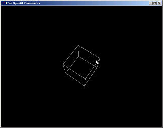
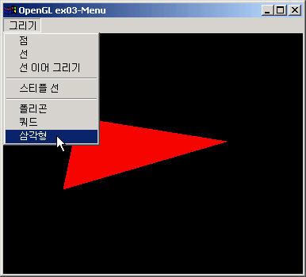
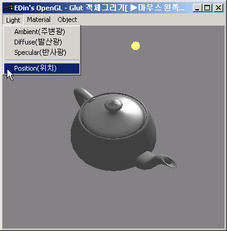

# 3장. OpenGL 윈도우 프레임웍 만들기 2편

전편에서 만들었던 eglWindow 클래스에 조금 변화가 생겼고 멤버 함수도 몇개 추가 되었지만 그리 변한 것은 없다. 아래는 eglWindow 클래스의 모습이며 여기에 추가되는 코드는 모두 OpenGL 을 설정하기 위한 코드이다. 이러한 코드에 대해서 자세하게 설명하지는 않을 것이다. 그 이유는 이 문서 말고도 OpenGL 기초 서적이나 Nehe 튜토리얼 같은 문서를 보면 아주 자세하게 설명되어 있기 때문이다. 그럼 각설하고 eglWindow 의 모습을 보자.

```cpp
class eglWindow
{
protected:
    BOOL mFullscreen;
    HWND mHWnd;
    MSG mMsg;
    HDC mDC;
    HGLRC mRC;
    HINSTANCE mHInstance;
    void DestroyGLWindow(void);
public:
    eglWindow();
    ~eglWindow();
    virtual BOOL InitGL(void);
    virtual void RenderGLScene(void);
    HWND GetHWND(void);
    HDC GetHDC(void);

    BOOL Create(BOOL bFullScreen=FALSE, const char *title="EDin OpenGL Framework", int width=640, int height=480, int bits=16);
    int Run(void);

    DECLARE_MESSAGE_MAP(eglWindow);
    virtual void OnCreate(WPARAM wParam, LPARAM lParam){}
    virtual void OnSize(WPARAM wParam, LPARAM lParam);
    virtual void OnClose(WPARAM wParam, LPARAM lParam);
    virtual void OnKeyDown(WPARAM wParam, LPARAM lParam);
    virtual void OnSysCommand(WPARAM wParam, LPARAM lParam);
    virtual void OnCommand(WPARAM wParam, LPARAM lParam) {}
    virtual void OnKeyUp(WPARAM wParam, LPARAM lParam){}
    virtual void OnLButtonDown(WPARAM wParam, LPARAM lParam){}
    virtual void OnLButtonUp(WPARAM wParam, LPARAM lParam){}
    virtual void OnMouseMove(WPARAM wParam, LPARAM lParam){}
    virtual void OnRButtonDown(WPARAM wParam, LPARAM lParam){}
    virtual void OnRButtonUp(WPARAM wParam, LPARAM lParam){}
    virtual void OnChar(WPARAM wParam, LPARAM lParam){}
};
```

새로 추가된 멤버 변수는 HGLRC 인 GL 렌더링 컨텍스트와 풀스크린을 설정하는 플래그인 BOOL mFullscreen 이고 내부 헬퍼함수로 DestroyGLWindow\(void\) 함수가 있는데 이는 우리가 사용했던 시스템 자원들을 다시 시스템에 돌려주는 역할, 즉 뒷정리를 한다. virtual BOOL InitGL\(void\) 는 OpenGL 을 사용하기 위해서 OpenGL 의 상태를 초기화 하는 곳이며 가상함수인 것은 초기화는 때에 따라서 달라질 수 있기 때문에 상속 클래스에서 쉽게 변화를 줄 수 있게 하기 위해서다. virtual void RenderGLScene\(void\) 함수도 역시 가상이다. 이 함수가 하는 일은 화면에 무엇인가를 그리는 역할을 한다. 그러므로 그리는 일은 매번 다를 수 있으므로 상속클래스에서 쉽게 변경이 가능하도록 하기 위해서 가상함수로 만들었다. BOOL Create\(....\) 함수는 모습이 많이 바뀌었는데 함수의 인자를 보면 무슨 역할을 하는 인자인지 짐작이 갈 것이다. 이 함수 안에서 OpenGL 을 이용하여 그린 그림을 표시할 수 있는 윈도우를 생성한다. int Run\(void\) 함수는 전과 같이 단순한 메세지 펌핑코드로 만들어져 있다.

그 다음 눈에 띄는 것은 많은 수의 가상함수로 이루어진 메세지 핸들러이다. virtual void OnCreate\(WPARAM wParam, LPARAM lParam\){} 와 virtual void OnSize\(WPARAM wParam, LPARAM lParam\); 를 보면 하나는 선언과 동시에 구현\(아무런 역할도 하지 않는 OnCreate 함수\)을 함수이고 하나는 선언만 있는데 선언만 있는 함수는 많은 코드가 필요하여 inline 으로 만들지 않은 것이다. 자세한 사항은 소스코드를 살펴본다.

Create 함수는 아래와 같이 코딩되어 있다.

```cpp
BOOL eglWindow::Create(BOOL fullscreen, const char *title, int width, int height, int bits)
{
    if(!eglWindow::RegisterWindow(mHInstance))
        return FALSE;

    GLuint PixelFormat;     // Holds The Results After Searching For A Match
    DWORD dwExStyle;     // Window Extended Style
    DWORD dwStyle;     // Window Style
    RECT ClientRect;
    ClientRect.left = (long)0;
    ClientRect.right = (long)width;
    ClientRect.top = (long)0;
    ClientRect.bottom = (long)height;

    mFullscreen = fullscreen;
    if(mFullscreen)
    {
        DEVMODE dm;     // Device Mode
        memset(&dm, 0, sizeof(dm));     // Makes Sure Memory's Cleared
        dm.dmSize = sizeof(dm);     // Size Of The Devmode Structure
        dm.dmPelsHeight = height;  // Selected Screen Height
        dm.dmPelsWidth = width;     // Selected Screen Width
        dm.dmBitsPerPel = bits;      // Selected Bits Per Pixel
        dm.dmFields = DM_BITSPERPEL | DM_PELSWIDTH | DM_PELSHEIGHT;

        if(ChangeDisplaySettings(&dm, CDS_FULLSCREEN) != DISP_CHANGE_SUCCESSFUL)
        {
            if(MessageBox(NULL, TEXT("현재의 비디오카드에서 풀스크린을 지원하지 않습니다. 보통화면으로 보시겠습니까?"), TEXT("오류"),
                        MB_YESNO | MB_ICONEXCLAMATION) == IDYES)
            {
                mFullscreen = FALSE;
            }
            else
            {
                MessageBox(NULL, TEXT("프로그램을 종료합니다"), TEXT("알림"), MB_OK | MB_ICONSTOP);
                PostQuitMessage(0);
                return FALSE; //exit
            }
        }
    }

    if(mFullscreen)
    {
        dwExStyle = WS_EX_APPWINDOW;
        dwStyle = WS_POPUP;
        //ShowCursor(false);
    }
    else
    {
        dwExStyle = WS_EX_APPWINDOW | WS_EX_WINDOWEDGE;
        dwStyle = WS_OVERLAPPEDWINDOW; 
    }

    AdjustWindowRectEx(&ClientRect, dwStyle, false, dwExStyle); // Adjust Window To true Requested Size

    mHWnd = CreateWindowEx(
            dwExStyle,
            "eglWindow",
             title,
            dwStyle|WS_CLIPSIBLINGS|WS_CLIPCHILDREN,
            0, 0,
            ClientRect.right-ClientRect.left,
            ClientRect.bottom-ClientRect.top,
            (HWND)NULL,
            (HMENU)NULL,
            mHInstance,
            (LPVOID)this); //메세지맵을 위하여 this 포인터를 넘긴다.

    if(!mHWnd) 
    {
        MessageBox(NULL, TEXT("윈도우를 생성하는데 실패했습닏"), TEXT("오류"), MB_OK | MB_ICONEXCLAMATION);
        return FALSE;
    }

    static PIXELFORMATDESCRIPTOR pfd = {
        sizeof(pfd), // Size Of This Pixel Format Descriptor
        1, // Version Number
        PFD_DRAW_TO_WINDOW | // Format Must Support Window
        PFD_SUPPORT_OPENGL | // Format Must Support OpenGL
        PFD_DOUBLEBUFFER, // Must Support Double Buffering
        PFD_TYPE_RGBA, // Request An RGBA Format
        bits, // Select Our Color Depth
        0, 0, 0, 0, 0, 0, // Color Bits Ignored
        0, // No Alpha Buffer
        0, // Shift Bit Ignored
        0, // No Accumulation Buffer
        0, 0, 0, 0, // Accumulation Bits Ignored
        16, // 16Bit Z-Buffer (Depth Buffer)
        0, // No Stencil Buffer
        0, // No Auxiliary Buffer
        PFD_MAIN_PLANE, // Main Drawing Layer
        0, // Reserved
        0, 0, 0 // Layer Masks Ignored
    };

    // Did We Get A Device Context?
    if(!(mDC = GetDC(mHWnd)))
    { 
        DestroyGLWindow();
        MessageBox(NULL, TEXT("GL Device Context 를 생성할 수 없습니다"), TEXT("오류"), MB_OK | MB_ICONEXCLAMATION);
        return FALSE;
    }

    // Did Windows Find A Matching Pixel Format?
    if (!(PixelFormat = ChoosePixelFormat(mDC, &pfd)))
    {
        DestroyGLWindow();
        MessageBox(NULL, TEXT("장치에 맞는 픽셀형식을 찾지 못했습니다"), TEXT("오류"), MB_OK | MB_ICONEXCLAMATION);
        return FALSE;
    }

    // Are We Able To Set The Pixel Format?
    if(!SetPixelFormat(mDC, PixelFormat, &pfd))
    {
        DestroyGLWindow();
        MessageBox(NULL, TEXT("픽셀형식을 설정할 수 없습니다"), TEXT("오류"), MB_OK | MB_ICONEXCLAMATION);
        return FALSE;
    }

    // Are We Able To Get A Rendering Context?
    if (!(mRC=wglCreateContext(mDC)))
    {
        DestroyGLWindow();
        MessageBox(NULL, TEXT("GL Rendering Context 를 생성할 수 없습니다"), TEXT("오류"), MB_OK | MB_ICONEXCLAMATION);
        return FALSE; // Return false
    }

    // Try To Activate The Rendering Context
    if(!wglMakeCurrent(mDC, mRC))
    {
        DestroyGLWindow();
        MessageBox(NULL, TEXT("GL Rendering Context 를 사용할 수 없습니다"), TEXT("오류"), MB_OK | MB_ICONEXCLAMATION);
        return FALSE; // Return false
    }

    ShowWindow(mHWnd, SW_SHOW); // Show The Window
    SetForegroundWindow(mHWnd); // Slightly Higher Priority
    SetFocus(mHWnd); // Sets Keyboard Focus To The Window

    OnSize(0, MAKELPARAM(width, height)); //이함수를 호출하지 않으면 FULLSCREEN 에서 그림이 그려지지 않는다.

    // Initialize Our Newly Created GL Window
    if (!InitGL())
    {
        DestroyGLWindow();
        MessageBox(NULL, TEXT("초기화에 실패했습니다"), TEXT("오류"), MB_OK | MB_ICONEXCLAMATION);
        return FALSE;
    }

    return TRUE;
}
```

위의 코드는 NeHe 튜토리얼에서 코드를 가져와 eglWindow 에 알맞게 아주 약간 수정만 한 코드이다. 코드가 조금 길지만 특별한 사항은 없으며 코드를 보면 누구나 다 이해할 수 있는 코드이다.\(OpenGL 을 조금 안다고치고..\) InitGL 의 함수는 아래와 같이 되어 있다.

```cpp
BOOL eglWindow::InitGL(void)
{
    glShadeModel(GL_SMOOTH); // Enable Smooth Shading
    glClearColor(0.0f, 0.0f, 0.0f, 1.0f); // Black Background
    glClearDepth(1.0f); // Depth Buffer Setup
    glEnable(GL_DEPTH_TEST); // Enables Depth Testing
    glDepthFunc(GL_LEQUAL); // The Type Of Depth Testing To Do
    glHint(GL_PERSPECTIVE_CORRECTION_HINT, GL_NICEST); // Really Nice Perspective Calculations
    return TRUE;
}
```

다음은 RenderGLScene 의 코드이다.

```cpp
void eglWindow::RenderGLScene(void)
{
    glClear(GL_COLOR_BUFFER_BIT | GL_DEPTH_BUFFER_BIT); // Clear Screen And Depth Buffer
    glLoadIdentity(); // Reset The Current Modelview Matrix
}
```

다음은 Run 함수의 코드이다.

```cpp
int eglWindow::Run(void)
{
    while(1)
    {
        if(PeekMessage(&mMsg, NULL, 0, 0, PM_REMOVE))
        {
            if(mMsg.message == WM_QUIT)
            {
                break;
            }
            else
            {
                TranslateMessage(&mMsg);
                DispatchMessage(&mMsg);
            }
        }
        else
        {
            RenderGLScene();
            SwapBuffers(mDC); 
        }
    }
    return mMsg.message;
}
```

eglWindow 에는 몇몇개의 메세지에 대해 필요한 코드를 담고 있는데 그 핸들러의 코드는 아래와 같다.

```cpp
void eglWindow::OnKeyDown(WPARAM wParam, LPARAM lParam)
{
    if(wParam == VK_ESCAPE)
    {
        SendMessage(mHWnd, WM_CLOSE, 0, 0);
    }
}
```

```cpp
void eglWindow::OnSize(WPARAM wParam, LPARAM lParam)
{
    GLsizei width = LOWORD(lParam);
    GLsizei height = HIWORD(lParam);
    if (height == 0)
        height = 1; // Making Height Equal One

    glViewport( 0, 0, width, height ); // Reset The Current Viewport

    glMatrixMode(GL_PROJECTION); // Select The Projection Matrix
    glLoadIdentity(); // Reset The Projection Matrix

    // Calculate The Aspect Ratio Of The Window
    gluPerspective(45.0f, GLfloat(width)/GLfloat(height), 0.1f, 100.0f);

    glMatrixMode(GL_MODELVIEW); // Select The Modelview Matrix
    glLoadIdentity(); // Reset The Modelview Matrix
}
```

```cpp
void eglWindow::OnClose(WPARAM wParam, LPARAM lParam)
{
    DestroyGLWindow();
    PostQuitMessage(0);
}
```

```cpp
void eglWindow::OnSysCommand(WPARAM wParam, LPARAM lParam)
{
    switch (wParam) // Check System Calls
    {
    case SC_SCREENSAVE: // Screensaver Trying To Start?
    case SC_MONITORPOWER: // Monitor Trying To Enter Powersave?
        return ; // Prevent From Happening
    }
}
```

위의 eglWindow 에 정의되지 않은 메세지를 핸들링하려면 반드시 eglWindow 의 메세지맵에 등록을 시켜줘야한다. 주의할 점은 상속함수의 메세지맵에만 등록시키면 안된다는 것이다. 그래서 위에서 가상함수 메세지 핸들러가 많았던 이유는 필요할 것 같은 메세지 핸들러들을 미리 등록해 두었기 때문이다. 이 클래스를 이용해서 프로그램을 만들려면 다음과 같이 팔요한 것만 골라 쓰면 된다.

```cpp
class eglSubWindow : public eglWindow
{
private:
    POINT oldPoint;
    GLfloat xrot, yrot;
public:
    virtual void RenderGLScene(void);

    DECLARE_MESSAGE_MAP(eglSubWindow)

    virtual void OnCreate(WPARAM wParam, LPARAM lParam);
    virtual void OnLButtonDown(WPARAM wParam, LPARAM lParam);
    virtual void OnLButtonUp(WPARAM wParam, LPARAM lParam);
    virtual void OnMouseMove(WPARAM wParam, LPARAM lParam);
};

BEGIN_MESSAGE_MAP(eglSubWindow)
    ON_MESSAGE(eglSubWindow, WM_SIZE, OnSize)
    ON_MESSAGE(eglSubWindow, WM_CLOSE, OnClose)
    ON_MESSAGE(eglSubWindow, WM_KEYDOWN, OnKeyDown)
    ON_MESSAGE(eglSubWindow, WM_CREATE, OnCreate)
    ON_MESSAGE(eglSubWindow, WM_LBUTTONDOWN, OnLButtonDown)
    ON_MESSAGE(eglSubWindow, WM_LBUTTONUP, OnLButtonUp)
    ON_MESSAGE(eglSubWindow, WM_MOUSEMOVE, OnMouseMove)
END_MESSAGE_MAP();

void eglSubWindow::RenderGLScene(void)
{
    eglWindow::RenderGLScene();
    glTranslatef(0.0f, 0.0f, -6.0f);
    glRotatef(xrot, 1.0f, 0.0f, 0.0f);
    glRotatef(yrot, 0.0f, 1.0f, 0.0f);
    glutWireCube(1.0);
}
void eglSubWindow::OnCreate(WPARAM wParam, LPARAM lParam)
{
    xrot = yrot = 0.0f;
    memset(&oldPoint, 0, sizeof(oldPoint));
}
void eglSubWindow::OnLButtonDown(WPARAM wParam, LPARAM lParam)
{
    oldPoint.x = LOWORD(lParam);
    oldPoint.y = HIWORD(lParam);
    SetCapture(GetHWND());
}
void eglSubWindow::OnLButtonUp(WPARAM wParam, LPARAM lParam)
{
    oldPoint.x = 0;
    oldPoint.y = 0;
    ReleaseCapture();
}
void eglSubWindow::OnMouseMove(WPARAM wParam, LPARAM lParam)
{
    if(GetCapture()==GetHWND())
    {
        xrot = LOWORD(lParam) - oldPoint.x/3.6;
        yrot = HIWORD(lParam) - oldPoint.y/3.6;
    }
}

int APIENTRY WinMain(HINSTANCE hInstance, HINSTANCE hPrevInstance, LPSTR lpCmdLine, int nShowCmd)
{
    eglSubWindow app;
    app.Create(TRUE);
    return app.Run();
}
```

위의 프로그램은 화면에서 마우스 왼쪽 버튼을 누른채 마우스를 움직이면 큐브가 알맞게 회전하는 코드이다.




이상으로 OpenGL 을 위한 윈도우프레임웤을 만들어 보았다. 이번은 설명이 너무나 성의없는 것 같기도 해 미안할 따름이다. 바랄 것이 있다면 부족한 내용이지만 많은 이들에게 도움이 되었으면 좋겠다. 질문할 사항이 있다면 언제든지 위의 이메일 주소로 메일을 보내거나 홈페이지에 글을 남겨주길 바란다. 다음에 더욱 멋진 내용으로 다시 만나길 바라며... ;\]

### 알고 있는 문제점 <a id="%EC%95%8C%EA%B3%A0-%EC%9E%88%EB%8A%94-%EB%AC%B8%EC%A0%9C%EC%A0%90"></a>

* 다수의 WndProc 이 선언되지 않는다. 즉 DECLARE\_MESSAGE\_MAP\(eglSubWindow\) 를 해도 매크로 함수에 들어가는 CLASSNAME 은 eglSubWindow 의 부모 클래스의 이름인 eglWindow 의 이름이 들어간다. 그래서 eglWindow 에 다수의 메세지 핸들러를 가상함수로 선언해 놓은 것이다.
* 위의 문제로 eglSubWindow 에서 DECLARE\_MESSAGE\_MAP, BEGIN\_MESSAGE\_MAP, END\_MESSAGE\_MAP 을 선언할 필요가 없다.
* 위의 문제로 크게 문제될 것은 없으나 eglWindow 에서 핸들링 하지 않는 메세지를 핸들링하려면 반드시 eglWindow 에 핸들링 함수와 메세지를 등록해야하는 불편함이 있다. 원래 바라던 동작은 상속클래스에서 바로 새로운 메세지 핸들러를 추가할 수 있는 것이다. 어떻게 수정해야할까?

### 변경 사항 <a id="%EB%B3%80%EA%B2%BD-%EC%82%AC%ED%95%AD"></a>

* 리소스인 메뉴를 추가할 수 있도록 Create 함수를 아래와 같이 수정



* GLUT 모든 객체 그리기



```cpp
//함수 원형
BOOL Create(BOOL bFullScreen=FALSE, const char *title="EDin OpenGL Framework", int width=640, int height=480, int bits=16, LPTSTR menu=NULL);

//CreateWindow 함수 내
mHWnd = CreateWindowEx(
        dwExStyle,
        "eglWindow",
        title,
        dwStyle|WS_CLIPSIBLINGS|WS_CLIPCHILDREN,
        0, 0,
        ClientRect.right-ClientRect.left,
        ClientRect.bottom-ClientRect.top,
        (HWND)NULL,
        (HMENU)((!fullscreen) ? LoadMenu(mHInstance, menu) : NULL),
        mHInstance,
        (LPVOID)this);

//사용예
class eglSubWindow : public eglWindow
{
private:
public:
    virtual void RenderGLScene(void);
    virtual void OnCommand(WPARAM wParam, LPARAM lParam);
};
void eglSubWindow::OnCommand(WPARAM wParam, LPARAM lParam)
{
    switch(LOWORD(wParam))
    {
    case IDM_DRAW_LINE:
        MessageBox(mHWnd, "DRAW LINE", "CAPTION", MB_OK);
        break;
    }
}
void eglSubWindow::RenderGLScene(void)
{
    eglWindow::RenderGLScene();
}
int APIENTRY WinMain(HINSTANCE hInstance, HINSTANCE hPrevInstance, LPSTR lpCmdLine, int nShowCmd)
{
    eglSubWindow app;
    app.Create(FALSE, "OpenGL ex03-Menu", 640, 480, 16, MAKEINTRESOURCE(IDR_MAINMENU));
    return app.Run();
}
```

