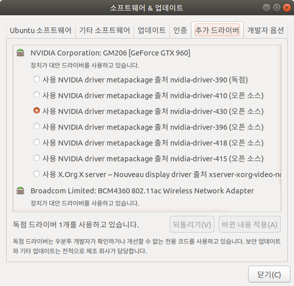
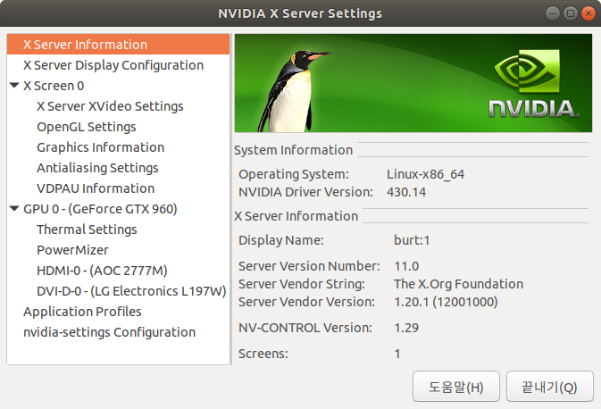

# nvidia driver

우분투 설치 후 조금 고생하는 부분이  nvidia driver 설치 부분인 것 같다. 아래 문서가 도움이 되었다.



## STEPS

### **Step 1 – Clean the system of other Nvidia drivers**

```text
$ sudo apt-get perge nvidia*
```

### **Step 2 – Check the latest driver version for our Nvidia GPU**



위 페이지에서 최신 nvidia 드라이버 출시 목록을 확인하고 자신이 사용하고 있는 그래픽스 카드가 어떤 버전의 드라이버를 사용해야 하는지 확인한다.



그리고 위 페이지에서 어느 버전까지 지원하고 있는지 확인하고 해당 버전의 드라이버를 설치하면 된다.

### **Step 3 – Add the Nvidia graphic card PPA**

```text
$ sudo add-apt-repository ppa:graphics-drivers
```

### **Step 4- Prepare the system for the installation**

```text
sudo apt-get update
```

### Step 5 - Install Driver

apt-get 으로 설치하지 않고 소프트웨어 업데이트를 사용해서 설치함. Step4 까지 진행하면 PPA에서 최신 드라이버 목록을 소프트웨어 업데이트 패널에서 보여준다.



### Step 6 - Reboot

재부팅 후 `nvidia-settings` 를 실행한다.



위처럼 패널이 나오면 nvidia 드라이버 설치가 완료된 것이다. 

